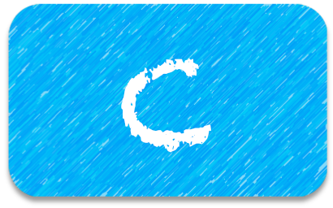
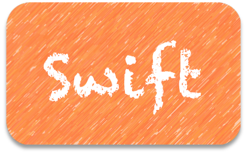

# iOSer 的随笔

***

##### &emsp;- C 语言

&nbsp;
&emsp; [学习笔记](https://github.com/sxxjaeho/iOS-Primer/contents/C/Primer/C-Note-Catalogue.md)
&emsp; [练习代码](https://github.com/sxxjaeho/iOS-Primer/contents/C/Primer/C-Code-Catalogue.md)
&emsp; [...](https://github.com/sxxjaeho/iOS-Primer/contents/C/C-Catalogue.md)
 
 

##### &emsp;- Swift

&nbsp;
&emsp; [练习代码](https://github.com/sxxjaeho/iOS-Primer/contents/Swift/Primer/Swift-Code-Catalogue.md)
&emsp; [...](https://github.com/sxxjaeho/iOS-Primer/contents/Swift/Swift-Catalogue.md)
 
 

##### &emsp;- 面试

&nbsp;
&emsp;[全新角度剖析--iOS面试](https://github.com/sxxjaeho/iOS-Primer/contents/Interview/Contents/15712112980765.md)
&emsp;[...](https://github.com/sxxjaeho/iOS-Primer/contents/Interview/Interview-Catalogue.md)
 
 

