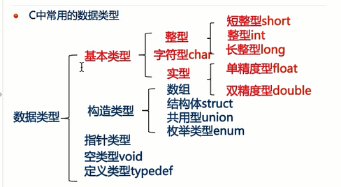

# day1
[TOC]
## 关键字及分类
【了解】关键字的基本概念
【理解】数据类型关键字
【理解】流程控制关键字

1. 关键字节本概念
关键字（保留字）就是已经被 C 语言本身实用，不能做其他用途的字。
例如关键字不能用作变量名、函数名等 
C 语言共有 32 个关键字
`auto` `double` `int` `strcut` `break` `else` `long` `switch` `case` `enum` `register` `typedef` `char` `extern` `return` `union` `const` `float` `short`      `unsigned` `continue` `for` `signed` `void` `default` `goto` `sizeof`      `volatile` `do` `if` `while` `static`
不用专门去记忆，用多了就会了

1. 数据类型关键字
     1. 基本数据类型（5 个）
void：声明函数无返回值或无参数，声明无类型指针，显示丢弃运算结果
char：字符型类型数据，属于整型数据的一种
int：整型数据，通常为编译器指定的机器字长
float：单精度浮点型数据，属于浮点数据的一种
double：双精度浮点型数据，属于浮点数据的一种

     2. 类型修饰关键字（4 个）
short：修饰 int,短整型数据，可省略被修饰的 int
long：修饰 int,长整型数据，可省略被修饰的 int
signed：修饰整型数据，有符号数据类型
unsigned：修饰整型数据，无符号数据类型

     3. 复杂类型关键字（5 个）
struct：结构体声明
union：共用体生命
enum：枚举声明
typedef：声明类型别名
sizeof：得到特定类型或特性类型变量的大小

     4. 存储级别关键字（6 个）
auto：指定为自动变量，由编译器自动分配及释放。通常在栈上分配
static：指定为静态变量，分配在静态变量去，修饰函数时，指定函数作用域为文件内部
register：指定为寄存器变量，建议编译器将变量存储到寄存器中实用，也可以修饰函数形参，建议编译器通过寄存器而不是堆栈传递参数
extern：指定对应变量为外部变量，即标示变量或者函数的定义在别的文件中，提示编译器遇到此变量和函数时在其他模块中寻找其定义。
const：与 volatile 合称"cv 特性"，指定变量不可被当前线程/进程改变（但有可能被系统或其他线程/进程改变）
volatile：与 const 合称"cv 特性"，指定变量的值有可能会被系统或其他进程/线程改变，强制编译器每次从内存中取得该变量的值。

2. 流程控制关键字
     1. 跳转结构（4 个）
return：用在函数体中，返回特定值（或者是 void 值，即不返回值）
continue：结束当前循环，开始下一轮循环
break：跳出当前循环或 switch 结构
goto：无条件跳转语句

     2. 分支结构（5 个）
if：条件语句，后面不需要放分号
else：条件语句否定分支（与 if 连用）
switch：开关语句（多种分支语句）
case：开关语句中的分支标记
default：开关语句中的“其他”分之，可选

     3. 循环结构（3 个）
for：for 循环结构
do：do 循环结构
while：while 循环机构

## 标识符概念及其命名原则
【了解】标识符
【掌握】标识符命名规则

1. 标识符
在 C 语言中，符号常量，变量，数组，函数等都需要一定的名称，我们把这种名称成为标识符。
标识符划分：关键字，预定义标识符和用户标识符

2. 标识符命名规则
    1. 只能由字母、数字、下划线或者美元符号（$）组成
    2. 不能以数字开头
    3. 不能与关键字重名
    4. 严格区分大小写

## 标识符的命名规范
【理解】标识符命名规范
【了解】标识符命名规范详述

1. 标识符命名规范
    1. 起一个有意义的名字（能提高代码的可读性）
    2. 驼峰命名
  如果一个标识符由多个单词组成
  第一个单词的首字母小写，其他单词的首字母都大写
  或者所有单词的首字母都大写
  
  
## 数据及数据类型
【理解】为什么要有数据类型
【了解】C 语言数据类型概述

1. 为什么要有数据类型 
什么是数据？ 
生活中时时刻刻都在跟数据打交道，比如体重数据、血压数据、股价数据等。在我们使用计算机过程中，会接触到各种各样的数据，有文档数据、图片数据、视频数据，还有聊 QQ 时产生的文字数据、用迅雷下载的文件数据等。 
硬盘读取数据到内存叫输入流
从内存写到文件中去叫输出流 
1B(Byte 字节)=8 bit(位)
1 KB(KByte)=1024 B
1 MB=1024 KB
1 GB=1024 MB
1 TB=1024 GB

2. C 语言数据类型概述
C 语言中有 5 大类数据类型：
基本类型、构造类型、指针类型、空类型、定义类
 
C 中常用的数据类型
常见的数据类型有:int、float、double、char
    1. 整型：用于准确地表示整数，根据表示范围不同分为以下三种：
     短整型 (short)<整型 (int)<长整型 (long)
     
    2. 实型 (浮点型)：用于表示实数 (小数) 根据范围和精度不同分为以下两种：
     单精度浮点数 (float)<双精度浮点数 (double)
     注意：float 只能够保证 7 位数字是有效 
    float 和 double 的区别:精确度不一样。 
    float 有效位数为 6 位。 
    double 有效位数为 15 位。
    
    3. 字符型：用来描述单个字符，char

## 数据类型的内存占用及范围
## 常量的概述及分类
## 不同类型的常量表示方法
## 变量的概念定义
## 变量的作用域
## %f 输出精度问题
## printf 函数使用注意事项
## scanf 函数介绍及使用
## scanf 使用注意事项
## scanf 函数原理
