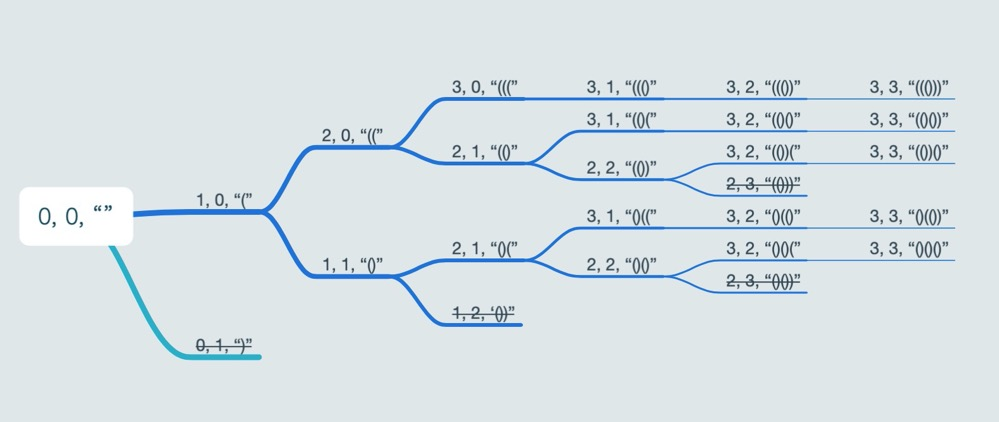

   * [LeetCode-部分算法题解](#LeetCode-部分算法题解)
      * [1.两数之和](#1两数之和)
      * [15.三数之和](#15三数之和)
      * [20.有效的括号](#20有效的括号)
      * [22.括号生成](#22括号生成)
      * [24.两两交换链表中的节点](#24两两交换链表中的节点)
      * [50.Pow(x, n)](#50powx-n)
      * [70.爬楼梯](#70爬楼梯)
      * [88.合并两个有序数组](#88合并两个有序数组)
      * [98.验证二叉搜索树](#98验证二叉搜索树)
      * [100.相同的树](#100相同的树)
      * [102.二叉树的层次遍历](#102二叉树的层次遍历)
      * [120.三角形最小路径和](#120三角形最小路径和)
      * [141.环形链表](#141环形链表)
      * [146.LRU缓存机制](#146LRU缓存机制)
      * [179.最大数](#179最大数)
      * [191.位1的个数](#191位1的个数)
      * [226.翻转二叉树](#226翻转二叉树)
      * [236.二叉树的最近公共祖先](#236二叉树的最近公共祖先)
      * [239.滑动窗口最大值](#239滑动窗口最大值)
      * [443.压缩字符串](#443压缩字符串)
      * [468.验证IP地址](#468验证IP地址)
      * [480.滑动窗口中位数](#480滑动窗口中位数)
      * [703.数据流中的第K大元素](#703数据流中的第K大元素)
      * [704.二分查找](#704二分查找)
      * [709.转换成小写字母](#709转换成小写字母)
      * [912.排序数组](#912排序数组)

# LeetCode-部分算法题解

## 1.两数之和

[两数之和.playground](https://github.com/sxxjaeho/iOS-Primer/blob/master/contents/arithmetic/code/两数之和.playground)

题目：给定一个整数数组 nums 和一个目标值 target，请你在该数组中找出和为目标值的那两个整数，并返回他们的数组下标。

```
func twoSum(_ nums: [Int], _ target: Int) -> [[Int]] {
    var dictionary = [Int: Int]()
    var result = [[Int]]()
    for (index, value) in nums.enumerated() {
        if let differenceIndex = dictionary[target - value] {
            result.append([differenceIndex, index])
        }
        dictionary[value] = index
    }
    return result
}

print(twoSum([2, 7, 5, 1, 2, 4], 9))
```

**时间复杂度：O(n)**

***

## 15.三数之和

[三数之和.playground](https://github.com/sxxjaeho/iOS-Primer/blob/master/contents/arithmetic/code/三数之和.playground)

题目：给你一个包含 n 个整数的数组 nums，判断 nums 中是否存在三个元素 a，b，c ，使得 a + b + c = 0 ？请你找出所有满足条件且不重复的三元组。

注意：答案中不可以包含重复的三元组。

示例：

```
给定数组 nums = [-1, 0, 1, 2, -1, -4]，

满足要求的三元组集合为：
[
  [-1, 0, 1],
  [-1, -1, 2]
]
```

```
func threeSum(_ nums: [Int]) -> [[Int]] {
    guard nums.count >= 3 else {
        return []
    }

    //    let sortedNums = nums.sorted()
    let sortedNums = sortArray(nums)

    var resultArray = [[Int]]()

    var resultSet: Set<Set<Int>> = []

    for (index, value) in sortedNums.enumerated() {
        guard index < sortedNums.count - 2 else {
            break
        }

        var ahead = sortedNums.count - 1
        var behind = index + 1
        while ahead > behind {
            let curSum = sortedNums[ahead] + sortedNums[behind]
            if curSum == 0 - value {
                if !resultSet.contains([value, sortedNums[ahead], sortedNums[behind]]) {
                    resultArray.append([value, sortedNums[ahead], sortedNums[behind]])
                    resultSet.insert([value, sortedNums[ahead], sortedNums[behind]])
                }
                behind += 1
            } else if curSum > 0 - value {
                ahead -= 1
            } else {
                behind += 1
            }
        }
    }
    return resultArray
}

func sortArray(_ nums: [Int]) -> [Int] {
    guard nums.count > 1 else {
        return nums
    }
    let pivot = nums[nums.count / 2]
    let left = nums.filter { $0 < pivot}
    let middle = nums.filter { $0 == pivot}
    let right = nums.filter { $0 > pivot}
    return sortArray(left) + middle + sortArray(right)
}

print(threeSum([-1, 0, 1, 2, -1, -4], 0))
```

**时间复杂度：O(n<sup>2</sup>) 空间复杂度：O(logN)**

***

## 20.有效的括号

[有效的括号.playground](https://github.com/sxxjaeho/iOS-Primer/blob/master/contents/arithmetic/code/有效的括号.playground)

题目：给定一个只包括 '('，')'，'{'，'}'，'['，']' 的字符串，判断字符串是否有效。

有效字符串需满足：

1.左括号必须用相同类型的右括号闭合。
2.左括号必须以正确的顺序闭合。

注意空字符串可被认为是有效字符串。


```
func isValid(_ string: String) -> Bool {
    var stack = [Character]()
    let dictionary = [")": "(", "]": "[", "}": "{"]

    for character in string {
        if !dictionary.keys.contains(String(character)) {
            stack.append(character)
        } else if !(!stack.isEmpty && String(stack.popLast()!) == dictionary[String(character)]) {
            return false
        }
    }
    return stack.isEmpty
}

print(isValid("()"))
print(isValid("()[]{}"))
print(isValid("(]"))
print(isValid("([)]"))
print(isValid("{[]}"))
```

**时间复杂度：O(n)**

***

## 22.括号生成

[括号生成.playground](https://github.com/sxxjaeho/iOS-Primer/blob/master/contents/arithmetic/code/括号生成.playground)

题目：给出 n 代表生成括号的对数，请你写出一个函数，使其能够生成所有可能的并且有效的括号组合。

例如，给出 n = 3，生成结果为：

```
[
  "((()))",
  "(()())",
  "(())()",
  "()(())",
  "()()()"
]
```



```
var list = [String]()
func _gen(_ left: Int, _ right: Int,  _ n: Int, _ result: String) {
    if left == n && right == n {
        list.append(result)
        return
    }
    if left < n {
        _gen(left + 1, right, n, result + "(")
    }
    if left > right && right < n {
        _gen(left, right + 1, n, result + ")")
    }
}

func generateParenthesis(_ n: Int) -> [String] {
    if n <= 0 {
        return []
    }
    _gen(0, 0,  n, "")
    return list
}

print(generateParenthesis(3))
```

**时间复杂度：O(n<sup>2</sup>)**

***

## 24.两两交换链表中的节点

[两两交换链表中的节点.playground](https://github.com/sxxjaeho/iOS-Primer/blob/master/contents/arithmetic/code/两两交换链表中的节点.playground)

题目：给定一个链表，两两交换其中相邻的节点，并返回交换后的链表。

你不能只是单纯的改变节点内部的值，而是需要实际的进行节点交换。

示例：

```
给定 1->2->3->4, 你应该返回 2->1->4->3.
```

```
class ListNode {
    var value: Int
    var next: ListNode?
    
    init(_ value: Int) {
        self.value = value
    }
    
    func next(_ value: Int) -> ListNode {
        let node = ListNode(value)
        next = node
        return node
    }
}

func swapPairs(_ head: ListNode?) -> ListNode? {
    let dumb = ListNode(0)
    dumb.next = head
    var pre = dumb
    while pre.next != nil && pre.next?.next != nil {
        let a = pre.next!
        let b = a.next!
        pre.next = b
        a.next = b.next
        b.next = a
        pre = a
    }
    return dumb.next
}

func traverseList(_ head : ListNode?) {
    var node = head
    while node != nil {
        print(node?.value ?? 0)
        node = node?.next
    }
}

let head = ListNode(1)
head.next(2).next(3).next(4).next(5)
if let result = swapPairs(head) {
    traverseList(result)
}
```

**时间复杂度：O(n)**

***

## 50.Pow(x, n)

[Pow(x, n).playground](https://github.com/sxxjaeho/iOS-Primer/tree/master/contents/arithmetic/code/Pow(x%2C%20n).playground)

题目：实现 pow(x, n) ，即计算 x 的 n 次幂函数。


示例：

```
输入：2.00000, 10
输出：1024.00000
```

```
func myPow(_ x: Double, _ n: Int) -> Double {
    if n == 0 {
        return 1
    }
    if n < 0 {
        return 1 / myPow(x, -n);
    }
    if n % 2 == 1 {
        return x * myPow(x, n - 1);
    }
    return myPow(x * x, n / 2)
}
print(myPow(2, 10))
```

**时间复杂度：O(logn)**

***

## 70.爬楼梯

[爬楼梯.playground](https://github.com/sxxjaeho/iOS-Primer/blob/master/contents/arithmetic/code/爬楼梯.playground)

题目：假设你正在爬楼梯。需要 n 阶你才能到达楼顶。
 每次你可以爬 1 或 2 个台阶。你有多少种不同的方法可以爬到楼顶呢

示例：

```
输入： 2
输出： 2
解释： 有两种方法可以爬到楼顶。
1.  1 阶 + 1 阶
2.  2 阶
```

```
func climbStairs(_ n: Int) -> Int {
    if n <= 2  {
        return n
    }
    var mem = Array(repeating: 0, count: n)
    mem[0] = 1
    mem[1] = 2
    for i in 2..<n {
        mem[i] = mem[i-1] + mem[i-2]
    }
    return mem[n-1]
}

print(climbStairs(5))
```

**时间复杂度：O(n) 空间复杂度：O(n)**

***

## 88.合并两个有序数组

[合并两个有序数组.playground](https://github.com/sxxjaeho/iOS-Primer/blob/master/contents/arithmetic/code/合并两个有序数组.playground)


题目：给定两个有序整数数组 nums1 和 nums2，将 nums2 合并到 nums1 中，使得 num1 成为一个有序数组。

说明:
初始化 nums1 和 nums2 的元素数量分别为 m 和 n。
你可以假设 nums1 有足够的空间（空间大小大于或等于 m + n）来保存 nums2 中的元素。

示例：

```
输入：
nums1 = [1,2,3,0,0,0], m = 3
nums2 = [2,5,6],       n = 3

输出：[1,2,2,3,5,6]
```

```
func merge(_ nums1: inout [Int], _ m: Int, _ nums2: [Int], _ n: Int) {
    var i = m - 1, j = n - 1
    if i < 0 {
        nums1 = nums2
    } else if j < 0 {
    } else {
        while i >= 0 || j >= 0 {
            if j < 0 || (i >= 0 && j >= 0 && nums1[i] > nums2[j]) {
                nums1[i + j + 1] = nums1[i]
                i -= 1
            } else {
                nums1[i + j + 1] = nums2[j]
                j -= 1
            }
        }
    }
}

var nums1 = [1, 2, 3, 0, 0, 0]
var nums2 = [2, 5, 6]
merge(&nums1, 3, nums2, 3)
print(nums1)
```

**时间复杂度：O(n+m) 空间复杂度：O(1)**

***

## 98.验证二叉搜索树

[验证二叉搜索树.playground](https://github.com/sxxjaeho/iOS-Primer/blob/master/contents/arithmetic/code/验证二叉搜索树.playground)

题目：给定一个二叉树，判断其是否是一个有效的二叉搜索树。

假设一个二叉搜索树具有如下特征：

节点的左子树只包含小于当前节点的数。
节点的右子树只包含大于当前节点的数。
所有左子树和右子树自身必须也是二叉搜索树。


示例：

```
输入：
    2
   / \
  1   3
输出: true
```

```
class BinaryTreeNode {
    var left: BinaryTreeNode?
    var right: BinaryTreeNode?
    var value: Int
    
    init(value: Int, left: BinaryTreeNode?, right: BinaryTreeNode?) {
        self.value = value
        self.left = left
        self.right = right
    }
}

func isValidBST(_ root: BinaryTreeNode?, min : Int?, max : Int?) -> Bool {
    guard let root = root else { return true }
    if let max = max, root.value >= max  {
        return false
    }
    if let min = min, root.value <= min {
        return false
    }
    return isValidBST(root.left, min: min, max: root.value) && isValidBST(root.right, min: root.value, max: max)
}

let root = BinaryTreeNode(value: 2, left: BinaryTreeNode(value: 1, left: nil, right: nil), right: BinaryTreeNode(value: 3, left: nil, right: nil))
print(isValidBST(root, min: nil, max: nil))
```

**时间复杂度：O(n) 空间复杂度：O(n)**

***

## 100.相同的树

[相同的树.playground](https://github.com/sxxjaeho/iOS-Primer/blob/master/contents/arithmetic/code/相同的树.playground)

题目：给定两个二叉树，编写一个函数来检验它们是否相同。

如果两个树在结构上相同，并且节点具有相同的值，则认为它们是相同的。

示例 1：

```
输入：   
           1         1
          / \       / \
         2   3     2   3

        [1,2,3],   [1,2,3]

输出：true
```

示例 2：

```
输入：   
           1         1
          /           \
         2             2

        [1,2],     [1,null,2]

输出： false
```

示例 3：

```
输入：    
           1         1
          / \       / \
         2   1     1   2

        [1,2,1],   [1,1,2]

输出： false
```

```
class BinaryTreeNode {
    var left: BinaryTreeNode?
    var right: BinaryTreeNode?
    var value: Int
    
    init(value: Int, left: BinaryTreeNode?, right: BinaryTreeNode?) {
        self.value = value
        self.left = left
        self.right = right
    }
}

func isSameTree(_ node1: BinaryTreeNode?, _ node2: BinaryTreeNode?) -> Bool {
    if node1 == nil && node2 == nil {
        return true
    }
    if node1 == nil || node2 == nil {
        return false
    }
    if node1!.value != node2!.value {
        return false
    }
    return isSameTree(node1!.left, node2!.left) && isSameTree(node1!.right, node2!.right)
}

let node1 = BinaryTreeNode(value: 1, left: BinaryTreeNode(value: 2, left: nil, right: nil), right: BinaryTreeNode(value: 3, left: nil, right: nil))
let node2 = BinaryTreeNode(value: 1, left: BinaryTreeNode(value: 2, left: nil, right: nil), right: BinaryTreeNode(value: 3, left: nil, right: nil))
let node3 = BinaryTreeNode(value: 1, left: BinaryTreeNode(value: 2, left: nil, right: nil), right: nil)
let node4 = BinaryTreeNode(value: 1, left: nil, right: BinaryTreeNode(value: 3, left: nil, right: nil))
let node5 = BinaryTreeNode(value: 1, left: BinaryTreeNode(value: 2, left: nil, right: nil), right: BinaryTreeNode(value: 1, left: nil, right: nil))
let node6 = BinaryTreeNode(value: 1, left: BinaryTreeNode(value: 1, left: nil, right: nil), right: BinaryTreeNode(value: 3, left: nil, right: nil))

print(isSameTree(node1, node2))
print(isSameTree(node3, node4))
print(isSameTree(node5, node6))
```

***

## 102.二叉树的层次遍历

[二叉树的层次遍历.playground](https://github.com/sxxjaeho/iOS-Primer/blob/master/contents/arithmetic/code/二叉树的层次遍历.playground)

题目：给定一个二叉树，返回其按层次遍历的节点值。 （即逐层地，从左到右访问所有节点）。

```
例如:
给定二叉树: [3,9,20,null,null,15,7],

    3
   / \
  9  20
    /  \
   15   7
返回其层次遍历结果：

[
  [3],
  [9,20],
  [15,7]
]
```

```
class BinaryTreeNode {
    var left: BinaryTreeNode?
    var right: BinaryTreeNode?
    var value: Int
    
    init(value: Int, left: BinaryTreeNode?, right: BinaryTreeNode?) {
        self.value = value
        self.left = left
        self.right = right
    }
}

func levelOrderTraversal(_ root: BinaryTreeNode?) -> [[Int]] {
    
    guard let root = root else { return [] }
    
    var queue: [BinaryTreeNode] = [root]
    
    var result: [[Int]] = []
    
    while !queue.isEmpty {
        var currentLevel: [Int] = []
        
        for _ in queue {
            let node = queue.removeFirst()
            currentLevel.append(node.value)
            if let left = node.left {
                queue.append(left)
            }
            if let right = node.right {
                queue.append(right)
            }
        }
        result.append(currentLevel)
    }
    return result
}

let root = BinaryTreeNode(value: 3, left: BinaryTreeNode(value: 9, left:  nil, right: nil), right: BinaryTreeNode(value: 20, left:  BinaryTreeNode(value: 15, left: nil, right: nil), right: BinaryTreeNode(value: 7, left: nil, right: nil)))
print(levelOrderTraversal(root))

// 二叉树前序遍历
func preorderTraversal(_ root: BinaryTreeNode?) -> [Int] {
    guard let root = root else { return [] }
    
    var res: [Int] = []
    res.append(root.value)
    res += preorderTraversal(root.left)
    res += preorderTraversal(root.right)
    
    return res
}

// 二叉树中序遍历
func inorderTraversal(_ root: BinaryTreeNode?) -> [Int] {
    guard let root = root else { return [] }

    var res: [Int] = []
    res += inorderTraversal(root.left)
    res.append(root.value)
    res += inorderTraversal(root.right)
    
    return res
}

// 二叉树后序遍历
func postorderTraversal(_ root: BinaryTreeNode?) -> [Int] {
    guard let root = root else { return [] }
    
    var res: [Int] = []
    res += postorderTraversal(root.left)
    res += postorderTraversal(root.right)
    res.append(root.value)
    
    return res
}

```

**时间复杂度：O(n)**

***

## 120.三角形最小路径和

[三角形最小路径和.playground](https://github.com/sxxjaeho/iOS-Primer/blob/master/contents/arithmetic/code/三角形最小路径和.playground)

题目：给定一个三角形，找出自顶向下的最小路径和。每一步只能移动到下一行中相邻的结点上。

 相邻的结点 在这里指的是 下标 与 上一层结点下标 相同或者等于 上一层结点下标 + 1 的两个结点。

 例如，给定三角形：
```
 [
      [2],
     [3,4],
    [6,5,7],
   [4,1,8,3]
 ]
 
 自顶向下的最小路径和为 11（即，2 + 3 + 5 + 1 = 11）。
```

```
func minimumTotal(_ triangle: [[Int]]) -> Int {
    var mini = triangle[triangle.count-1]
    for i in (0..<triangle.count-1).reversed() {
        for j in (0...triangle[i].count-1) {
            mini[j] = triangle[i][j] + min(mini[j], mini[j+1]);
        }
    }
    return mini[0]
}
```

**时间复杂度：O(n<sup>2</sup>) 空间复杂度：O(n<sup>2</sup>)**

***

## 141.环形链表

[环形链表.playground](https://github.com/sxxjaeho/iOS-Primer/blob/master/contents/arithmetic/code/环形链表.playground)

题目：给定一个链表，判断链表中是否有环。

为了表示给定链表中的环，我们使用整数 pos 来表示链表尾连接到链表中的位置（索引从 0 开始）。 如果 pos 是 -1，则在该链表中没有环。

示例 1：

```
输入：head = [3,2,0,-4], pos = 1
输出：true
解释：链表中有一个环，其尾部连接到第二个节点。
```

示例 2：

```
输入：head = [1,2], pos = 0
输出：true
解释：链表中有一个环，其尾部连接到第一个节点。
```

示例 3：

```
输入：head = [1], pos = -1
输出：false
解释：链表中没有环。
```

```
// 双指针解法
class ListNode {
    var value: Int
    var next: ListNode?
    
    init(_ value: Int) {
        self.value = value
    }
    
    func next(_ value: Int) -> ListNode {
        let node = ListNode(value)
        next = node
        return node
    }
}

func hasCycle(_ head: ListNode?) -> Bool {
    if (head == nil || head?.next == nil) {
        return false
    }
    var slow = head
    var fast = head?.next
    while(slow !== fast) {
        if (fast ==  nil || fast?.next == nil) {
           return false
        }
        slow = slow?.next
        fast = fast?.next?.next
    }
    return true
}

let head = ListNode(3)
let node1 = ListNode(2)
let node2 = ListNode(0)
let node3 = ListNode(-4)
head.next = node1
node1.next = node2
node2.next = node3
node3.next = node1

print(hasCycle(head))
```

***

## 146.LRU缓存机制

[LRU缓存机制.playground](https://github.com/sxxjaeho/iOS-Primer/blob/master/contents/arithmetic/code/LRU缓存机制.playground)

题目：运用你所掌握的数据结构，设计和实现一个  LRU (最近最少使用) 缓存机制。它应该支持以下操作： 获取数据 get 和 写入数据 put 。

获取数据 get(key) - 如果密钥 (key) 存在于缓存中，则获取密钥的值（总是正数），否则返回 -1。
写入数据 put(key, value) - 如果密钥不存在，则写入其数据值。当缓存容量达到上限时，它应该在写入新数据之前删除最近最少使用的数据值，从而为新的数据值留出空间。

```
class DLinkedNode {
    var key: Int?
    var value: Int?
    var next: DLinkedNode?
    var prev: DLinkedNode?
    
    init(key: Int? = nil, value: Int? = nil) {
        self.key = key
        self.value = value
    }
}

class LRUCache {

    var capacity = 0
    let head = DLinkedNode()
    let tail = DLinkedNode()
    
    init(_ capacity: Int) {
        self.capacity = capacity
        
        head.next = tail
        tail.prev = head
    }
    
    func addNode(_ node: DLinkedNode) {
        node.prev = head
        node.next = head.next

        head.next!.prev = node
        head.next = node
    }
    
    func removeNode(_ node: DLinkedNode) {
        node.prev?.next = node.next
        node.next?.prev = node.prev
    }
    
    func moveToHead(_ node: DLinkedNode) {
        removeNode(node)
        addNode(node)
    }
    
    func popTail() -> DLinkedNode? {
        let res = tail.prev!
        if res.value != nil {
            removeNode(res)
            return res
        } else {
            return nil
        }
    }
    
    var count = 0
    var cache = Dictionary<Int, DLinkedNode>()
    
    func get(_ key: Int) -> Int {
        if let node = cache[key] {
            moveToHead(node)
            return node.value!
        } else {
            return -1
        }
    }
    
    func put(_ key: Int, _ value: Int) {
        if let node = cache[key] {
            node.value = value
            moveToHead(node)
        } else {
            let newNode = DLinkedNode(key: key, value: value)
            
            cache[key] = newNode
            count += 1

            if count > capacity {
                let tail = popTail()!
                cache.removeValue(forKey: tail.key!)
                addNode(newNode)
                
                count -= 1
            } else {
                addNode(newNode)
            }
        }
    }
}

var cache = LRUCache(2 /* 缓存容量 */ )
cache.put(1, 1);
cache.put(2, 2);
print(cache.get(1));       // 返回  1
cache.put(3, 3);    // 该操作会使得密钥 2 作废
print(cache.get(2));       // 返回 -1 (未找到)
cache.put(4, 4);    // 该操作会使得密钥 1 作废
print(cache.get(1));       // 返回 -1 (未找到)
print(cache.get(3));       // 返回  3
print(cache.get(4));       // 返回  4
```

**时间复杂度：对于 put 和 get 都是 O(1) 
空间复杂度：O(capacity)，因为哈希表和双向链表最多存储 capacity + 1 个元素**

***

### 179.最大数
[最大数.playground](https://github.com/sxxjaeho/iOS-Primer/blob/master/contents/arithmetic/code/最大数.playground)

题目：给定一组非负整数，重新排列它们的顺序使之组成一个最大的整数。

示例 1：

```
输入：[10,2]
输出：210
```

示例 2：

```
输入：[3,30,34,5,9]
输出：9534330
```

说明: 输出结果可能非常大，所以你需要返回一个字符串而不是整数。

```
func largestNumber(_ nums: [Int]) -> String {
    var nums = nums.map { (num) -> String in
        return String(num)
    }
    nums = nums.sorted { (num1, num2) -> Bool in
        return num1 + num2 > num2 + num1
    }
    if nums.count > 0 {
        if (nums[0] as NSString).isEqual(to: "0") {
            return "0"
        }
    }
    
    return (nums as NSArray).componentsJoined(by: "")
}

print(largestNumber([3,30,34,5,9]))
```

**时间复杂度：O(nlgn)**

***

## 191.位1的个数
[位1的个数.playground](https://github.com/sxxjaeho/iOS-Primer/blob/master/contents/arithmetic/code/位1的个数.playground)

题目：编写一个函数，输入是一个无符号整数，返回其二进制表达式中数字位数为 ‘1’ 的个数（也被称为汉明重量）。

示例：

```
输入：00000000000000000000000000001011
输出：3
解释：输入的二进制串 00000000000000000000000000001011 中，共有三位为 '1'。
```

```
func hammingWeight(_ n: UInt32) -> Int {
    var n = n
    var res = 0
    for _ in 0..<32 {
        if n & 1 == 1 {
            res += 1
        }
        n = n >> 1
    }
    return res
}

func hammingWeight1(_ n: UInt32) -> Int {
    var n = n
    var res = 0
    while n != 0 {
        res += 1
        n = n & (n - 1)
    }
    return res
}

print(hammingWeight(0b00000000000000000000000000001011))
```

**时间复杂度：O(1)**

***

## 226.翻转二叉树

[翻转二叉树.playground](https://github.com/sxxjaeho/iOS-Primer/blob/master/contents/arithmetic/code/翻转二叉树.playground)

题目：翻转一棵二叉树。
输入：

```
     4
   /   \
  2     7
 / \   / \
1   3 6   9
```

输出：

```
     4
   /   \
  7     2
 / \   / \
9   6 3   1
```

```
class BinaryTreeNode {
    var left: BinaryTreeNode?
    var right: BinaryTreeNode?
    var value: Int
    
    init(value: Int, left: BinaryTreeNode?, right: BinaryTreeNode?) {
        self.value = value
        self.left = left
        self.right = right
    }
}

func invertTree(_ root: BinaryTreeNode?) -> BinaryTreeNode? {
    if root == nil {
        return nil
    }
    
    let temp = root!.left
    root!.left = root!.right
    root!.right = temp
    
    invertTree(root?.left)
    invertTree(root?.right)
    
    return root
}

// 二叉树前序遍历
func preorderTraversal(_ root: BinaryTreeNode?) -> [Int] {
    guard let root = root else { return [] }
    
    var res: [Int] = []
    res.append(root.value)
    res += preorderTraversal(root.left)
    res += preorderTraversal(root.right)
    
    return res
}

let root = BinaryTreeNode(value: 4, left: BinaryTreeNode(value: 2, left:  BinaryTreeNode(value: 1, left: nil, right: nil), right: BinaryTreeNode(value: 3, left: nil, right: nil)), right: BinaryTreeNode(value: 7, left:  BinaryTreeNode(value: 6, left: nil, right: nil), right: BinaryTreeNode(value: 9, left: nil, right: nil)))
print(preorderTraversal(root))

let invertRoot = invertTree(root)
print(preorderTraversal(invertRoot))
```

***

## 236.二叉树的最近公共祖先

[二叉树的最近公共祖先.playground](https://github.com/sxxjaeho/iOS-Primer/blob/master/contents/arithmetic/code/二叉树的最近公共祖先.playground)

题目：给定一个二叉树, 找到该树中两个指定节点的最近公共祖先。

百度百科中最近公共祖先的定义为：“对于有根树 T 的两个结点 p、q，最近公共祖先表示为一个结点 x，满足 x 是 p、q 的祖先且 x 的深度尽可能大（一个节点也可以是它自己的祖先）。”

例如，给定如下二叉树:  root = [3,5,1,6,2,0,8,null,null,7,4]


示例：

```
输入：root = [3,5,1,6,2,0,8,null,null,7,4], p = 5, q = 1
输出：3
解释：节点 5 和节点 1 的最近公共祖先是节点 3。
```

```
class BinaryTreeNode {
    var left: BinaryTreeNode?
    var right: BinaryTreeNode?
    var value: Int
    
    init(value: Int, left: BinaryTreeNode?, right: BinaryTreeNode?) {
        self.value = value
        self.left = left
        self.right = right
    }
}

func lowestCommonAncestor(_ root: BinaryTreeNode?, _ node1: BinaryTreeNode?, _ node2: BinaryTreeNode?) -> BinaryTreeNode? {
    if root == nil || root?.value == node1?.value || root?.value == node2?.value {
        return root
    }
    
    let left = lowestCommonAncestor(root?.left, node1, node2)
    let right = lowestCommonAncestor(root?.right, node1, node2)
    return left == nil ? right : (right == nil ? left : root)
}

let root = BinaryTreeNode(value: 3, left: BinaryTreeNode(value: 5, left: BinaryTreeNode(value: 6, left: nil, right: nil), right: BinaryTreeNode(value: 2, left: BinaryTreeNode(value: 7, left: nil, right: nil), right: BinaryTreeNode(value: 4, left: nil, right: nil))), right: BinaryTreeNode(value: 1, left: BinaryTreeNode(value: 0, left: nil, right: nil), right: BinaryTreeNode(value: 8, left: nil, right: nil)))

let node = lowestCommonAncestor(root, BinaryTreeNode(value: 5, left: BinaryTreeNode(value: 6, left: nil, right: nil), right: BinaryTreeNode(value: 2, left: BinaryTreeNode(value: 7, left: nil, right: nil), right: BinaryTreeNode(value: 4, left: nil, right: nil))), BinaryTreeNode(value: 1, left: BinaryTreeNode(value: 0, left: nil, right: nil), right: BinaryTreeNode(value: 8, left: nil, right: nil)))


if let node = node {
    print(node.value)
}
```

**时间复杂度：O(n)**

***

## 239.滑动窗口最大值

[滑动窗口最大值.playground](https://github.com/sxxjaeho/iOS-Primer/blob/master/contents/arithmetic/code/滑动窗口最大值.playground)

题目：给定一个数组 nums，有一个大小为 k 的滑动窗口从数组的最左侧移动到数组的最右侧。你只可以看到在滑动窗口内的 k 个数字。滑动窗口每次只向右移动一位。

返回滑动窗口中的最大值。

示例：

```
输入：nums = [1,3,-1,-3,5,3,6,7], 和 k = 3
输出：[3,3,5,5,6,7] 
解释：

        滑动窗口的位置         最大值
--------------------------    -----
[1  3  -1] -3  5  3  6  7       3
 1 [3  -1  -3] 5  3  6  7       3
 1  3 [-1  -3  5] 3  6  7       5
 1  3  -1 [-3  5  3] 6  7       5
 1  3  -1  -3 [5  3  6] 7       6
 1  3  -1  -3  5 [3  6  7]      7
```

```
var max = Heap<Int>(sort: >)

func maxSlidingWindow(_ nums: [Int], _ k: Int) -> [Int]? {
    if nums.count == 0 { return nil }
    
    var res = [Int]()
    
    for (index, value) in nums.enumerated() {
        max.insert(value)
        
        let removeIndex = index - k
        if removeIndex >= 0 {
            max.remove(node: nums[removeIndex])
        }
        
        if max.count == k {
            res.append(max.peek()!)
        }
    }
    
    return res
}

let array = [1, 3, -1, -3, 5, 3, 6, 7]
if let result = maxSlidingWindow(array, 3) {
    print(result)
}
```

**时间复杂度：O(n*logn)**

***

## 443.压缩字符串

[压缩字符串.playground](https://github.com/sxxjaeho/iOS-Primer/blob/master/contents/arithmetic/code/压缩字符串.playground)

题目：给定一组字符，使用原地算法将其压缩。
压缩后的长度必须始终小于或等于原数组长度。
数组的每个元素应该是长度为1 的字符（不是 int 整数类型）。
在完成原地修改输入数组后，返回数组的新长度。

示例：

```
输入：
["a","a","b","b","c","c","c"]

输出：
返回6，输入数组的前6个字符应该是：["a","2","b","2","c","3"]

说明：
"aa"被"a2"替代。"bb"被"b2"替代。"ccc"被"c3"替代。
```

```
func compress(_ chars: inout[Character]) {
    if chars.isEmpty { return }
    var length = 0, count = 1
    for i in 0..<chars.count {
        if i == chars.count - 1 || chars[i] != chars[i+1] {
            chars[length] = chars[i]
            length += 1
            if count > 1 {
                for char in String(count) {
                    chars[length] = char
                    length += 1
                }
                count = 1
            }
        } else {
           count += 1
        }
    }
    chars = Array(chars.prefix(upTo: length))
}

var chars = Array("aaabbccc")
compress(&chars)
print(String(chars))
```

***

## 468.验证IP地址

[验证IP地址.playground](https://github.com/sxxjaeho/iOS-Primer/blob/master/contents/arithmetic/code/验证IP地址.playground)

编写一个函数来验证输入的字符串是否是有效的 IPv4 或 IPv6 地址。

IPv4 地址由十进制数和点来表示，每个地址包含4个十进制数，其范围为 0 - 255， 用(".")分割。比如，172.16.254.1；

同时，IPv4 地址内的数不会以 0 开头。比如，地址 172.16.254.01 是不合法的。

IPv6 地址由8组16进制的数字来表示，每组表示 16 比特。这些组数字通过 (":")分割。比如,  2001:0db8:85a3:0000:0000:8a2e:0370:7334 是一个有效的地址。而且，我们可以加入一些以 0 开头的数字，字母可以使用大写，也可以是小写。所以， 2001:db8:85a3:0:0:8A2E:0370:7334 也是一个有效的 IPv6 address地址 (即，忽略 0 开头，忽略大小写)。

然而，我们不能因为某个组的值为 0，而使用一个空的组，以至于出现 (::) 的情况。 比如， 2001:0db8:85a3::8A2E:0370:7334 是无效的 IPv6 地址。

同时，在 IPv6 地址中，多余的 0 也是不被允许的。比如， 02001:0db8:85a3:0000:0000:8a2e:0370:7334 是无效的。

说明: 你可以认为给定的字符串里没有空格或者其他特殊字符。

```
func validIPAddress(_ IP: String) -> String {
    if isValidIPv41(IP) {
        return "IPv4"
    } else if isValidIPv61(IP) {
        return "IPv6"
        
    } else {
        return "Neither"
    }
}

func isValidIPv4(_ IP: String) -> Bool {
    if IP.count < 7 { return false }
    if IP[0] == "." { return false }
    if IP[IP.count - 1] == "." { return false }
    
    let component: [String] = IP.components(separatedBy: ".")
    if component.count != 4  { return false }
    for address in component {
        if !isValidIPv4Component(address) { return false }
    }
    return true
}

func isValidIPv4Component(_ component: String) -> Bool {
    if component.hasPrefix("0") && component.count > 1 { return false }
    
    if let element = Int(component) {
        if element < 0 || element > 255 { return false }
        return true
    } else {
        return false
    }
}

func isValidIPv41(_ IP: String) -> Bool {
    let args = "((2[0-5][0-5]|1[0-9][0-9]|[1-9][0-9]|[0-9])\\.){3}(2[0-5][0-5]|1[0-9][0-9]|[1-9][0-9]|[0-9])"
    let predicate = NSPredicate(format: "SELF MATCHES %@", args)
    return  predicate.evaluate(with: IP)
}

func isValidIPv6(_ IP: String) -> Bool {
    if IP.count < 15 { return false }
    if IP[0] == ":" { return false }
    if IP[IP.count - 1] == ":" { return false }
    let component: [String] = IP.components(separatedBy:":")
    if component.count != 8  { return false }
    for element in component {
        if !isValidIPv6Component(element) { return false }
    }
    return true
}

func isValidIPv6Component(_ component: String) -> Bool {
    if component.count == 0 || component.count > 4 { return false }
    
    for element in Array(component) {
        let isDigit: Bool = element.ascii >= 48 && element.ascii <= 57
        let isUppercase: Bool = element.ascii >= 65 && element.ascii <= 70
        let isLowercase: Bool = element.ascii >= 97 && element.ascii <= 102
        if !(isDigit || isUppercase || isLowercase) {
            return false
        }
    }
    return true
}

func isValidIPv61(_ IP: String) -> Bool {
    let args = "(([0-9]|[a-f]|[A-F]){1,4}:){7}(([0-9]|[a-f]|[A-F]){1,4})"
    let predicate = NSPredicate(format: "SELF MATCHES %@", args)
    return  predicate.evaluate(with: IP)
}

extension String {
    subscript (_ i: Int) -> Character {
        get { return self[index(startIndex, offsetBy: i)] }
    }
}

extension Character {
    var ascii: Int {
        get {
            let value = String(self).unicodeScalars
            return Int(value[value.startIndex].value)
        }
    }
}

let IP1 = "172.16.254.1"
let IP2 = "2001:0db8:85a3:0:0:8A2E:0370:733"
let IP3 = "256.256.256.256"

print(validIPAddress(IP1))
print(validIPAddress(IP2))
print(validIPAddress(IP3))
```

***

## 480.滑动窗口中位数

[滑动窗口中位数.playground](https://github.com/sxxjaeho/iOS-Primer/blob/master/contents/arithmetic/code/滑动窗口中位数.playground)

题目：中位数是有序序列最中间的那个数。如果序列的大小是偶数，则没有最中间的数；此时中位数是最中间的两个数的平均数。

例如：
[2,3,4]，中位数是 3
[2,3]，中位数是 (2 + 3) / 2 = 2.5

给出一个数组 nums，有一个大小为 k 的窗口从最左端滑动到最右端。窗口中有 k 个数，每次窗口移动 1 位。你的任务是找出每次窗口移动后得到的新窗口中元素的中位数，并输出由它们组成的数组。

例如：
给出 nums = [1,3,-1,-3,5,3,6,7]，以及 k = 3。

```
窗口位置                       中位数
---------------------------   -----
[1  3  -1] -3  5  3  6  7       1
 1 [3  -1  -3] 5  3  6  7      -1
 1  3 [-1  -3  5] 3  6  7      -1
 1  3  -1 [-3  5  3] 6  7       3
 1  3  -1  -3 [5  3  6] 7       5
 1  3  -1  -3  5 [3  6  7]      6
```
因此，返回该滑动窗口的中位数数组 [1,-1,-1,3,5,6]。

```
var max = Heap<Int>(sort: >)
var min = Heap<Int>(sort: <)

func medianSlidingWindow(_ nums: [Int], _ k: Int) -> [Double]? {
    if nums.count == 0 { return nil }
    
    var res = [Double]()
    
    for (index, value) in nums.enumerated() {
        if max.isEmpty || value <= max.peek()! {
            max.insert(value)
        } else {
            min.insert(value)
        }
        
        balance()
        
        let removeIndex = index - k
        if removeIndex >= 0 {
            if nums[removeIndex] > max.peek()! {
                min.remove(node: nums[removeIndex])
            } else {
                max.remove(node: nums[removeIndex])
            }
        }
        
        balance()
        
        if index >= k - 1 {
            if k % 2 == 0 {
                res.append(Double((min.peek()! + max.peek()!)) / 2)
            } else {
                res.append(Double(max.peek()!))
            }
        }
    }
    
    return res
}

func balance() {
    if min.count < max.count - 1 {
        min.insert(max.remove()!)
    }
    if max.count < min.count {
        max.insert(min.remove()!)
    }
}

let array = [1, 3, -1, -3, 5, 3, 6, 7]
print(medianSlidingWindow(array, 3) ?? [])
```

**时间复杂度：O(Nlogk)，其中 N 是数组的长度
空间复杂度：O(N)**

***

## 703.数据流中的第K大元素

[数据流中的第K大元素.playground](https://github.com/sxxjaeho/iOS-Primer/blob/master/contents/arithmetic/code/数据流中的第K大元素.playground)

题目：设计一个找到数据流中第K大元素的类（class）。注意是排序后的第K大元素，不是第K个不同的元素。

你的 KthLargest 类需要一个同时接收整数 k 和整数数组nums 的构造器，它包含数据流中的初始元素。每次调用 KthLargest.add，返回当前数据流中第K大的元素。

示例：

```
int k = 3;
int[] arr = [4,5,8,2];
KthLargest kthLargest = new KthLargest(3, arr);
kthLargest.add(3);   // returns 4
kthLargest.add(5);   // returns 5
kthLargest.add(10);  // returns 5
kthLargest.add(9);   // returns 8
kthLargest.add(4);   // returns 8
```

```
class KthLargest {
    var heap = Heap<Int>(sort: <)
    let k : Int
    init(_ k : Int, _ nums : [Int]) {
        self.k = k
        for num in nums {
            self.heap.insert(num)
            if self.heap.count > k {
                self.heap.remove()
            }
        }
    }
    
    func add(_ num : Int) -> Int {
        if self.heap.count < k {
            self.heap.insert(num)
        }
        if heap.peek()! < num {
            self.heap.remove()
            self.heap.insert(num)
        }
        return heap.peek()!
    }
}

let kthLargest = KthLargest(3, [4, 5, 8, 2])
let result = kthLargest.add(3)
let result1 = kthLargest.add(5)
let result2 = kthLargest.add(10)
let result3 = kthLargest.add(9)
let result4 = kthLargest.add(4)

print(result)
print(result1)
print(result2)
print(result3)
print(result4)
```

**时间复杂度：O(log<sub>2</sub>n)**

***

## 704.二分查找

[二分查找.playground](https://github.com/sxxjaeho/iOS-Primer/blob/master/contents/arithmetic/code/二分查找.playground)

题目：给定一个 n 个元素有序的（升序）整型数组 nums 和一个目标值 target  ，写一个函数搜索 nums 中的 target，如果目标值存在返回下标，否则返回 -1。

示例：

```
输入：nums = [-1,0,3,5,9,12], target = 9
输出：4
解释：9 出现在 nums 中并且下标为 4
```

```
func search(_ nums: [Int], _ target: Int) -> Int {
    guard nums.count != 1 else {
        return nums.first! == target ? 0 : -1
    }
    
    var left = 0, right = nums.count - 1
    while left <= right {
        let mid = left + (right - left) / 2
        if nums[mid] == target {
            return mid
        } else if nums[mid] < target {
            left = mid + 1
        } else {
            right = mid - 1
        }
    }
    return -1
}

let nums = [-1, 0, 3, 5, 9, 12]
print(search(nums, 9))
```

***

### 709.转换成小写字母

[转换成小写字母.playground](https://github.com/sxxjaeho/iOS-Primer/blob/master/contents/arithmetic/code/转换成小写字母.playground)

题目：实现函数 ToLowerCase()，该函数接收一个字符串参数 str，并将该字符串中的大写字母转换成小写字母，之后返回新的字符串。


示例：

```
输入："Hello"
输出："hello"
```

```
func toLowerCase(_ str: String) -> String {
    return String(str.unicodeScalars.map { (s) -> Character in
        if s.value >= 65 && s.value <= 90 {
                return Character(UnicodeScalar(s.value + 32)!)
        }
        return Character(UnicodeScalar(s))
    })
}

func toLowerCase1(_ str: String) -> String {
    var arr = Array(str)
    var res = String()
    if arr.count <= 0 {
        return res
    } else {
        var char: Character = arr.first!
        if char >= "A" && char <= "Z" {
            char = (char.ascii + 32).ASCII
        }
        res.append(char)
        arr.removeFirst()
    }
    return res + toLowerCase(String(arr))
}

extension Character {
    var ascii: Int {
        get {
            let value = String(self).unicodeScalars
            return Int(value[value.startIndex].value)
        }
    }
}

extension Int {
    var ASCII: Character {
        get { return Character(UnicodeScalar(self)!)} }
}

print(toLowerCase1("Hello"))
```

***

## 912.排序数组

[排序数组.playground](https://github.com/sxxjaeho/iOS-Primer/blob/master/contents/arithmetic/code/排序数组.playground)

题目：给定一个整数数组 nums，将该数组升序排列。

示例：

```
输入：[5,2,3,1]
输出：[1,2,3,5]
```

```
//// 冒泡排序
//func sortArray(_ nums: inout [Int]) {
//    guard nums.count > 1 else {
//        return
//    }
//    for i in 0..<nums.count - 1 {
//        for j in 0..<nums.count - i - 1 {
//            if nums[j] > nums[j+1] {
//                nums.swapAt(j, j+1)
//            }
//        }
//    }
//}

// 选择排序
func sortArray(_ nums: inout [Int]) {
    guard nums.count > 1 else {
        return
    }
    for i in 0..<nums.count - 1 {
        for j in i+1..<nums.count {
            if nums[i] > nums[j] {
                nums.swapAt(i, j)
            }
        }
    }
}

//// 快速排序
//func sortArray(_ nums: [Int]) -> [Int] {
//    guard nums.count > 1 else {
//        return nums
//    }
//    let pivot = nums[nums.count / 2]
//    let left = nums.filter { $0 < pivot}
//    let middle = nums.filter { $0 == pivot}
//    let right = nums.filter { $0 > pivot}
//    return sortArray(left) + middle + sortArray(right)
//}

var nums = [5, 2, 3, 1]
sortArray(&nums)
print(nums)

```

***

