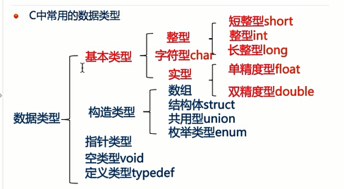
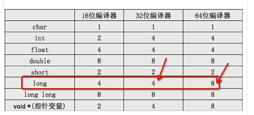
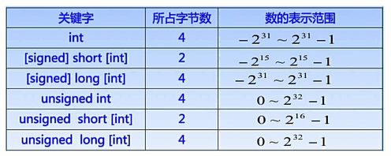
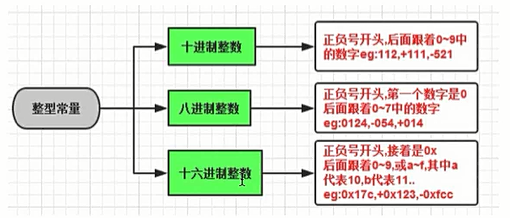
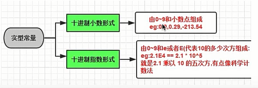
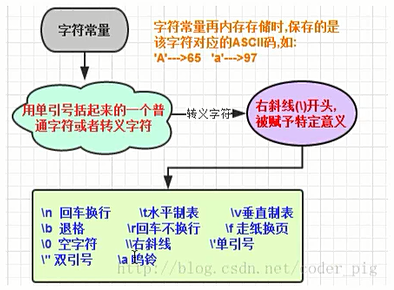
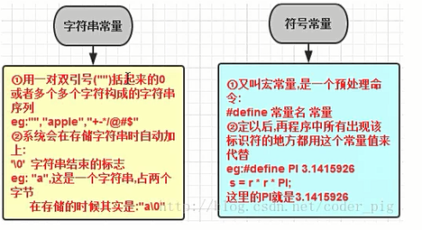
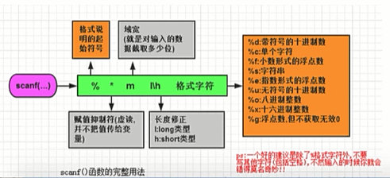
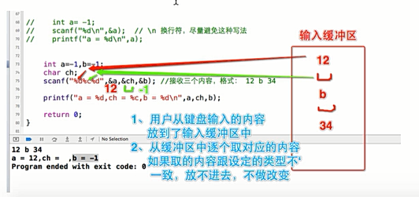

<!-- TOC -->

- [day1](#day1)
    - [关键字及分类](#关键字及分类)
    - [标识符概念及其命名原则](#标识符概念及其命名原则)
    - [标识符的命名规范](#标识符的命名规范)
    - [数据及数据类型](#数据及数据类型)
    - [数据类型的内存占用及范围](#数据类型的内存占用及范围)
    - [常量的概述及分类](#常量的概述及分类)
    - [不同类型的常量表示方法](#不同类型的常量表示方法)
    - [变量的概念定义](#变量的概念定义)
    - [变量的作用域](#变量的作用域)
    - [%f 输出精度问题](#%f-输出精度问题)
    - [printf 函数使用注意事项](#printf-函数使用注意事项)
    - [scanf 函数介绍及使用](#scanf-函数介绍及使用)
    - [scanf 使用注意事项](#scanf-使用注意事项)
    - [scanf 函数原理](#scanf-函数原理)

<!-- /TOC -->
# day1

## 关键字及分类
【了解】关键字的基本概念<br>
【理解】数据类型关键字<br>
【理解】流程控制关键字<br>

1. 关键字节本概念
关键字（保留字）就是已经被 C 语言本身实用，不能做其他用途的字
例如关键字不能用作变量名、函数名等<br>
C 语言共有 32 个关键字
`auto` `double` `int` `strcut` `break` `else` `long` `switch` `case` `enum` `register` `typedef` `char` `extern` `return` `union` `const` `float` `short`      `unsigned` `continue` `for` `signed` `void` `default` `goto` `sizeof`      `volatile` `do` `if` `while` `static`
不用专门去记忆，用多了就会了

1. 数据类型关键字
     1. 基本数据类型（5 个）
void：声明函数无返回值或无参数，声明无类型指针，显示丢弃运算结果
char：字符型类型数据，属于整型数据的一种
int：整型数据，通常为编译器指定的机器字长
float：单精度浮点型数据，属于浮点数据的一种
double：双精度浮点型数据，属于浮点数据的一种

     2. 类型修饰关键字（4 个）
short：修饰 int,短整型数据，可省略被修饰的 int
long：修饰 int,长整型数据，可省略被修饰的 int
signed：修饰整型数据，有符号数据类型
unsigned：修饰整型数据，无符号数据类型

     3. 复杂类型关键字（5 个）
struct：结构体声明
union：共用体生命
enum：枚举声明
typedef：声明类型别名
sizeof：得到特定类型或特性类型变量的大小

     4. 存储级别关键字（6 个）
auto：指定为自动变量，由编译器自动分配及释放。通常在栈上分配
static：指定为静态变量，分配在静态变量去，修饰函数时，指定函数作用域为文件内部
register：指定为寄存器变量，建议编译器将变量存储到寄存器中实用，也可以修饰函数形参，建议编译器通过寄存器而不是堆栈传递参数
extern：指定对应变量为外部变量，即标示变量或者函数的定义在别的文件中，提示编译器遇到此变量和函数时在其他模块中寻找其定义
const：与 volatile 合称"cv 特性"，指定变量不可被当前线程/进程改变（但有可能被系统或其他线程/进程改变）
volatile：与 const 合称"cv 特性"，指定变量的值有可能会被系统或其他进程/线程改变，强制编译器每次从内存中取得该变量的值

2. 流程控制关键字
     1. 跳转结构（4 个）
return：用在函数体中，返回特定值（或者是 void 值，即不返回值）
continue：结束当前循环，开始下一轮循环
break：跳出当前循环或 switch 结构
goto：无条件跳转语句

     2. 分支结构（5 个）
if：条件语句，后面不需要放分号
else：条件语句否定分支（与 if 连用）
switch：开关语句（多种分支语句）
case：开关语句中的分支标记
default：开关语句中的“其他”分之，可选

     3. 循环结构（3 个）
for：for 循环结构
do：do 循环结构
while：while 循环机构


## 标识符概念及其命名原则
【了解】标识符<br>
【掌握】标识符命名规则<br>

1. 标识符
在 C 语言中，符号常量，变量，数组，函数等都需要一定的名称，我们把这种名称成为标识符
标识符划分：关键字，预定义标识符和用户标识符

2. 标识符命名规则
    1. 只能由字母、数字、下划线或者美元符号（$）组成
    2. 不能以数字开头
    3. 不能与关键字重名
    4. 严格区分大小写


## 标识符的命名规范
【理解】标识符命名规范<br>
【了解】标识符命名规范详述<br>

1. 标识符命名规范
    1. 起一个有意义的名字（能提高代码的可读性）
    2. 驼峰命名
  如果一个标识符由多个单词组成
  第一个单词的首字母小写，其他单词的首字母都大写
  或者所有单词的首字母都大写
  
  
## 数据及数据类型
【理解】为什么要有数据类型<br>
【了解】C 语言数据类型概述<br>

1. 为什么要有数据类型<br>
什么是数据？
生活中时时刻刻都在跟数据打交道，比如体重数据、血压数据、股价数据等。在我们使用计算机过程中，会接触到各种各样的数据，有文档数据、图片数据、视频数据，还有聊 QQ 时产生的文字数据、用迅雷下载的文件数据等<br>
硬盘读取数据到内存叫输入流
从内存写到文件中去叫输出流<br>
1B(Byte 字节) = 8 bit(位)
1 KB(KByte) = 1024 B
1 MB = 1024 KB
1 GB = 1024 MB
1 TB = 1024 GB

2. C 语言数据类型概述
C 语言中有 5 大类数据类型：
基本类型、构造类型、指针类型、空类型、定义类

<div align=center>



</div>

C 中常用的数据类型
常见的数据类型有:int、float、double、char

    1. 整型：用于准确地表示整数，根据表示范围不同分为以下三种：
     短整型 (short) < 整型 (int) < 长整型 (long)
     
    2. 实型 (浮点型)：用于表示实数 (小数) 根据范围和精度不同分为以下两种：
     单精度浮点数 (float) < 双精度浮点数 (double)
     注意：float 只能够保证 7 位数字是有效<br>
     float 和 double 的区别:精确度不一样。 
     float 有效位数为 6 位
     double 有效位数为 15 位
    
    3. 字符型：用来描述单个字符，char


## 数据类型的内存占用及范围
【掌握】数据类型占用字节说明<br>
【理解】不同的数据类型表示范围<br>

1. 不同的数据类型占用不同的存储空间
2. 不同的数据类型表示范围

<div align=center>





</div>


## 常量的概述及分类
【了解】常量概述<br>
【理解】整型常量<br>

1. 常量概述
C 语言中有丰富的数据类型，在开发中，一般用常量或者变量来表示这些数据
“量”表示数据
常量，则表示一些固定的数据，也就是不能改变的数据

2. 常量分类
    1. 整型常量，也就是整常数
   二进制
   十进制
   八进制
   十六进制
    2. 实型常量
   单精度
   双精度
    3. 字符型常量
   普通字符
   转义字符
    4. 字符串常量，注意字符串常量和字符型常量是不一样的


## 不同类型的常量表示方法
【理解】整型常量<br>
【理解】实型常量<br>
【理解】字符型常量<br>
【理解】字符转型常量<br>

1. 整型常量
整型常量可以用三种样子：
    1. 十进制整数，如 356，-120,0
    2. 八进制整数，八进制形式的常量都已 0 开头，如 0123，也就是十进制中的 83；-011，也就十进制中的-9
    3. 十六进制整数，十六进制的常量都已 0x 开头，如 0x123，就是十进制的 291
    4. 二进制整数，逢二进一 0b 开头

<div align=center>



</div>

2. 实型常量
    1. 单精度的常量
   以 f 结尾，表示单精度的小数，占用 4 个字节
    2. 双精度的常量
   计算机中默认以双精度的形式表示一个小数

<div align=center>



</div>

3. 字符型常量表示
   用单引号括起来的字符，里面可以是字符、数字、符号，就是表示字符常量
   *特殊的字符常量（转义字符）
   \n 换行，相当于敲一下回车
   \t 调到下一个 tab 位置，相当于按一下键盘上的 tab 键
   \b 退格，相当于按一下 backspace
   \r 使光标回到本行开头

<div align=center>



</div>

4. 字符串常量表示
   用双引号括起来，里面可以是字符、数字、符号

<div align=center>



</div>


## 变量的概念定义
【了解】变量的基本概念
【掌握】变量的定义

1. 变量的基本概念
什么是变量？
所谓变量，它代表内存的某个空间，它的取值是可以变的，是数据的基本单元。变量由两要素构成：变量名与变量类型
程序执行过程中，它的值可以改变的数据，代表着一个存储空间，需要用变量名来找到这个数据
变量分为全局变量，局部变量。全局变量定义在函数外部，程序开始到结束一直在，而局部变量定义在函数内部，只能供函数实用，在函数内部有效
常用的数据类型：整型，实型，字符型</br>
变量为什么要区分类型
    1. 为了更加合理使用内存，不同的数据类型需要存储空间可能不一样
    2. 数据的存储格式不一样
    3. 不同数据类型他们的运算方式可能不一样
一个字节也就是八个二进制数为基本单位

2. 变量的定义和使用
变量用在什么地方？
某一个值还不确定，但是程序的执行过程中会修改这个值<br>
变量使用步骤
    1. 定义（声明）
   如何定一个变量？
   格式：变量的类型  变量的名称
   int a; //定义了一个 int 类型（4 个字节）的变量，变量名是 a</br>
   变量名的命名规范：
   1.严格遵守标识符的命名规范
   2.变量名不能同名（某些情况下可以）

    1. 变量的初始化
    int a; //不会报错，a 里面存的内容：1）随机数（垃圾数） 2）上次程序分配的存储空间，上一个程序遗留的数据 3）系统正在用的一些数据（系统的数据）
        1. 定义的同事进行初始化
        完全初始化
        //初始化格式：变量名 = 变量值
        int a=10;
        部分初始化
        int a,b=10;
    
        2. 先定义变量，后初始化
        int a;
        a=0;
 
        3. 使用一个变量，初始化另外一个变量
        int a;
        int b=10;
        a=b;//使用 b 去初始化 a

        4. 给变量连续初始化
        int a,b,c;
        a=b=c=10;
        注意：变量的第一次赋值成为初始化，以后再赋值相当于覆盖上一次的值
     
    1. 使用变量
        1. 进行赋值，赋值是要使用"="，把右侧的值放到左侧变量中 
        注意：赋值的时候，=号的左侧必须是变量
           规范：习惯将 = 的两侧各加上一个空格
        2. 变量的操作：运算 判断


## 变量的作用域
【了解】变量的作用域

1. 变量的作用域
C 语言中所有变量都有自己的作用域，申明变量的类型不同，其作用域也不同，C 语言中的变量，按照作用域的范围可分为两种，即局部变量和全局变量
   1. 局部变量
   局部变量也成为内部变量，局部变量是在函数内部或者代码块的内部定义说明的，其作用域仅限于函数内，离开函数后再使用这种变量是非法的
   局部变量的作用域还要说明以下几点：
       1. 主函数中定义的变量也只能在主函数中使用，不能再其他函数中使用。同时，主函数中也不能使用其它函数中定义的变量。因为主函数也是一个函数，它与其他函数是平行关系。
       2. 形参变量是属于被调函数的局部变量，实参变量是属于主调函数的局部变量
          出现在函数定义中的参数，就叫形参
          出现在函数调用中的参数，就叫实参
          
          ```
          int func(int a) // a 即 func 形参，写函数代码时，给传给这个函数的参数取的名字
          {
                return a;
          }
          ```
          ```
          int main()
          {
                int i = 3;
                return func(i); // i 是 func 的实参，即“调用”函数时传给函数的具体的实际的参数
          }
          ```
       3. 允许在不同的函数中使用相同的变量名，他们代表不同的对象，分配不同的单元   ，互不干扰，也不会发生混淆。虽然允许在不同的函数中使用相同的变量名，但是为了使程序明了易懂，不提倡在不同的函数中使用相同的变量名。

   2. 全局变量
   在函数的外部定义的变量


## %f 输出精度问题
【掌握】%f 输出精度问题

关于实型的精度问题<br>
对于单精度数，使用%f 格式符输出时，仅前 7 位是有效数字，小数 6 位<br>
对于双精度书，使用%lf 格式符输出时，前 16 位是有效数字，小数 6 位</br>
有效数字的位数与指定输出的小数位数（%.7f）是两码事
“有效数位为 7”：是指此数据从第一个非零数字开始，误差不超过本数位半个单位的、精确可信的位数是 7 位（包括小数点前的非零位数）<br>
%.7f：是指输出此数据的时候，小数点之后要显示 7 位数字（但是如果小数点前还有一些非零数位，那么小数点后的这 7 位并不能保证都是精确可信的有效数位）


## printf 函数使用注意事项
【理解】域宽问题
【掌握】转义字符问题

1. 域宽问题
%d：按整型数据的实际长度输出
%md：m 域宽，打印出来以后，在控制台上显示 m 位
     如果我们要打印的数的位数 > 域宽 m，则原样输出
     如果我们要打印的数的位数 < 域宽 m，则补空白，具体如下
     如果 m > 0，则左对齐（左侧补空白）
     如果 m < 0，则右对齐（右侧补空白）
%0md：表示不足部分补 0

## scanf 函数介绍及使用
【了解】scanf 函数的使用
【掌握】scanf 函数中格式控制符介绍

1. scanf 函数（阻塞式函数）
scanf 函数原型包含在标准输入输出头文件"stdio.h"中，用于接收键盘输入的内容。
格式：scanf("格式控制字符串",输入项的地址列表);</br>
在 C 语言中，一个变量的地址可以通过地址运算符&得到

<div align=center>



</div>

2. scanf 函数中格式控制符介绍
%d        输入一个十进制整数
%o        输入一个八进制整数
%x        输入一个十六进制整数
%i        输入一个有符号或无符号的十进制、八进制、十六进制整数
%u        输入一个无符号十进制整数
%c        输入一个字符
%s        输入一个字符串</br>
格式控制包括格式说明和格式字符，格式说明由%和格式字符组成。作用是将输出的数据转换成指定的格式输出，格式说明总是由%字符开始</br>
域宽小数点也占位


## scanf 使用注意事项
【掌握】scanf 使用注意事项
【掌握】scanf 中的修饰符

1. scanf 使用注意事项
   1. 如果在输入时，输入了多个空格、回车、Tab 都会被系统忽略
   2. 如果获取的内容是多个整数，中间输入了多个空格、回车、Tab 都会被系统忽略

2. scanf 中的修饰符
标识符&nbsp;&nbsp;&nbsp;&nbsp;&nbsp;意义
域宽&nbsp;&nbsp;&nbsp;&nbsp;&nbsp;&nbsp;&nbsp;&nbsp;指定输入数据的宽度
\*&nbsp;&nbsp;&nbsp;&nbsp;&nbsp;&nbsp;&nbsp;&nbsp;&nbsp;&nbsp;&nbsp;&nbsp;&nbsp;&nbsp;跳过相应数据不做处理
l 或 h&nbsp;&nbsp;&nbsp;&nbsp;&nbsp;&nbsp;&nbsp;读入长整型、双精度型或者短整型数据

*普通字符要原样输入


## scanf 函数原理
【掌握】scanf 函数原理

1. scanf 的运行原理
    1. 当用户输入内容后，用户输入的内容会被存放到 scanf 的输入缓冲区中，然后 scanf 函数会根据格式控制的字符的要求，从输入缓冲区一次取它想要的内容</br>
         如果从缓冲区中取得内容和我们的格式要求一致，则把值存放到变量中
       如果格式不一致，则不修改变量的值
       <div align=center>

        

        </div>

    2. 如果 scanf 缓冲区中还有内容，则 scanf 不会提示我们再次输入

**建议如果整型和字符型混合的时候要加上逗号**


