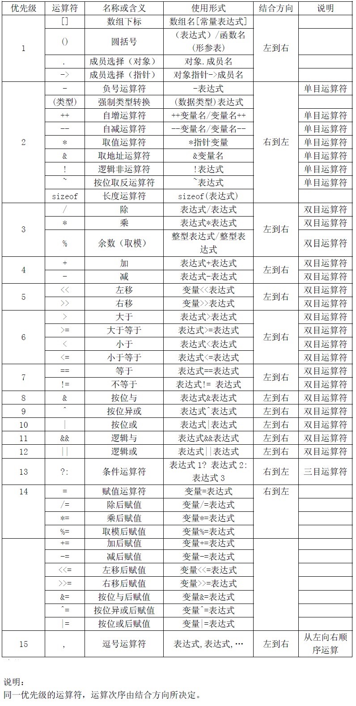
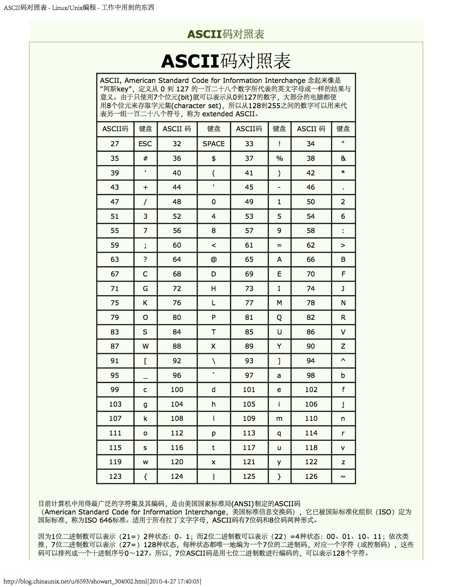
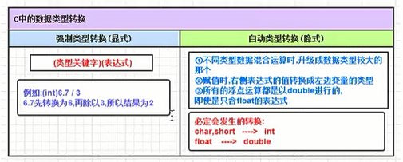
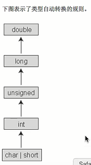
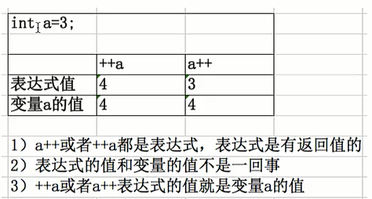
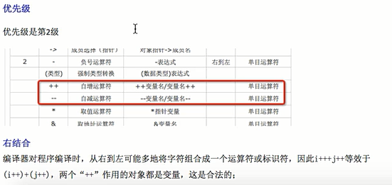
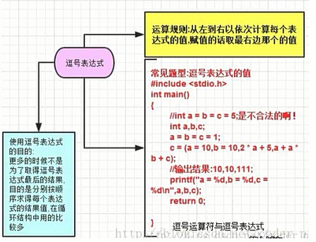
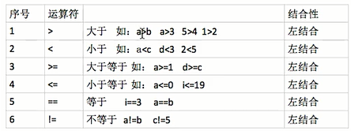
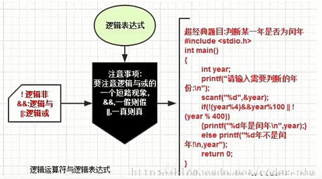
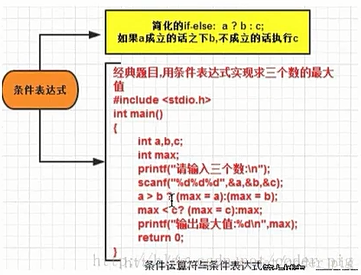

<!-- TOC -->

- [day2](#day2)
    - [运算符的概念及分类](#运算符的概念及分类)
    - [运算符的优先级及结合性](#运算符的优先级及结合性)
    - [算术运算符介绍及用法](#算术运算符介绍及用法)
    - [算术运算中类型转换问题](#算术运算中类型转换问题)
    - [数据类型转换](#数据类型转换)
    - [赋值运算符](#赋值运算符)
    - [自增自减运算符](#自增自减运算符)
    - [自增自减掌握技巧](#自增自减掌握技巧)
    - [sizeof 运算符](#sizeof-运算符)
    - [逗号运算符](#逗号运算符)
    - [关系运算符](#关系运算符)
    - [逻辑运算符](#逻辑运算符)
    - [逻辑运算符结合性和优先级](#逻辑运算符结合性和优先级)
    - [三目运算符符及求值方法](#三目运算符符及求值方法)

<!-- /TOC -->
# day2

## 运算符的概念及分类
【了解】运算符基本概念<br>
【理解】运算符分类<br>

1. 运算符基本概念
运算符是告诉编译程序执行特定算术或逻辑操作的符号

2. 分类
按功能划分：算术运算符、关系运算符与逻辑运算符、按位运算符<br>
按参与运算的操作数的个数划分：单目运算、双目运算、三目运算
单目运算符：只有一个操作数 如：i++ ! sizeof
双目运算符：有两个操作数   如：a+b
三目运算符：C 语言中唯一的一个，也称为问号表达式 a > b ? 1 : 0

## 运算符的优先级及结合性
【理解】优先级<br>
【理解】结合性<br>

1. 优先级
C 语言中，运算符的运算优先级共分为 15 级。
1 级最好，15 级最低。在表达式中，优先级较高的先于优先级较低的进行运算。而在一个运算量两侧的运算符优先级相同时，则按运算符的结合性所规定的结合方向处理

2. 结合性
C 语言中各运算符的结合性分为两种，即左结合性（自左至右）和右结合性（自右至左）
<div align=center>



</div>
<div align=center>



</div>


## 算术运算符介绍及用法 
【理解】算术运算符<br>
【掌握】结合性和优先级<br>

1. 算术运算符
\- * / %

2. 结合性和优先级
综合性：从左到右
优先级：1）* / %优先级大于 + -
&nbsp;&nbsp;&nbsp;&nbsp;&nbsp;&nbsp;&nbsp;&nbsp;&nbsp;&nbsp;&nbsp;&nbsp;&nbsp;&nbsp;&nbsp;2) 优先级相同则左结合计算

```
//经典题目：倒叙输出五位数
#include "stdio.h"
int main()
 {
    int a,i;
    printf("输入需要倒序的五位数：\n");
    scanf("%d",&a);
    printf("倒序后的五位数：\n");
    for(i=0;i<5;i++)
    {
        printf("%d",a%10);
        a/=10;
    }
    printf("\n");
    return 0;
}
```


## 算术运算中类型转换问题
【掌握】算术运算中类型转换问题<br>

1. 类型转换问题
类型转换分为：隐式数据类型转换（自动转换）和显示数据类型转换（强制类型转换）

强制类型转换格式：（要转换的类型）要转换的变量或者表达式

**注意事项**
* 用一个大数加上一个特别小的数，如果使用 float 会有问题（造成数据丢失）
* 强制类型转换是临时转换，不会改变原值


## 数据类型转换
&nbsp;
<div align=center>



</div>
<div align=center>



</div>


## 赋值运算符
【掌握】赋值运算符<br>
【理解】赋值表达式及赋值语句<br>
【理解】复合赋值运算符<br>

1. 什么是表达式？
将同类型的数据（如常量、变量、函数等），用运算符号按一定的规则连接起来的、有意义的式子称为表达式，一定有返回值

2. 赋值表达式
把“=”定义为运算符，从而组成赋值表达式
*具有右结合性

3. 复合赋值运算符

```
+=      a+=3  ---->  a=a+3;    
-+    
*=
/=
%=
```


## 自增自减运算符
【了解】自增、自减运算符介绍<br>
【掌握】自增、自减运算符求值过程<br>

1. 自增、自减运算符介绍
在程序设计中，经常遇到 "i=i+1" 这种极为常用的操作。C 语言为这种操作提供了两个更为间接地运算符，即 ++ 和 --，分别叫做自增运算符合自减运算符。它们是单目运算符，是从右向左结合的算术运算符。

2. 自增、自减运算符求值过程
    1. 前缀表达式：++x，--x；其中 x 表示变量名，先完成变量的自增自减 1 运算，再用 x 的值作为表达式的值；即“先变后用”，也就是变量的值先变，再用变量的值参与运算

    2. 后缀表达式：x++，x--；先用 x 的当前值作为表达式的值，再进行自增自减 1 运算。即"先用后变"，也就是先用变量的值参与运算，变量的值再进行自增自减变化。

**不管是 a++还是++a，最终执行完以后，a 的值都会被+1**

自增、自减运算只能用于单个变量，只要是标准类型的变量，不管是整型、实型，还是字符型变量等，但不能用于表达式（表达式必有返回值）或常量。
<div align=center>



</div>
<div align=center>



</div>


## 自增自减掌握技巧
【掌握】优先级和结合性<br>
【理解】典型问题分析<br>

技巧：
i++    先看到的是变量，表达式的值就是变量的值
++i    先看到的是++，先让 i 的值+1


## sizeof 运算符
【了解】sizeof 运算符介绍<br>
【理解】使用方法<br>

1. sizeof 运算符介绍
sizeof 是 C 语言中的一种单目运算符，如 C 语言中的其他操作符++、--等。sizeof 操作符以字节形式给出了其操作数的存储大小。操作数可以使一个表达式或括在括号内的类型名。操作数的存储大小由操作数的类型决定<br>
用法：sizeof(类型说明符，数组名或表达式);
      sizeof 常量/变量名 也就是可以省略括号    
作用：就是返回一个对象（常量、变量）或者数据类型所占内存字节数

2. 使用方法
    1. 用 sizeof 运算符计算常量在内存中占用的字节数 
char 类型的常量存储占 4 个字节，先取出 ASCII 码值当成整型的数存到计算机中
char 类型的变量存储占 1 个字节，先取出 ASCII 码值转化为二进制（1 个字节）的数存到计算机中

    2. 用 sizeof 运算符计算变量在内存中占用的字节数

    3. 用 sizeof 计算某一数据类型在内存中占用的字节数


## 逗号运算符
【了解】基本概念用法<br>
【理解】求值过程<br>

1. 基本概念
其功能是把两个表达式连接起来组成一个表达式，称为逗号表达式</br>
格式：
    表达式 1,表达式 2

2. 求值过程
分别求每个表达式的值，并以表达式 n 的值作为整个表达式的值
    表达式 1,表达式 2,⋯表达式 n
<br>
使用注意事项：
  * 逗号运算符可以嵌套使用
  * 有时候不太注重逗号表达式的值，通常是分别求逗号表达式内各表达式的值
  * 并不是所有逗号出现的地方都组成逗号表达式，如在变量声明中，函数参数表中逗号只是用作各
变量之间的间隔符
<div align=center>



</div>
			
			
## 关系运算符
【了解】基本概念用法<br>

关系运算符，主要用于较运算，比较的结果只有真或假两种情况，结果值用 BOOL 类型变量存储
<div align=center>



</div>


## 逻辑运算符
【了解】逻辑运算符概念<br>
【掌握】逻辑表达式<br>
【掌握】逻辑表达式的值<br>
【了解】逻辑表达式真值表<br>

1. 逻辑运算符概念
&&（与运算） “并且”“且”“同时”
||（或运算） “或者”
！（非运算）

2. 逻辑表达式的值
逻辑运算的值也为“真”和“假”两种，用“1”和“0”来表示。
    1. 与运算 （同真为真，一假则假）
    2. 或运算 （同假为假，一真则真）


## 逻辑运算符结合性和优先级
【掌握】逻辑运算符结合性<br>
【理解】逻辑运算符优先级<br>
【掌握】逻辑运算符短路问题<br>

1. 结合性
与运算符（&&）和或运算符（||）均为双目运算符，具有左结合性
非运算符（！）为单目运算符，具有右结合性

2. 逻辑运算符短路问题
与短路：&& 只要第一个条件表达式为假，那么后面的表达式就不参与运算
或短路：|| 只要第一个条件表达式为真，那么后面的表达式就不参与运算
<div align=center>



</div>


## 三目运算符符及求值方法
【了解】条件运算符概念<br>
【了解】求值的规则<br>
【了解】注意事项<br>

1. 条件运算符（条件运算符）概念
三目运算符（条件运算符）为?和:，它是一个三目运算符
一般形式：
  表达式 1?表达式 2:表达式 3

2. 注意事项
    1. 条件运算符的运算优先级低于关系运算符和算术运算符，但高于赋值符。因此 max=(a>b)?a:b 可以去掉括号而写为 max=a>b?a:b
    2. 条件运算符?和:是一对运算符，不能分开单独使用
    3. 条件运算符的结合方向是自右至左
<div align=center>



</div>