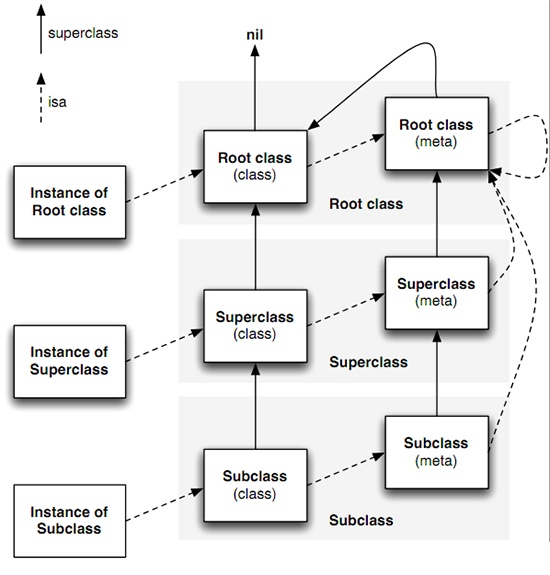

   * [全新角度剖析--iOS面试](#全新角度剖析--ios面试)
      * [iOS基础](#ios基础)
         * [- 讲讲你对 atomic &amp; nonatomic 的理解](#--讲讲你对-atomic--nonatomic-的理解)
         * [- 被 weak 修饰的对象在被释放的时候会发生什么？是如何实现的？知道 sideTable 么？里面的结构可以画出来么？](#--被-weak-修饰的对象在被释放的时候会发生什么是如何实现的知道-sidetable-么里面的结构可以画出来么)
         * [- block 用什么修饰？strong 可以？](#--block-用什么修饰strong-可以)
         * [- block 为什么能够捕获外界变量？ __block做了什么事？](#--block-为什么能够捕获外界变量-__block做了什么事)
         * [-  __block 与 __weak 的区别](#---__block-与-__weak-的区别)
         * [- 谈谈你对事件的传递和响应链的理解 （这个面试题，如果求职者能够回答一些实际开发相关的处理，不只是简单的概念，予以加分）](#--谈谈你对事件的传递和响应链的理解-这个面试题如果求职者能够回答一些实际开发相关的处理不只是简单的概念予以加分)
         * [- 谈谈 KVC 以及 KVO 的理解？](#--谈谈-kvc-以及-kvo-的理解)
         * [- RunLoop 的作用是什么？它的内部工作机制了解么？](#--runloop-的作用是什么它的内部工作机制了解么)
         * [- 苹果是如何实现 autoreleasepool 的？](#--苹果是如何实现-autoreleasepool-的)
         * [- 谈谈你对 FRP (函数响应式) 的理解，延伸一下 RxSwift 或者 RAC！](#--谈谈你对-frp-函数响应式-的理解延伸一下-rxswift-或者-rac)
         * [- 平时开发有没有玩过 Instrument ？](#--平时开发有没有玩过-instrument-)
      * [Runtime](#runtime)
         * [- 什么是 isa，isa 的作用是什么？](#--什么是-isaisa-的作用是什么)
         * [- 一个实例对象的isa 指向什么？类对象指向什么？元类isa 指向什么？](#--一个实例对象的isa-指向什么类对象指向什么元类isa-指向什么)
         * [- objc 中类方法和实例方法有什么本质区别和联系？](#--objc-中类方法和实例方法有什么本质区别和联系)
         * [- load 和 initialize 的区别？](#--load-和-initialize-的区别)
         * [- _objc_msgForward 函数是做什么的？直接调用会发生什么问题？](#--_objc_msgforward-函数是做什么的直接调用会发生什么问题)
         * [- 简述下 Objective-C 中调用方法的过程](#--简述下-objective-c-中调用方法的过程)
         * [- 能否想向编译后得到的类中增加实例变量？能否向运行时创建的类中添加实例变量？为什么？](#--能否想向编译后得到的类中增加实例变量能否向运行时创建的类中添加实例变量为什么)
         * [- 谈谈你对切面编程的理解](#--谈谈你对切面编程的理解)
      * [网络&amp;多线程](#网络多线程)
         * [- HTTP 的缺陷是什么？](#--http-的缺陷是什么)
         * [- 说一说 HTTP 中 GET 和 POST 的区别](#--说一说-http-中-get-和-post-的区别)
         * [- 谈谈三次握手，四次挥手！为什么是三次握手，四次挥手？](#--谈谈三次握手四次挥手为什么是三次握手四次挥手)
         * [- socket 连接和 Http 连接的区别](#--socket-连接和-http-连接的区别)
         * [- HTTPS，安全层除了 SSL 还有什么最新的协议？ 参数握手时首先客户端要发什么额外参数](#--https安全层除了-ssl-还有什么最新的协议-参数握手时首先客户端要发什么额外参数)
         * [- HTTPS 是什么？握手过程，SSL 原理，非对称加密了解多少](#--https-是什么握手过程ssl-原理非对称加密了解多少)
         * [- 什么时候 POP 网路，有了 Alamofire 封装网络 URLSession 为什么还要用 Moya？](#--什么时候-pop-网路有了-alamofire-封装网络-urlsession-为什么还要用-moya)
         * [- 如何实现 dispatch_once](#--如何实现-dispatch_once)
         * [- 能否写一个读写锁？谈谈具体的分析](#--能否写一个读写锁谈谈具体的分析)
         * [- 什么时候会出现死锁？如何避免？](#--什么时候会出现死锁如何避免)
         * [- 有哪几种锁？各自的原理？它们之间的区别是什么？最好可以结合使用场景来](#--有哪几种锁各自的原理它们之间的区别是什么最好可以结合使用场景来)
      * [数据结构](#数据结构)
         * [- 数据结构的存储一般常用的有几种？各有什么特点？](#--数据结构的存储一般常用的有几种各有什么特点)
         * [- 集合结构 线性结构 树形结构 图形结构](#--集合结构-线性结构-树形结构-图形结构)
         * [- 单向链表 双向链表 循环链表](#--单向链表-双向链表-循环链表)
         * [- 数组和链表区别](#--数组和链表区别)
         * [- 堆、栈和队列](#--堆栈和队列)
         * [- 输入一棵二叉树的根结点，求该树的深度？](#--输入一棵二叉树的根结点求该树的深度)
         * [- 输入一课二叉树的根结点，判断该树是不是平衡二叉树？](#--输入一课二叉树的根结点判断该树是不是平衡二叉树)
      * [算法](#算法)
         * [- 时间复杂度](#--时间复杂度)
         * [- 空间复杂度](#--空间复杂度)
         * [- 常用的排序算法](#--常用的排序算法)
         * [- 字符串反转](#--字符串反转)
         * [- 链表反转](#--链表反转)
         * [- 有序数组合并](#--有序数组合并)
         * [- 查找第一个只出现一次的字符](#--查找第一个只出现一次的字符)
         * [- 查找两个子视图的共同父视图](#--查找两个子视图的共同父视图)
         * [- 无序数组中的中位数](#--无序数组中的中位数)
         * [- 给定一个整数数组和一个目标值，找出数组中和为目标值的两个数。](#--给定一个整数数组和一个目标值找出数组中和为目标值的两个数)
      * [架构设计](#架构设计)
         * [- 设计模式是为了解决什么问题的？](#--设计模式是为了解决什么问题的)
         * [- 看过哪些第三方框架的源码，它们是怎么设计的？](#--看过哪些第三方框架的源码它们是怎么设计的)
         * [- 可以说几个重构的技巧么？你觉得重构适合什么时候来做？](#--可以说几个重构的技巧么你觉得重构适合什么时候来做)
         * [- 开发中常用架构设计模式你怎么选型?](#--开发中常用架构设计模式你怎么选型)
         * [- 你是如何组件化解耦的？](#--你是如何组件化解耦的)
      * [性能优化](#性能优化)
         * [- tableView 有什么好的性能优化方案？](#--tableview-有什么好的性能优化方案)
         * [- 界面卡顿和检测你都是怎么处理？](#--界面卡顿和检测你都是怎么处理)
         * [- 谈谈你对离屏渲染的理解？](#--谈谈你对离屏渲染的理解)
         * [- 如何降低APP包的大小](#--如何降低app包的大小)
         * [- 日常如何检查内存泄露？](#--日常如何检查内存泄露)
         * [- APP启动时间应从哪些方面优化？](#--app启动时间应从哪些方面优化)


# 全新角度剖析--iOS面试
## iOS基础
### - 讲讲你对 atomic & nonatomic 的理解
`atomic` 修饰的对象会**保证 setter 和 getter 的完整性**，**任何线程访问他都可以得到一个完整的初始化后的对象**。因为要保证操作的完成，所以速度比较慢。atomic 比 nonatomic 安全，但也不是绝对的线程安全，例如，当多个线程同时调用 set 和 get 时，就会导致获得的对象不一样。要想线程绝对安全，就要用 @synchronized。

`nonatomic` 修饰的对象**不保证 setter 和 getter 的完整性，所以当多个线程访问他时可能会返回未初始化的对象。nonatomic 比 atomic 的速度快，但是线程不安全。**
***

### - 被 weak 修饰的对象在被释放的时候会发生什么？是如何实现的？知道 sideTable 么？里面的结构可以画出来么？
释放时，调用 clearDeallocating 函数。clearDeallocating 函数首先根据对象地址获取所有 weak 指针地址的数组，然后遍历这个数组把其中的数据设为 nil，最后把这个 entry 从 weak 表中删除，最后清理对象的记录。

sideTable 这个结构体主要用于管理对象的引用计数和 weak 表。

```
struct SideTable {
    // 保证原子操作的自旋锁
    spinlock_t slock;
    // 引用计数的 hash 表
    RefcountMap refcnts;
    // weak 引用全局 hash 表
    weak_table_t weak_table;
}
```
[参考链接：笔记-更深层次的了解iOS内存管理](https://juejin.im/post/5c4821fdf265da613b70159d#heading-8)

***

### - block 用什么修饰？strong 可以？
对于这个问题得区分 MRC 环境 和 ARC 环境。Block 引用了普通外部变量，都是创建在栈区的。对于分配在栈区的对象，我们很容易会在释放之后继续调用，导致程序奔溃，所以我们使用的时候需要将栈区的对象移到堆区，来延长该对象的生命周期。

对于`MRC`环境，**使用 Copy 修饰 Block，会将栈区的 Block 拷贝到堆区。**

对于`ARC`环境，**使用 Strong、Copy 修饰 Block，都会将栈区的 Block 拷贝到堆区。**

所以，**Block 不是一定要用 Copy 来修饰的，在 ARC 环境下面 Strong 和 Copy 修饰效果是一样的。**
***

### - block 为什么能够捕获外界变量？ __block做了什么事？
为了保证 Block 内部能够正常访问外部的变量，Block 有一个`变量捕获机制`。Block 捕获外部变量仅仅只捕获 Block 闭包里面会用到的值，其他用不到的值，它并不会去捕获。

全局变量因为是全局的，作用域广，无论在哪里都可以访问，所以 Block 捕获他们进去后，进行操作，Block 结束后值依旧可以保存下来
局部变量都会被 Block 捕获，保存进了 Block 的结构体实例中，也就是 Block 自身中，自动变量是值捕获，静态变量为地址捕获。

**用 __block 修饰的外部变量引用，block 是复制其引用地址来实现访问的。block 可以修改 __block 修饰的外部变量的值。
一个局部变量加上 \__block 修饰符后跟 block 一样变成了一个 \__Block_byref_val_0 结构体类型的自动变量实例。**

```
__block int val = 10;
转换成
__Block_byref_val_0 val = {
    0,
    &val,
    0,
    sizeof(__Block_byref_val_0),
    10
};
```
***

### - \__block 与 __weak 的区别
* __block 不管是 ARC 还是 MRC 模式下都可以使用，可以修饰对象，还可以修饰基本数据类型
* __weak 只能在 ARC 模式下使用，也只能修饰对象，不能修饰基本数据类型
* \__block 对象 可以在 block 中被重新赋值，__weak 不可以
* \__block 对象在 ARC 下可能会导致循环引用，非 ARC 下会避免循环引用，__weak 只在 ARC 下使用，可以避免循环引用

__weak **可以避免循环引用**，但是其会导致外部对象释放了之后，block 内部也访问不到这个对象的问题，我们可以**通过在 block 内部声明一个 __strong 的变量来指向 weakObj，在 block 执行期间，即使外部对象释放，依然能在 block 内部保持住**，又能避免循环引用的问题。

\__block **无法避免循环引用**，但是我们可以**通过在 block 内部手动把 blockObj 赋值为 nil 的方式来避免循环引用**，**__block 对象可以在 block 中被重新赋值**。
*** 

### - 谈谈你对事件的传递和响应链的理解 （这个面试题，如果求职者能够回答一些实际开发相关的处理，不只是简单的概念，予以加分）
`事件的传递`
其实就是在**事件产生与分发之后如何寻找最优响应的一个过程**

`事件的传递`是**从上到下**（父控件到子控件）
UIApplication -> window -> viewController -> View -> 检测所有子视图

`响应者链`

* 响应者链是响应者对象的连接序列，事件或动作消息(或菜单编辑消息)依次传递。
* 允许响应者对象把事件处理的职责转交给其它更高层的对象。
* 应用程序通过向上传递一个事件来查找合适的处理对象。
* 由多个响应者对象组成的链。

`事件的响应`是**从下到上**（顺着响应者链条向上传递-子控件到父控件)
触摸的子视图 ->view -> viewController -> window -> UIApplication   

具体应用：

```
// 可以控制响应视图的响应范围
- (BOOL)pointInside:(CGPoint)point withEvent:(UIEvent *)event
```

```
// 利用响应链传参
- (void)routerEventWithName:(NSString *)eventName userInfo:(NSDictionary *)userInfo {
    //顺着相应链传递
    [[self nextResponder] routerEventWithName:eventName userInfo:userInfo];
}
```
***

### - 谈谈 KVC 以及 KVO 的理解？
KVC 键值编码：

**是一种不通过存取方法，而通过属性名称字符串间接访问属性的机制**

1. 首先查找有无属性对应的存取方法，若有，则直接使用这些方法
2. 若查询不到以上任何存取方法，则尝试直接访问实例变量
3. 若连该成员变量也访问不到，则会在下面方法中抛出异常`valueForUndefinedKey:` `setValue:forUndefinedKey:`


KVO 键值观察机制：

**是一种能使得对象获取到其他对象属性变化的通知。对目标对象的某属性添加观察，当该属性发生变化时，会自动的通知观察者**。实现 KVO 键值观察模式，被观察的对象必须使用 KVC 键值编码来修改它的实例变量，这样才能被观察者观察到。因此，KVC 是 KVO 的基础。

当观察一个对象时，一个新的类会动态被创建。这个类继承自该对象的原本的类，并重写了被观察属性的 setter 方法。重写的 setter 方法会负责在调用原 setter 方法之前和之后通知所有观察对象值的更改。最后把这个对象的 isa 指针 (isa 指针告诉 Runtime 系统这个对象的类是什么) 指向这个新创建的子类，对象就神奇的变成了新创建的子类的实例。派生类还重写了 dealloc 方法来释放资源。
***

### - RunLoop 的作用是什么？它的内部工作机制了解么？
RunLoop 是一个消息循环机制，保证线程不会退出，循环监听着各种事件源、消息，并且能在不处理消息的时候让线程休眠，避免资源占用，在接收到消息的时候唤醒线程做出对应处理。RunLoop 的设计是为了减少 CPU 无谓的空转。


***

苹果用 RunLoop 实现的功能：

* 事件响应：
**苹果注册了一个 Source1 (基于 mach port 的) 用来接收系统事件，当一个硬件事件发生**，首先由 IOKit.framework 生成一个 IOHIDEvent 事件并由 SpringBoard 接收，随后**用 mach port 转发给需要的 App 进程**，随后苹果注册的 **Source1 就会触发回调**，并调用 _UIApplicationHandleEventQueue() **进行应用内部的分发**。

* 手势识别：
当识别了一个手势时，**系统将对应的 UIGestureRecognizer 标记为待处理**，苹果**注册了一个 Observer 监测 BeforeWaiting (Loop即将进入休眠) 事件**，这个 **Observer 的回调函数**是 _UIGestureRecognizerUpdateObserver()，其内部会**获取所有刚被标记为待处理的 GestureRecognizer，并执行 GestureRecognizer 的回调**。

* 界面更新：
当在操作 UI 时，**注册了一个 Observer 监听 BeforeWaiting(Loop即将进入休眠) 和 Exit (即将退出Loop) 事件，回调去执行一个函数遍历所有待处理的 UIView/CAlayer 以执行实际的绘制和调整，并更新 UI 界面**
***

### - 苹果是如何实现 autoreleasepool 的？
AutoreleasePool 并没有单独的结构，而是由若干个AutoreleasePoolPage以双向链表的形式组合而成的栈结构

单个自动释放池的执行过程就是

`objc_autoreleasePoolPush() —> [object autorelease] —> objc_autoreleasePoolPop(void *)`

autoreleasePoolPush() 和 autoreleasePoolPop 是AutoreleasePoolPage 对应静态方法 push 和 pop 的封装
 
每当自动释放池调用objc_autoreleasePoolPush时都会把边界对象放进栈顶，然后返回边界对象，用于释放。
objc_autoreleasePoolPop传入边界对象，然后将边界对象指向的这一页 AutoreleasePoolPage 内的对象释放

[参考链接：AutoreleasePool底层实现原理
](https://juejin.im/post/5b052282f265da0b7156a2aa#heading-1)

***

### - 谈谈你对 FRP (函数响应式) 的理解，延伸一下 RxSwift 或者 RAC！
函数式编程（Functional Programming）：使用高阶函数。比如函数用其它函数作为參数。

响应式编程（Reactive Programming）：关注于数据流和变化传播。
***

### - 平时开发有没有玩过 Instrument ？
Instruments 是 Xcode 的一个工具集，为我们提供了强大的程序性能分析及测试能力。使用 Instruments 你可以做下面这些事：

* 检查一个或多个应用或进程的行为。
* **检查设备相关的功能**，比如：Wi-Fi、蓝牙等。
* 在真机或模拟器上进行**性能测试。**
* 创建自定义的 DTrace 来分析系统以及应用的各种行为。
* 跟踪源码中的问题。
* 对 App 进行**性能分析。**
* 查找 App 中的**内存问题**，比如：内存泄露(Leaked memory)、废弃内存(Abandoned memory)、僵尸(zombies)等。
* 给出**程序优化的建议。**
* 进行系统级别的问题定位。
* 通过脚本记录一个用户行为序列，从而可以通过运行脚本对你的 iOS 应用进行可重复多次的自动化测试。
* 保存测试配置模板以供复用。

[参考资料：使用 Instruments 做 iOS 程序性能调试](http://www.samirchen.com/use-instruments/)
***


## Runtime
### - 什么是 isa，isa 的作用是什么？
isa：**是和 Class 同类型的 objc_class 指针，每个实例对象有个 isa 的指针指向对象的类，类对象的指针指向其所属的类，即元类**。
初始化一个字符串对象 string，其本质就是一个 objc_object 结构体，而这个结构体的成员变量 isa 指针则表明了string is a NSString，因此这个 isa 就指向了 NSString 类，这个 NSString 类其实是类对象。
***

### - 一个实例对象的isa 指向什么？类对象指向什么？元类isa 指向什么？
一个实例对象的 isa 指向类对象
类对象的 isa 指向元类
所有的元类，包括 Root class，Superclass，Subclass 的 isa 都指向 Root class 的元类，形成一个闭环



***

### - objc 中类方法和实例方法有什么本质区别和联系？
类方法:

* 类方法属于类对象
* 类方法只能通过类对象调用
* 类方法中的 self 是类对象
* 类方法可以调用其他类方法
* 类方法中不能访问成员变量
* 类方法不能直接调用对象方法

实例方法：

* 实例方法是属于实例对象的
* 实例方法只能通过实例对象调用
* 实例方法中的 self 是实例对象
* 实例方法中可以访问成员变量
* 实例方法中直接调用实例方法
* 实例方法中也可以调用类方法（通过类名）

***

### - load 和 initialize 的区别？
`+load方法要点`
当**类被引用进项目的时候就会执行 load 函数**（**在main函数开始执行之前**），与这个类是否被用到无关，每个类的 load 函数**只会自动调用一次**。由于**系统自动加载的**，因此不需要再调用[super load]，否则父类的 load 函数会多次执行。

* **父类的 load 方法执行顺序要优先于子类**
* 当一个类未实现 load 方法时，不会调用父类 load 方法
* **类中的 load 方法执行顺序要优先于类别**
* 当有**多个类别都实现了 load 方法，这几个 load 方法都会执行**，其执行顺序与类别在 Compile Sources 中出现的顺序一致

load 一般是**用来交换方法 Method Swizzle**，由于它是**线程安全的**，而且**一定会调用且只会调用一次**，通常在**使用路由注册类**的时候也在 load 方法中注册

注意：
load 调用时机比较早，当 load 调用时，其他类可能还没加载完成，**运行环境不安全**。但是它内部使用了锁，所以是**线程安全**，应该**避线程阻塞**。

`+initialize方法要点`
initialize 在**类或者其子类的第一个方法被调用前调用**。即使类文件被引用进项目，但是没有使用，initialize 不会被调用。由于**系统自动调用**，也不需要调用父类的 initialize，否则父类的initialize会被多次执行。假如这个类放到代码中，而这段代码并没有被执行，这个函数是不会被执行的。

* **父类的 initialize 方法执行顺序要优先于子类**
* 当子类不实现 initialize 方法，父类的 initialize 方法会被优先调用一次，然后会把父类的实现继承过来调用一遍
* 当有**多个类别都实现了 initialize方法，会覆盖类中的方法，只执行一个**，会执行 Compile Sources 列表中最后一个类别的 initialize方法

initialize 方法主要用来**对一些不方便在编译期初始化的对象进行赋值**，或者说**对一些静态常量进行初始化操作** 

注意：
在 initialize 方法调用时，**运行环境基本健全**。它内部也使用了锁，所以是**线程安全**的，应该**避免线程阻塞**，不要再使用锁。
***

### - _objc_msgForward 函数是做什么的？直接调用会发生什么问题？
**_objc_msgForward 是 IMP 类型**，用于**消息转发**的，当**向一个对象发送一条消息，但它并没有实现的时候，_objc_msgForward 会尝试做消息转发**。

如果**直接调用就算实现了想调用的方法，也不会被调用**，因为会**跳过查找 IMP 的过程，直接触发消息转发**。

最常见的场景是：你想获取某方法所对应的 NSInvocation 对象。
举例说明：
JSPatch 就是直接调用 _objc_msgForward 来实现其核心功能的。
***

### - 简述下 Objective-C 中调用方法的过程
runtime 又叫运行时，是一套底层的 C 语言 API，其为 iOS 内部的核心之一，我们平时编写的 OC 代码，底层都是基于它来实现的

其实就是 Objective-C 的动态机制。runtime 执行的是编译后的代码，这时它可以动态加载方法，添加方法，修改属性，传递信息等。
对象调用方法在运行时会被动态转为消息发送，即：`objc_msgSend(receiver, selector)`
编译器翻译->给接收者发送消息->接受者响应消息

objc_msgSend 操作过程：

* **判断该对象是否为 nil，为 nil 直接 clean up，然后 return**
* **不为 nil，runtime 库就通过该对象的 isa 指针找到该对象所属的类**
* **在类的缓存以及方法列表根据 selector 查找 IMP**
* **如果没找到就找到这个类的父类，父类的父类，直到根类（一般就是 NSObject）查找 IMP**
* **如果一直查找到根类仍旧没有找到方法，程序在运行时会 crash 并抛出异常`unrecognized selector sent to XXX`。但是在这之前，运行时会给出防止程序崩溃的机会，则用`_objc_msgForward`函数指针代替 IMP，执行这个 IMP，即消息转发。**

1. 消息动态处理

    * 调用`resolveInstanceMethod:`方法，允许用户在此时为**该类动态添加实现**。如果有实现了，则调用并返回。如果仍没实现，继续下面的动作。
    * 调用`forwardingTargetForSelector:`方法，尝试**找到一个能响应该消息的代理对象**。如果获取到，则**直接转发给它**。如果返回了 nil，继续下面的动作。

2. 消息转发

    * 调用`methodSignatureForSelector:`方法，**尝试获得一个方法签名**。如果获取不到，则直接调用`doesNotRecognizeSelector`抛出异常。
    * 调用`forwardInvocation:`方法，将第三步**获取到的方法签名包装成 NSInvocation 传入**，在**该方法中重定向方法，传递调用信息，对象接收消息并打印**。

补充说明：runtime 铸就了 Objective-C 是动态语言的特性，使得 C 语言具备了面向对象的特性，在程序运行期创建，检查，修改类、对象及其对应的方法，这些操作都可以使用 runtime 中的对应方法实现。
***

### - 能否想向编译后得到的类中增加实例变量？能否向运行时创建的类中添加实例变量？为什么？
**不能**向**编译后**得到的类中增加实例变量，**能**向**运行时**创建的类中添加实例变量。

因为编译后的**类已经注册在 runtime 中**，类结构体中的 objc_ivar_list **实例变量的链表**和 instance_size **实例变量的内存大小**已经确定，同时 runtime 会调用 class_setIvarLayout 或 class_setWeakIvarLayout 来**处理了 strong weak 引用**，所以不能向存在的类中添加实例变量

运行时创建的类是可以添加实例变量，**调用 class_addIvar 函数**，但是得在**调用 objc_allocateClassPair 之后**，objc_registerClassPair之前，原因同上。
***

### - 谈谈你对切面编程的理解
面向切面编程就是通过**预编译和运行期动态代理实现给程序动态统一添加功能**的一种技术。

比如如果需要在每个控制器的 viewDidLoad 里面都需要添加统计代码，或者每个类都需要添加日志代码。其实上面的需求很容易想到在每个控制器里面都写一遍，这样的话会有很多重复的代码而且不好维护。另外也可以用继承，但是用继承无形中增加了类的强耦合，所以都不是最好的办法。

这时可能很容易想到 runtime 中 method swizzle。**method swizzle 是 runtime 的黑魔法之一，也就是在无法看到一个类的源代码的情况下，改变方法实现或者偷换方法实现的一种强大技术**。method swizzle确实是一个很好的方法，而且降低了业务逻辑各个部分的耦合性。

method swizzle 应用：
防止数组取值时越界崩溃
处理按钮重复点击
***


## 网络&多线程
### - HTTP 的缺陷是什么？
**通信使用明文（不加密），内容可能会被窃听。
不验证通信方的身份，因此有可能遭遇伪装。
无法证明报文的完整性，所以有可能已遭篡改。**

### - 说一说 HTTP 中 GET 和 POST 的区别
* 从**方向**上看，**GET 是从服务器端获取信息的，POST 是向服务器端发送信息的**。
* 从**类型**上看，**GET 处理静态和动态内容，POST 只处理动态内容**。
* 从**参数位置**看，**GET的 参数在其 URI 里，POST 的参数在其包体里，从这个角度看 POST 比 GET 更加安全、隐秘**。
* **GET 可以被缓存，可以被存储在浏览器的浏览历史中，其内容从理论上来说有长度限制，POST 恰恰相反**。

***

### - 谈谈三次握手，四次挥手！为什么是三次握手，四次挥手？
三次握手而不是两次握手是因为**防止已经失效的连接请求报文突然又传送到了服务器**，两次握手的机制会让客户端和服务器再次建立连接，导致不必要的错误和资源的浪费。如果采用的是三次握手，就算是**已经失效的报文传送过来了，服务端接受到了那条失效报文并且回复了确认报文，但是客户端不会再次发出确认。由于服务器收不到确认，就知道客户端并没有请求连接**。

四次挥手是因为**TCP 是全双工模式，这就意味着，当主机1发出FIN报文段时，只是表示主机1已经没有数据要发送了**，主机1告诉主机2，它的数据已经全部发送完毕了；但是，这个时候主机1还是可以接受来自主机2的数据；当主机2返回ACK报文段时，表示它已经知道主机1没有数据发送了，但是主机2还是可以发送数据到主机1的；**当主机2也发送了FIN报文段时，这个时候就表示主机2也没有数据要发送了，就会告诉主机1，我也没有数据要发送，之后就会中断这次TCP连接**。

***

### - socket 连接和 Http 连接的区别
`http连接` 就是所谓的**短连接**，即**客户端向服务器端发送一次请求，服务器端响应后连接即会断掉**。
`socket连接` 就是所谓的**长连接**，理论上**客户端和服务器端一旦建立起连接将不会主动断掉**，但是由于各种环境因素可能会使连接断开。
***

### - HTTPS，安全层除了 SSL 还有什么最新的协议？ 参数握手时首先客户端要发什么额外参数
**TSL 是 SSL 的升级版**，目前应用最广泛的是 TSL 1.0，接下来是 SSL 3.0，但是主流浏览器已经实现了 TSL 1.2 的支持。

`客户端先向服务器发出加密通信的请求(ClientHello)`:

* 安全协议版本号，比如 TLS 1.0 版
* **一个客户端生成的随机数，用于生成“对话密钥”**
* 客户端支持的加密算法列表
* 会话 ID
* 压缩算法

[参考链接：HTTP + SSL = HTTPS](https://www.jianshu.com/p/29a90d057510)
***

### - HTTPS 是什么？握手过程，SSL 原理，非对称加密了解多少
HTTPS（全称：Hypertext Transfer Protocol over Secure Socket Layer），是以安全为目标的HTTP通道，简单讲是 **HTTP 的安全版**。即 **HTTP 下加入 SSL 层**，**HTTPS 的安全基础是 SSL，因此加密的详细内容就需要 SSL**。用于安全的 HTTP 数据传输。HTTPS 存在不同于 HTTP 的**默认端口及一个加密/身份验证层**（在HTTP与TCP之间）。这个系统的最初研发由NetScape(网景)公司进行，提供了身份验证与加密通讯方法，现在它被广泛用于万维网上安全敏感的通讯，例如交易支付方面。

`https 和 http 的区别`：
1. **https 协议需要到 ca 申请证书**，一般免费证书很少，需要交费。
2. **http 是超文本传输协议，信息是明文传输，https 则是具有安全性的 ssl 加密传输协议**。
3. **http 和 https 使用的是完全不同的连接方式，用的端口也不一样，前者是80，后者是443**。
4. **http 的连接很简单，是无状态的；https 协议是由 ssl+http 协议构建的可进行加密传输、身份认证的网络协议，比 http 协议安全**。

HTTPS连接建立流程：

1. 客户端访问 HTTPS 连接：客户端先向服务器发出加密通信的请求，发送安全协议版本号、支持的加密算法列表、随机数等发给服务端。
2. 服务端发送证书给客户端：服务器收到客户端请求后，向客户端发出回应，选择一种支持的对称算法(如 AES)。在发送加密算法的同时还会把数字证书和随机数发送给客户端。
3. 客户端验证 server 证书：客户端收到服务器回应以后，首先验证服务器证书，如果证书不是可信机构颁布、或者证书中的域名与实际域名不一致、或者证书已经过期，就会向访问者显示一个警告，由其选择是否还要继续通信如果证书没有问题。如果验证通过客户端就会从证书中取出服务器的公钥。
4. 客户端组装会话秘钥：客户端会用服务器公钥来生成一个前主秘钥(Pre-Master Secret，PMS)，并通过该前主秘钥和客户端随机数、服务端随机数来组装成会话秘钥
5. 客户端将前主秘钥加密发送给服务端：通过服务端的公钥来对前主秘钥进行非对称加密，发送给服务端
6. 服务端通过私钥解密得到前主秘钥：服务端接收到加密信息后，用私钥解密得到前主秘钥
7. 服务端组装会话秘钥：服务端通过前主秘钥和客户端随机数、服务端随机数来组装会话秘钥。服务端和客户端都已经知道了用于此次会话的主秘钥
8. 数据传输

SSL协议的基本过程：


1.客户端生成客户端随机数，客户端（通常是浏览器）先向服务器发出加密通信的请求，发送客户端随机数，向服务器端索要公钥
2.服务器收到客户端请求后，生成服务端随机数，向客户端发出回应，回应信息包括服务端随机数，服务器证书(包含公钥) 
3.客户端收到后，验证服务器证书的有效性，取出公钥，生成前主秘钥，使用公钥加密前主秘钥，发给服务器
4.服务器回应， 至此，服务器和客户端都有3个随机数，使用3个随机数生成这次的会话秘钥(即对称秘钥)，二者开始使用对称加密通讯。服务器通知客户端：编码改变通知，表示随后的信息都将用双方商定的加密方法和密钥发送。服务器握手结束通知，表示服务器的握手阶段已经结束
5.之后二者将通过对称加密来通讯

SSL安全实现原理：
SSL 提供了用于启动 TCP/IP 连接的安全性“信号交换”:
1. 这种信号交换导致客户和服务器同意将使用的安全性级别，并履行连接的任何身份验证要求
2. 通过数字签名和数字证书可实现浏览器和Web服务器双方的身份验证
3. 在用数字证书对双方的身份验证后，双方就可以用保密密钥进行安全的会话了。

```
对称加密：密钥只有一个，加密解密为同一个密码，且加解密速度快，典型的对称加密算法有DES、AES等；
```
```
非对称加密：密钥成对出现（且根据公钥无法推知私钥，根据私钥也无法推知公钥），加密解密使用不同密钥（公钥加密需要私钥解密，私钥加密需要公钥解密），相对对称加密速度较慢，典型的非对称加密算法有RSA、DSA等。
```
***

### - 什么时候 POP 网路，有了 Alamofire 封装网络 URLSession 为什么还要用 Moya？
POP 网络：面向协议编程的网络能够大大降低耦合度。
网络层下沉，业务层上浮，中间利用 POP 网络的 Moya 隔开。
***

### - 如何实现 dispatch_once
dispatch_once 用**原子性操作标记执行 block 执行情况**，同时用**信号量确保只有一个线程执行 block**，等 block 执行完再唤醒所有等待中的线程。

dispatch_once 常被用于创建单例、swizzeld method等功能。

[参考链接：深入浅出 GCD 之 dispatch_once
](https://xiaozhuanlan.com/topic/7916538240)
***

### - 能否写一个读写锁？谈谈具体的分析
自定义并行队列，利用 dispatch_barrier_async 方法，在**栅栏中的任务会等待在它之前加入到队列的任务都完成，才会执行**，在他之后加入队列的任务也会等它完成后才执行，保证每次“写”的时候是线程安全的。

```
//初始化 异步队列
self.rwqueue = dispatch_queue_create("rw.thread", DISPATCH_QUEUE_CONCURRENT);
dispatch_queue_t queue = dispatch_get_global_queue(0, 0);
for (NSInteger i = 0; i < 5; i ++) {
	dispatch_async(queue, ^{
		[self readBarryier];
		[self readBarryier];
		[self readBarryier];
		[self writeBarrier];
	});
}

- (void)readBarryier{
   //添加任务到rwqueue
	dispatch_async(self.rwqueue, ^{
		NSLog(@"读文件 %@",[NSThread currentThread]);
		sleep(1);
	});
}
- (void)writeBarrier{
   //barrier_async添加任务到self.rwqueue中
	dispatch_barrier_async(self.rwqueue, ^{
		NSLog(@"写入文件 %@",[NSThread currentThread]);
		sleep(1);
	});
}

//log

2019-07-30 11:16:53 读文件 <NSThread: 0x600001ae0740>{number = 9, name = (null)}
2019-07-30 11:16:53 读文件 <NSThread: 0x600001ae8500>{number = 10, name = (null)}
2019-07-30 11:16:53 读文件 <NSThread: 0x600001ae8040>{number = 8, name = (null)}
2019-07-30 11:16:53 读文件 <NSThread: 0x600001ac3a80>{number = 11, name = (null)}
2019-07-30 11:16:54 写入文件<NSThread: 0x600001ac3a80>{number = 11, name = (null)}
2019-07-30 11:16:55 写入文件<NSThread: 0x600001ac3a80>{number = 11, name = (null)}
2019-07-30 11:16:56 写入文件<NSThread: 0x600001ac3a80>{number = 11, name = (null)}
```

读写任务都添加到异步队列 rwqueue 中，使用**栅栏函数 dispatch_barrier_async 拦截一下，实现读写互斥**，读可以异步无限读，写只能一个同步写的功能。

[参考链接：谈谈iOS多线程的锁](https://juejin.im/post/5a0a92996fb9a0451f307479#heading-15)
[参考链接：iOS底层原理 多线程之安全锁以及常用的读写锁](https://juejin.im/post/5d395318f265da1b8608ca98#heading-20)
***

### - 什么时候会出现死锁？如何避免？
死锁是指**两个或两个以上的进程在执行过程中，由于竞争资源或者由于彼此通信而造成的一种阻塞的现象，若无外力作用，它们都将无法推进下去**。此时称系统处于死锁状态或系统产生了死锁，这些永远在互相等待的进程称为死锁进程。是操作系统层面的一个错误，是进程死锁的简称。

死锁的产生满足一些特定条件：

1. **互斥条件**：进程对于所分配到的资源具有排它性，即一个资源只能被一个进程占用，直到被该进程释放。
2. **请求和保持条件**：一个进程因请求被占用资源而发生阻塞时，对已获得的资源保持不放。
3. **不剥夺条件**：任何一个资源在没被该进程释放之前，任何其他进程都无法对他剥夺占用。
4. **循环等待条件**：当发生死锁时，所等待的进程必定会形成一个环路（类似于死循环），造成永 久阻塞。

在系统设计、进程调度等方面注意如何不让这四个必要条件成立，如何确定资源的合理分配算法，避免进程永久占据系统资源。此外，也要防止进程在处于等待状态的情况下占用资源。因此，对资源的分配要给予合理的规划 
***

### - 有哪几种锁？各自的原理？它们之间的区别是什么？最好可以结合使用场景来

[参考链接：谈谈iOS多线程的锁](https://juejin.im/post/5a0a92996fb9a0451f307479#heading-13)
[参考链接：iOS底层原理 多线程之安全锁以及常用的读写锁 --(11)](https://juejin.im/post/5d395318f265da1b8608ca98#heading-9)
***


## 数据结构
### - 数据结构的存储一般常用的有几种？各有什么特点？
`顺序存储方式`顺序存储方式就是在**一块连续的存储区域一个接着一个的存放数据**。顺序存储方式把逻辑上相连的结点存储在物理位置上相邻的存储单元里，**结点间的逻辑关系由存储单元的邻接关系来体现**。顺序存储方式也称为顺序存储结构，一般采用数组或者结构数组来描述。 线性存储方式主要用于线性逻辑结构的数据存放，而对于图和树等非线性逻辑结构则不适用。

`链接存储方式`链接存储方式比较灵活，其**不要求逻辑上相邻的结点在物理位置上相邻，结点间的逻辑关系由附加的引用字段表示**。一个结点的引用字段往往指导下一个结点的存放位置。一般在原数据项中增加应用类型来表示结点之间的位置关系。

`索引存储方式`**采用附加索引表的方式来存储结点信息的一种存储方**式。索引表由若干个索引项组成。索引存储方式中索引项的一般形式为：（关键字、地址）。其中，关键字是能够唯一标识一个结点的数据项。
索引存储方式还可以细分为如下两类：
`稠密索引（dense index）`：这种方式中每个结点在索引表中都有一个索引项。其中，索引项的地址指示结点所在的的存储位置；
`稀疏索引（spare index）`：这种方式中一组结点在索引表中只对应一个索引项。其中，索引项的地址指示一组结点的起始存储位置。

`散列存储方式`**根据结点的关键字直接计算出该结点的存储地址**的一种存储的方式。
***

### - 集合结构 线性结构 树形结构 图形结构
***

### - 单向链表 双向链表 循环链表
***

### - 数组和链表区别
`数组` 数组元素在内存上连续存放，可以通过下标查找元素，插入、删除需要移动大量元素，比较适用于元素很少变化的情况
`链表` 链表中的元素在内存中不是顺序存储的，查找慢，插入、删除只需要对元素指针重新赋值，效率高
***

### - 堆、栈和队列
***

### - 输入一棵二叉树的根结点，求该树的深度？

```
class BinaryTreeNode {
    var left: BinaryTreeNode?
    var right: BinaryTreeNode?
    var value: Int
    
    init(value: Int, left: BinaryTreeNode?, right: BinaryTreeNode?) {
        self.value = value
        self.left = left
        self.right = right
    }
}

func treeDepth(_ root: BinaryTreeNode?) -> Int {
    guard root != nil else {
        return 0
    }
    let left = treeDepth(root?.left)
    let right = treeDepth(root?.right)
    return max(left, right) + 1
}
```
***

### - 输入一课二叉树的根结点，判断该树是不是平衡二叉树？

```
bool IsBalanced(TreeNode* pRoot){
    if(pRoot==NULL)
        return true;
    int left=TreeDepth(pRoot->left);
    int right=TreeDepth(pRoot->right);
    int diff=left-right;
    if(diff>1 || diff<-1)
        return false;
    return IsBalanced(pRoot->left) && IsBalanced(pRoot->right);
}
```
[参考链接：输入一课二叉树的根结点，判断该树是不是平衡二叉树？](https://www.jianshu.com/p/c47097a01762)
***


## 算法
### - 时间复杂度
***

### - 空间复杂度
***

### - 常用的排序算法
1. 冒泡排序
2. 选择排序
3. 插入排序
4. 希尔排序
5. 快速排序
6. 归并排序
7. 堆排序

[参考链接：常见的7种排序算法](https://blog.csdn.net/liang_gu/article/details/80627548)
***

### - 字符串反转

[翻转字符串.playground](https://github.com/sxxjaeho/iOS-Primer/blob/master/contents/Swift/Arithmetic/Code/翻转字符串.playground)

题目：输入一个英文句子，翻转句子中单词的顺序，但单词内字符的顺序不变。为简单起见，标点符号和普通字母一样处理。例如输入字符串"I am a student."，则输出"student. a am I"。

```
func reverse<T> (_ chars: inout Array<T>, _ begin: Int, _ end: Int) {
    var begin = begin
    var end = end
    
    while begin < end {
        chars.swapAt(begin, end)
        begin += 1
        end -= 1
    }
}

func reverseSentence(_ sentence: String?) -> String? {
    guard let sentence = sentence else {
        return nil
    }
    var chars = Array(sentence)
    var start = 0
    reverse(&chars, 0, chars.count - 1)
    for i in 0..<chars.count {
        if i == chars.count - 1 || chars[i + 1] == " " {
            print(i)
            reverse(&chars, start, i)
            start = i + 2
        }
    }
    return String(chars)
}

print(reverseSentence("I am a student.") ?? "")
```

***

### - 链表反转

[反转链表.playground](https://github.com/sxxjaeho/iOS-Primer/blob/master/contents/Swift/Arithmetic/Code/反转链表.playground)

题目：定义一个函数，输入一个链表的头结点，反转该链表并输出反转后链表的头结点。链表节点定义如下：

```
class ListNode {
    var value: Int
    var next: ListNode?
    
    init(_ value: Int) {
        self.value = value
    }
    
    func next(_ value: Int) -> ListNode {
        let node = ListNode(value)
        next = node
        return node
    }
}

func reverseList(_ head: ListNode?) -> ListNode? {
    var reversedHead: ListNode? = nil
    var node: ListNode? = head
    var prev: ListNode? = nil
    while node != nil {
        let next = node?.next
        if next == nil {
            reversedHead = node
        }
        node?.next = prev
        prev = node
        node = next
    }
    return reversedHead
}

func traverseList(_ head : ListNode?) {
    var node = head
    while node != nil {
        print(node?.value ?? 0)
        node = node?.next
    }
}


let head = ListNode(1).next(2).next(3).next(4).next(5)
print("原链表:")
traverseList(head)

let newHead = reverseList(head)
print("反转链表:")
traverseList(newHead)
```   

***

### - 有序数组合并

[合并两个有序数组.playground](https://github.com/sxxjaeho/iOS-Primer/blob/master/contents/Swift/Arithmetic/Code/合并两个有序数组.playground)

题目：给定两个有序整数数组 nums1 和 nums2，将 nums2 合并到 nums1 中，使得 num1 成为一个有序数组。

```
func merge(_ nums1: inout [Int], _ m: Int, _ nums2: [Int], _ n: Int) {
    var i = m - 1, j = n - 1
    if m == 0 {
        nums1 = nums2
    } else {
        while i >= 0 || j >= 0{
            if j < 0 || (i >= 0 && j >= 0 && nums1[i] > nums2[j]){
                nums1[i + j + 1] = nums1[i]
                i -= 1
            } else {
                nums1[i + j + 1] = nums2[j]
                j -= 1
            }
        }
    }
    print(nums1)
}

var nums1 = [1, 2, 3, 0, 0, 0]
var nums2 = [2, 5, 6]
merge(&nums1, 3, nums2, 3)
```

***

### - 查找第一个只出现一次的字符

[字符串中第一个只出现一次的字符.playground](https://github.com/sxxjaeho/iOS-Primer/blob/master/contents/Swift/Arithmetic/Code/字符串中第一个只出现一次的字符.playground)

题目：字符串中第一个只出现一次的字符。
在字符串中找出第一个只出现一次的字符。如输入“abaccdeff”，则输出“b”。

```
// 题目：字符串中第一个只出现一次的字符。
// 在字符串中找出第一个只出现一次的字符。如输入“abaccdeff”，则输出“b”

func firstNotRepeatingChar(_ string: String) -> Character? {
    let chars = Array(string)
    var dictionary = [Character: Int]()
    for char in chars {
        if dictionary[char] == nil {
            dictionary[char] = 1
        } else {
            dictionary[char]! += 1
        }
    }
    print(dictionary)
    for char in chars {
        if dictionary[char]! == 1 {
            return char
        }
    }
    return nil
}

print(firstNotRepeatingChar("abaccdeff") ?? "")
```

***

### - 查找两个子视图的共同父视图

```
- (NSArray <UIView *> *)findCommonSuperView:(UIView *)viewOne other:(UIView *)viewOther {

    NSMutableArray *result = [NSMutableArray array];
    
    // 查找第一个视图的所有父视图
    NSArray *arrayOne = [self findSuperViews:viewOne];
    // 查找第二个视图的所有父视图
    NSArray *arrayOther = [self findSuperViews:viewOther];
    
    int i = 0;
    // 越界限制条件
    while (i < MIN((int)arrayOne.count, (int)arrayOther.count)) {
        // 倒序方式获取各个视图的父视图
        UIView *superOne = [arrayOne objectAtIndex:arrayOne.count - i - 1];
        UIView *superOther = [arrayOther objectAtIndex:arrayOther.count - i - 1];
        
        // 比较如果相等 则为共同父视图
        if (superOne == superOther) {
            [result addObject:superOne];
            i++;
        }
        // 如果不相等，则结束遍历
        else{
            break;
        }
    }
    
    return result;
}

- (NSArray <UIView *> *)findSuperViews:(UIView *)view {
    // 初始化为第一父视图
    UIView *temp = view.superview;
    // 保存结果的数组
    NSMutableArray *result = [NSMutableArray array];
    while (temp) {
        [result addObject:temp];
        // 顺着superview指针一直向上查找
        temp = temp.superview;
    }
    return result;
}
```

***

### - 无序数组中的中位数

[数据流中的中位数.playground](https://github.com/sxxjaeho/iOS-Primer/blob/master/contents/Swift/Arithmetic/Code/数据流中的中位数.playground)

题目：如何得到一个数据流中的中位数？如果从数据流中读出奇数个数值，那么中位数就是所有数值排序之后位于中间的数值。如果从数据流中读出偶数个数值，那么中位数就是所有数值排序之后中间两个数的平均值。

```
func getMedian(_ nums: [Int]) -> Double? {
    if nums.count == 0 { return nil }
    var max = Heap<Int>(sort: >) // 存放数组左边数据
    var min = Heap<Int>(sort: <) // 存放数组右边数据
    for num in nums {
        var operateNum = num
        if (max.count + min.count) % 2 == 0 {
            if max.count > 0 && num < max.peek()! {
                operateNum = max.peek()!
                max.insert(num)
                max.remove()
            }
            min.insert(operateNum)
        } else {
            if min.count > 0 && num > min.peek()! {
                operateNum = min.peek()!
                min.insert(num)
                min.remove()
            }
            max.insert(operateNum)
        }
    }
    let size = min.count + max.count
    if size % 2 == 0 {
        return Double((min.peek()! + max.peek()!)) / 2
    } else {
        return Double(min.peek()!)
    }
}

let array = [5, 8, 1, 3, 6, 2, 9];
print(getMedian(array) ?? 0)
```

***

### - 给定一个整数数组和一个目标值，找出数组中和为目标值的两个数。

[和为s的数字.playground](https://github.com/sxxjaeho/iOS-Primer/blob/master/contents/Swift/Arithmetic/Code/和为s的数字.playground)

题目：输入一个递增排序的数组和一个数字 s，在数组中查找两个数，使得它们的和正好是 s。如果有多对数字的和等于 s，输出任意一对即可。

```
func findNumbersWithSum(_ nums: [Int], _ sum: Int) -> (num1: Int, num2: Int)? {
    if nums.count < 2 {
        return nil
    }
    
    var ahead = nums.count - 1
    var behind = 0
    
    while ahead > behind {
        let curSum = nums[ahead] + nums[behind]
        if curSum == sum {
            return (nums[behind], nums[ahead])
        } else if curSum > sum {
            ahead -= 1
        } else {
            behind += 1
        }
    }
    return nil
}

let result = findNumbersWithSum([1, 2, 4, 7, 11, 15], 10)
if result != nil {
    print(result!)
} else {
    print("未找到符合条件的两个数")
}
```

***

## 架构设计
### - 设计模式是为了解决什么问题的？
设计模式（Design pattern）是一套被反复使用、多数人知晓的、经过分类编目的**代码设计经验的总结**。**是前人总结、面对开发中常见问题的解决方案，就是程序开发的套路和模板**，使用设计模式是为了可重用代码、让代码更容易被他人理解、保证代码可靠性。
设计模式最主要解决的问题是通过**封装**和**隔离变化**来**处理软件的各种变化问题**。隔离变化的好处在于，将系统中经常变化的部分和稳定的部分隔离**有助于增加复用性，并降低系统耦合度**。很多设计模式的意图中都明显地指出了其对问题的解决方案，学习设计模式的要点是发现其解决方案中封装的变化点。

* 单例模式
* 装饰模式
* 观察者模式
* 备忘录模式

***

### - 看过哪些第三方框架的源码，它们是怎么设计的？
***

### - 可以说几个重构的技巧么？你觉得重构适合什么时候来做？
* 重复代码的提炼
* 冗长方法的分割
* 嵌套条件分支的优化
* 去掉一次性的临时变量
* 消除过长参数列表
* 提取类或继承体系中的常量
* 让类提供应该提供的方法
* 拆分冗长的类
* 提取继承体系中重复的属性与方法到父类

在新功能增加时候。
在扩展不再简单的时候。
**重构是一个不断的过程**

***

### - 开发中常用架构设计模式你怎么选型?
`MVC（Model-View-Controller）`

**Model 负责处理数据**
**View 负责处理 UI**
**Controller 是 View 和 Model 的桥梁**，将数据从 Model 层传送到 View 层并展示出来，同时将 View 层的交互传送到 Model 层以改变数据

优点：

* 代码量少
* 简单易懂

缺点：**视图层和控制层高耦合，代码分配过于笼统**

* 代码过于集中
* 难以进行测试
* 难以扩展
* Model层过于简单
* 网络请求逻辑无从安放

MVC 的中间层 Controller 持有 View 和 Model，通过传递参数和实例变量来直接完成所有操作


<br>

`MVP（Model-View-Presenter）`

**MVP 的 Model 与 MVC 的 Model 一样，View 是单独的 UIView/UIViewController，Presenter 也是单独的类**

**View**持有 Presenter 作为变量，会**调用 Presenter 处理用户交互信息**，不包含任何业务逻辑代码，只会交给 Presenter，并接收结果更新自己

**Presenter 负责业务逻辑**，是 View 和 Model 的桥接，会根据 View 的交互修改 Model，或根据 Model 的变化修改 View，**中间层不拥有视图，视图拥有中间层**

优点：耦合度降低，代码分配更合理，测试起来更方便

缺点：View 的交互都要传给 Presenter 处理，功能增加 View 和 Presenter 的代码都要增加

MVP 的中间层 Presenter 持有 Model，不拥有视图，视图拥有中间层。中间层工作流程是：从视图层接收交互传递->响应->向视图层传递响应指定->视图进行更新。全部操作手动书写完成


<br>

`MVVM（Model-View-ViewModel）`

**MVVM 的 Model 与 MVC 的 Model 一样，View 是单独的 UIView/UIViewController，ViewModel 是视图层的真正数据提供者，是视图层的交互响应者**

MVVM 中间层 ViewModel 持有 Model，完全独立于视图，视图拥有中间层，通过绑定属性自动进行更新。全部操作由响应式框架自动完成


比较三种架构：

* MVC 的耦合度很好，代码分配不合理，维护成本最高，但是因为无需层级传递，所以代码量少，适合初学者理解和使用
* MVP 和 MVVM 相似，耦合度和代码分配合理，比较容易实现搞测试覆盖率。MVP 的缺点是视图层需要将所有的交互传递给中间层，且需要手动实现响应和更新，所以代码量超 MVVM，MVVM 在响应和更新上通过响应式框架自动操作，大大精简了代码量，但是需要引入第三方响应式框架，且属性观察环环相扣，调用栈很大，Debug 起来不易
* MVC，MVP，MVVM 都是以视图为驱动的架构，皆以用户交互和视图更新为主要目标

***

### - 你是如何组件化解耦的？
最常用的是**使用统跳路由的方式**，目前比较常用的 iOS 开源路由框架主要是 JLRoutes、MGJRouter、HHRouter 等，这些路由框架各有优点和缺点，基本可以满足大部分需求，实现基本的组件化开发，实现各模块之间的解藕

[参考链接：组件化架构漫谈](https://www.jianshu.com/p/67a6004f6930)
***


## 性能优化
### - tableView 有什么好的性能优化方案？
tableView 滑动很慢可能的原因是：

* **列表渲染时间较长**，可能是因为某些 UI 控件比较复杂，或者图层过多
* **界面渲染延后**，坑内是因为大量的操作或者耗时的计算阻塞了主线程
* **数据源问题**，可能是网络请求太慢或者是需要更新的数据太多

tableview优化最主要：

* cell 是否使用了**复用机制**，而不是每一次都创建新的 cell
* **复杂视图的创建采用懒加载来推迟创建时间，尽量减少视图的层级**
* cell 避免为子控件添加多次约束，**尽量设置图片为不透明**
* 高度计算方法时**不做复杂的计算**，或者是可以用**GCD 多线程操作将复杂的计算放到后端线程**，可以**缓存高度**
* **避免快速滑动情况下开过多线程**
* 图片处理时后台下载图片后再回主线程刷新 UI，**避免阻塞主线程**，图片过大会造成 GPU 负担过大，可以在**图片下载后压缩尺寸后显示**
* 重写 drawRect 方法会离屏渲染，导致内存急剧上升，即使在这个方法里面不写一句代码，也会让内存升高

***

### - 界面卡顿和检测你都是怎么处理？
CRT 显示器原理：CRT 的电子枪会从上到下一行一行扫描，扫描完成后显示器呈现一帧画面，随后电子枪回到初始位置继续下一次扫描。为了把**显示器的显示过程和系统的视频控制器进行同步，显示器会用硬件时钟产生一系列定时信号**。电子枪换到新的**一行**，显示器会发出一个**水平同步信号**（HSync），而当**一帧**画面绘制完成后，电子枪回到原位，准备画下一帧前，显示器发送一个**垂直同步信号**（VSync）。显示器通常以固定频率进行刷新，这个刷新率就是 VSync 信号产生的频率。

为了防止双缓冲造成画面撕裂现象，**GPU 通常有一个机制叫做垂直同步**（简写也是 V-Sync），**当开启垂直同步后，GPU 会等待显示器的 VSync 信号发出后，才进行新的一帧渲染和缓冲区更新**。如果**当下一次 VSync 信号到来之前，CPU 和 GPU 还没有完成内容提交，则这一帧就会被丢弃，而显示屏保留之前的内容不变**，这就是界面卡顿的原因。

`卡顿检测`

* **主线程卡顿监控**。**通过子线程监测主线程的 runLoop，判断两个状态区域之间的耗时是否达到一定阈值**
* 使用 Instruments 中的 Core Animation 可以**监控 FPS**，要保持流畅的UI交互，**App 刷新率应该当努力保持在 60fps**。监控实现原理比较简单，通过记录两次刷新时间间隔，就可以计算出当前的 FPS
* 调试渲染选项 **XCode的 Debug -> View Debugging -> Rendering** 

`卡顿优化`
造成卡顿的原因是由 CPU 和 GPU 造成的，所有优化的时候也要从这两个方面来着手。那么解决卡顿的**主要思路就是尽可能减少 CPU、GPU 资源消耗**

ps:
`CPU`计算显示内容，视图对象的创建和销毁、布局计算、文本绘制、图片解码、图像的绘制

`GPU`负责变换、合成、纹理的渲染，把渲染结果提交到帧缓冲区

卡顿优化在 CPU 层面

* 尽量用轻量级的对象，比如用不到事件处理的地方，可以考虑使用 CALayer 取代 UIView
* 不要频繁地调用 UIView 的相关属性，比如 frame、bounds、transform 等属性，尽量减少不必要的修改
* 尽量提前计算好布局，在有需要时一次性调整对应的属性，不要多次修改属性
* Autolayout 会比直接设置 frame 消耗更多的 CPU 资源
* 图片的 size 最好刚好跟 UIImageView 的 size 保持一致
* 控制一下线程的最大并发数量
* 尽量把耗时的操作放到子线程
* 文本处理(尺寸计算、绘制)
* 图片处理(解码、绘制)

卡顿优化在 GPU 层面

* 尽量避免短时间内大量图片的显示，尽可能将多张图片合成一张进行显示
* GPU 能处理的最大纹理尺寸是 4096x4096，一旦超过这个尺寸，就会占用 CPU 资源进行处理，所以
  纹理尽量不要超过这个尺寸
* 尽量减少视图数量和层次
* 减少透明的视图(alpha<1)，不透明的就设置 opaque 为 YES
* 尽量避免出现离屏渲染


[参考链接：iOS页面卡顿及性能优化](https://wjerry.com/2019/02/02/iOS%E9%A1%B5%E9%9D%A2%E5%8D%A1%E9%A1%BF%E5%8F%8A%E6%80%A7%E8%83%BD%E4%BC%98%E5%8C%96/)
***

### - 谈谈你对离屏渲染的理解？
当前屏幕渲染的局限因素限制（只有自身上下文、屏幕缓存有限等），当前屏幕渲染有些情况下的渲染解决不了的，就使用到离屏渲染

相比于当前屏幕渲染，离屏渲染的代价是很高的，主要体现在两个方面：
1. 创建新缓冲区
2. 上下文切换

常见离屏渲染场景分析

* cornerRadius+clipsToBounds
* shadow
* group opacity
* mask
* UIBlurEffect

`检测`
通过勾选 Xcode 的 Debug -> View Debugging -> Rendering -> Run -> Color Offscreen-Rendered Yellow 项

`优化`

* 应用 AsyncDisplayKit（Texture）作为主要渲染框架，对于文字和图片的异步渲染操作交由框架来处理。
* 对于图片的圆角，不经由容器来做剪切，而是预先使用 CoreGraphics 为图片裁剪圆角
* 对于视频的圆角，由于实时剪切非常消耗性能，我们会创建四个白色弧形的 layer 盖住四个角，从视觉上制造圆角的效果
* 对于 view 的圆形边框，如果没有 backgroundColor，可以放心使用 cornerRadius 来做
* 对于所有的阴影，使用 shadowPath 来替代 shadowOffset 等属性，规避离屏渲染
* 对于特殊形状的 view，使用 layer mask 并打开 shouldRasterize 来对渲染结果进行缓存
* 对于模糊效果，不采用系统提供的 UIVisualEffect，而是另外实现模糊效果（CIGaussianBlur），并手动管理渲染结果

[参考链接：iOS 关于离屏渲染的理解 以及解决方案](https://www.jianshu.com/p/cff0d1b3c915)
[参考链接：关于iOS离屏渲染的深入研究](https://zhuanlan.zhihu.com/p/72653360)

***

### - 如何降低APP包的大小
* 可执行文件优化
  可执行文件，即和项目同名的文件，一般是占用包体积最大的那个
  * 三方库优化（删除不使用的三方库，合并功能重复的三方库）
  * 代码优化（清理 import，去掉空方法，去掉无用的 log，去掉无用的变量）
  * 文件优化（删除无用的类和文件）
  
* 资源优化（图片、音频、视频等）
  * 无用文件删除
  * 重复文件删除
  * 大文件压缩
  * On-Demand Resource（资源动态下载，只提供部分的 App 内容，只要满足基本运行即可，后续内容可以解锁下载到 App 中）

* 编译选项优化
  
* 其他技巧
  * 把相关的依赖改成动态库方式，达到共享
  * 使用 asset 管理图片
  * 开启 Bitcode（Bitcode 是一个编译好的程序的表示形式，上传新版本 App 时，App Store 会对包含 Bitcode 二进制 App 进行优化，而不需要提交一个新的 App 到 App Store）

[参考链接：iOS 瘦包常见方式梳理](https://juejin.im/entry/5be3de19f265da6110368954)
***

### - 日常如何检查内存泄露？
内存泄漏（memory leak）：是指**申请的内存空间使用完毕之后未回收**。 一次内存泄露危害可以忽略，但若一直泄漏，无论有多少内存，迟早都会被占用光，最终导致程序 crash

泄露的内存主要有以下两种：
Leak Memory：忘记 release 操作所泄露的内存
Abandon Memory：循环引用，无法释放掉的内存

排除方法： 
第一种：静态分析方法（Analyze）
第二种：动态分析方法（Instrument 工具库里的 Leaks）
***

### - APP启动时间应从哪些方面优化？
App 启动时间过长，可能由多个原因造成。App 启动时间由 main() 函数之前的加载时间和 main() 函数之后的加载时间组成

t1 可以添加环境变量，启动 App 日志打印出来，具体可以：

* 减少动态库数量
* 减少 Objective-C 的类数量
* 使用 initialize 方法替代 load 方法，或是尽量将 load 方法中的代码延后调用

t2 主要是构建第一个界面并完成的时间，所以 t2 需要在具体界面布局和渲染代码中进行打点观察，具体可以：

* 尽量不要使用 xib/storyboard，而是用纯代码作为首页 UI
* 避免在启动时打印过多的 log
* 防止创建过多的线程
* 不要在主线程执行磁盘、网络、锁、发送消息给其他线程等操作

[参考链接：iOS App 启动性能优化](https://zhuanlan.zhihu.com/p/28600469)
***

