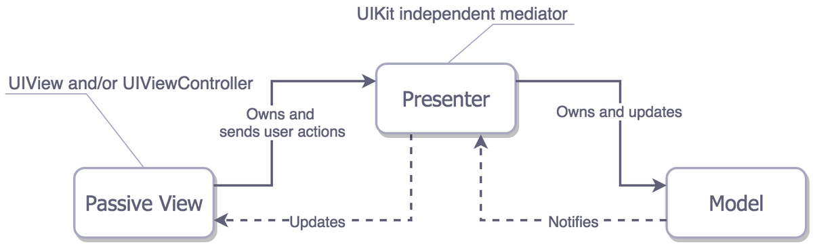

<!-- TOC -->

- [iOS 面试总结](#ios-面试总结)
    - [iOS 基础](#ios-基础)
        - [说明并比较关键词：strong，weak，assign 和 copy](#说明并比较关键词strongweakassign-和-copy)
        - [atomatic nonatomic 区别和理解](#atomatic-nonatomic-区别和理解)
        - [load 和 initialize 的区别？](#load-和-initialize-的区别)
        - [id 和 instencetype 的区别](#id-和-instencetype-的区别)
        - [isKindOfClass 和 isMemberOfClass 联系与区别](#iskindofclass-和-ismemberofclass-联系与区别)
        - [键路径(keyPath)、键值编码（KVC）、键值观察（KVO）](#键路径keypath键值编码kvc键值观察kvo)
        - [KVO 底层实现](#kvo-底层实现)
        - [cell 中一个点赞功能如果用 KVO 需要注意什么？（涉及cell复用问题）](#cell-中一个点赞功能如果用-kvo-需要注意什么涉及cell复用问题)
        - [NSNotification、Block、Delegate和KVO的区别](#nsnotificationblockdelegate和kvo的区别)
        - [block 用什么修饰？strong 可以？](#block-用什么修饰strong-可以)
        - [block 为什么能够捕获外界变量？ __block做了什么事？](#block-为什么能够捕获外界变量-__block做了什么事)
        - [\__block 与 __weak 的区别](#\__block-与-__weak-的区别)
        - [为什么要用autorelease？](#为什么要用autorelease)
        - [苹果是如何实现 autoreleasepool 的？](#苹果是如何实现-autoreleasepool-的)
        - [#import 跟 #include 有 什 么 区 别 ， @class 呢，#import<> 跟 #import” ”有什么区别?](#import-跟-include-有-什-么-区-别--class-呢import-跟-import-有什么区别)
        - [类别和类扩展的区别](#类别和类扩展的区别)
    - [UI](#ui)
        - [UIView 和 layer 的关系，组合关系，为什么不做继承，两种方式各有什么利弊](#uiview-和-layer-的关系组合关系为什么不做继承两种方式各有什么利弊)
        - [为什么有了 UIView 还要 CALayer？](#为什么有了-uiview-还要-calayer)
        - [显示动画和隐式动画](#显示动画和隐式动画)
        - [Auto Layout 和 Frame 在 UI 布局和渲染上有什么区别](#auto-layout-和-frame-在-ui-布局和渲染上有什么区别)
        - [layoutIfNeeded和setNeedsLayout的区别](#layoutifneeded和setneedslayout的区别)
        - [谈谈你对事件的传递和响应链的理解 （这个面试题，如果求职者能够回答一些实际开发相关的处理，不只是简单的概念，予以加分）](#谈谈你对事件的传递和响应链的理解-这个面试题如果求职者能够回答一些实际开发相关的处理不只是简单的概念予以加分)
    - [性能优化](#性能优化)
        - [平时开发有没有玩过 Instruments ？](#平时开发有没有玩过-instruments-)
        - [Instruments 使用 Time Profiler 要用真机运行](#instruments-使用-time-profiler-要用真机运行)
        - [如果一个列表视图滑动很慢，那怎么样优化](#如果一个列表视图滑动很慢那怎么样优化)
        - [界面卡顿和检测你都是怎么处理？](#界面卡顿和检测你都是怎么处理)
        - [聊一聊iOS 中的离屏渲染？](#聊一聊ios-中的离屏渲染)
        - [如何优化 App 的启动耗时？](#如何优化-app-的启动耗时)
        - [如何降低APP包的大小](#如何降低app包的大小)
    - [runtime](#runtime)
        - [我们说的 OC 是动态运行时语言是什么意思?](#我们说的-oc-是动态运行时语言是什么意思)
        - [说一下对 isa 指针的理解](#说一下对-isa-指针的理解)
        - [一个实例对象的isa 指向什么？类对象指向什么？元类isa 指向什么？](#一个实例对象的isa-指向什么类对象指向什么元类isa-指向什么)
        - [\_objc_msgForward 函数是做什么的？直接调用会发生什么问题？](#\_objc_msgforward-函数是做什么的直接调用会发生什么问题)
        - [消息转发，哪些步骤能被利用？](#消息转发哪些步骤能被利用)
        - [runtime 如何实现 weak 属性？](#runtime-如何实现-weak-属性)
        - [能否想向编译后得到的类中增加实例变量？能否向运行时创建的类中添加实例变量？为什么？](#能否想向编译后得到的类中增加实例变量能否向运行时创建的类中添加实例变量为什么)
        - [objc 中类方法和实例方法有什么本质区别和联系？](#objc-中类方法和实例方法有什么本质区别和联系)
        - [谈谈你对切面编程的理解](#谈谈你对切面编程的理解)
    - [runloop](#runloop)
        - [RunLoop 是什么？](#runloop-是什么)
        - [猜想 runloop 内部是如何实现的？](#猜想-runloop-内部是如何实现的)
        - [runloop 和线程有什么关系？](#runloop-和线程有什么关系)
        - [runloop 的 mode 作用是什么？](#runloop-的-mode-作用是什么)
        - [以 scheduledTimerWithTimeInterval 的方式触发的 timer，在滑动页面上的列表时，timer 会暂定回调，为什么？如何解决？](#以-scheduledtimerwithtimeinterval-的方式触发的-timer在滑动页面上的列表时timer-会暂定回调为什么如何解决)
    - [内存管理](#内存管理)
        - [Objective-C 如何对内存管理的，说说你的看法和解决方法?](#objective-c-如何对内存管理的说说你的看法和解决方法)
        - [日常如何检查内存泄露？](#日常如何检查内存泄露)
        - [BAD_ACCESS 在什么情况下出现？](#bad_access-在什么情况下出现)
        - [循环引用的产生原因，以及解决方法](#循环引用的产生原因以及解决方法)
    - [多线程](#多线程)
        - [多线程编程](#多线程编程)
        - [线程与进程的区别和联系?](#线程与进程的区别和联系)
        - [队列和线程的关系？](#队列和线程的关系)
        - [串行队列和并行队列有什么区别？](#串行队列和并行队列有什么区别)
        - [同步和异步有什么区别？](#同步和异步有什么区别)
        - [并发操作的三种方式](#并发操作的三种方式)
        - [Objective-C 中创建线程的方法是什么?如果在主线程中执行代码，方法是什么?如果想延时执行代码、方法又是什么?](#objective-c-中创建线程的方法是什么如果在主线程中执行代码方法是什么如果想延时执行代码方法又是什么)
        - [怎么实现多个任务执行完后，再统一处理？](#怎么实现多个任务执行完后再统一处理)
        - [线程之间如何进行通讯？](#线程之间如何进行通讯)
        - [渲染 UI 为什么要在主线程?](#渲染-ui-为什么要在主线程)
        - [不使用 GCD 如何保证线程安全？](#不使用-gcd-如何保证线程安全)
        - [死锁是怎么产生的？](#死锁是怎么产生的)
        - [有哪几种锁？各自的原理？它们之间的区别是什么？最好可以结合使用场景来](#有哪几种锁各自的原理它们之间的区别是什么最好可以结合使用场景来)
        - [synchronized是什么锁？原理是？](#synchronized是什么锁原理是)
    - [网络](#网络)
        - [TCP和UDP的区别](#tcp和udp的区别)
        - [- 谈谈三次握手，四次挥手！为什么是三次握手，四次挥手？](#--谈谈三次握手四次挥手为什么是三次握手四次挥手)
        - [HTTP了解吗？HTTP2.0介绍下，HTTS呢？](#http了解吗http20介绍下htts呢)
        - [- HTTPS，安全层除了 SSL 还有什么最新的协议？ 参数握手时首先客户端要发什么额外参数](#--https安全层除了-ssl-还有什么最新的协议-参数握手时首先客户端要发什么额外参数)
        - [- HTTPS 是什么？握手过程，SSL 原理，非对称加密了解多少](#--https-是什么握手过程ssl-原理非对称加密了解多少)
        - [- socket 连接和 Http 连接的区别](#--socket-连接和-http-连接的区别)
        - [有了解过WebSocket吗？](#有了解过websocket吗)
        - [https 在哪个网络层，对称加密还是非对称加密？证书在哪里请求。](#https-在哪个网络层对称加密还是非对称加密证书在哪里请求)
        - [七层协议栈](#七层协议栈)
        - [HTTP常见的返回码有哪些？](#http常见的返回码有哪些)
        - [HTTP除了GET、POST还有哪些？](#http除了getpost还有哪些)
        - [NSURLSessionDataTask](#nsurlsessiondatatask)
        - [NSURLSessionDownloadTask](#nsurlsessiondownloadtask)
    - [Swift](#swift)
        - [Swift 用过没？它就使用了面向协议？](#swift-用过没它就使用了面向协议)
        - [OOP/POP](#ooppop)
    - [架构](#架构)
        - [开发中常用架构设计模式你怎么选型?](#开发中常用架构设计模式你怎么选型)
    - [设计模式](#设计模式)
        - [设计模式是为了解决什么问题的？](#设计模式是为了解决什么问题的)
        - [iOS应用导航模式有哪些？](#ios应用导航模式有哪些)
    - [框架](#框架)
        - [pod update和pod install的区别](#pod-update和pod-install的区别)
        - [动态库与静态库](#动态库与静态库)
        - [AFNetworking 怎么实现线程保活?](#afnetworking-怎么实现线程保活)
        - [reachability 如何检测到网络状态变化?](#reachability-如何检测到网络状态变化)
        - [FB那个Async库都做了什么？](#fb那个async库都做了什么)
        - [SDWebImage实现原理](#sdwebimage实现原理)
        - [介绍基于LLVM/Clang的静态分析](#介绍基于llvmclang的静态分析)
    - [git](#git)
        - [git merge 和 git rebase 的区别？](#git-merge-和-git-rebase-的区别)
    - [数据持久化](#数据持久化)
        - [iOS开发中数据持久性有哪几种?](#ios开发中数据持久性有哪几种)
        - [Core Data的6成员对象](#core-data的6成员对象)
        - [Core Data的功能](#core-data的功能)
        - [Realm](#realm)
    - [数据结构和算法](#数据结构和算法)
        - [堆和栈的区别](#堆和栈的区别)
        - [有哪些排序算法，哪些是稳定的，哪些是不稳定](#有哪些排序算法哪些是稳定的哪些是不稳定)
        - [快排为什么不稳定？](#快排为什么不稳定)
        - [912.排序数组](#912排序数组)
        - [442.数组中重复的数据](#442数组中重复的数据)
        - [1.两数之和](#1两数之和)
        - [24.两两交换链表中的节点](#24两两交换链表中的节点)
        - [21. 合并两个有序链表](#21-合并两个有序链表)
        - [88.合并两个有序数组](#88合并两个有序数组)
        - [141.环形链表](#141环形链表)
        - [295. 数据流的中位数](#295-数据流的中位数)
        - [480.滑动窗口中位数](#480滑动窗口中位数)
        - [344.反转字符串](#344反转字符串)
        - [206.反转链表](#206反转链表)
        - [226.翻转二叉树](#226翻转二叉树)
        - [236.二叉树的最近公共祖先](#236二叉树的最近公共祖先)
        - [443.压缩字符串](#443压缩字符串)
        - [509.斐波那契数](#509斐波那契数)
        - [如何不使用递归，打印所有一个UIView所有的subviews](#如何不使用递归打印所有一个uiview所有的subviews)

<!-- /TOC -->

# iOS 面试总结
## iOS 基础
### 说明并比较关键词：strong，weak，assign 和 copy
strong 表示指向并拥有该对象。其修饰的对象引用计数会增加1。设置新值时，设置方法会先保留新值，并释放旧值，再将新值设置上去

weak 表示指向但不拥有该对象。其修饰的对象引用计数不会增加。无需手动设置，该对象会自行在内存中被销毁。设置新值时，设置方法既不保留新值，也不释放旧值

assign 主要用来修饰基本数据类型（“纯量类型”），这些数值主要存在与栈中

weak 一般用来修饰对象，assign 一般用来修饰基本数据类型。assign 修饰的对象被释放后，指针依然存在，造成“野指针”，在堆上容易造成崩溃，而栈上的内存系统会自动处理，不会造成“野指针”

copy 与 strong 类似，strong 的复制是多个指针指向同一地址，而 copy 的复制是每次会在内存中复制一份对象，指针指向不同地址。copy 一般用在修饰有对应可变类型的不可变对象上，为的是保护其封装性

***

### atomatic nonatomic 区别和理解
atomic：修饰对象会保证 setter 和 getter 的完整性，任何线程访问都可以得到一个完整的初始化后的对象。因为要保证操作完成，所以速度比较慢。atomic 比 nonatomic 安全，但也不是绝对的线程安全，当多个线程同时调用 get 和 set 就会导致获得的对象值不一样。要想线程绝对安全，就要用@synchronized

nonatomic：修饰的对象不保证 setter 和 getter 的完整性，所以当多个线程访问它时可能会返回未初始化对象，因此 nonatomic 速度比 atomic 的速度快，但是线程是不安全的

***

### load 和 initialize 的区别？
`+load方法要点`
当**类被引用进项目的时候就会执行 load 函数**（**在main函数开始执行之前**），与这个类是否被用到无关，每个类的 load 函数**只会自动调用一次**。由于**系统自动加载的**，因此不需要再调用[super load]，否则父类的 load 函数会多次执行。

* **父类的 load 方法执行顺序要优先于子类**
* 当一个类未实现 load 方法时，不会调用父类 load 方法
* **类中的 load 方法执行顺序要优先于类别**
* 当有**多个类别都实现了 load 方法，这几个 load 方法都会执行**，其执行顺序与类别在 Compile Sources 中出现的顺序一致

load 一般是**用来交换方法 Method Swizzle**，由于它是**线程安全的**，而且**一定会调用且只会调用一次**，通常在**使用路由注册类**的时候也在 load 方法中注册

注意：
load 调用时机比较早，当 load 调用时，其他类可能还没加载完成，**运行环境不安全**。但是它内部使用了锁，所以是**线程安全**，应该**避线程阻塞**。

`+initialize方法要点`
initialize 在**类或者其子类的第一个方法被调用前调用**。即使类文件被引用进项目，但是没有使用，initialize 不会被调用。由于**系统自动调用**，也不需要调用父类的 initialize，否则父类的initialize会被多次执行。假如这个类放到代码中，而这段代码并没有被执行，这个函数是不会被执行的。

* **父类的 initialize 方法执行顺序要优先于子类**
* 当子类不实现 initialize 方法，父类的 initialize 方法会被优先调用一次，然后会把父类的实现继承过来调用一遍
* 当有**多个类别都实现了 initialize方法，会覆盖类中的方法，只执行一个**，会执行 Compile Sources 列表中最后一个类别的 initialize方法

initialize 方法主要用来**对一些不方便在编译期初始化的对象进行赋值**，或者说**对一些静态常量进行初始化操作** 

注意：
在 initialize 方法调用时，**运行环境基本健全**。它内部也使用了锁，所以是**线程安全**的，应该**避免线程阻塞**，不要再使用锁。

***

### id 和 instencetype 的区别
instencetype 用于对象初始化方法的返回值
id 用于不知道对象的具体类型情况

使用 instencetype 的好处在于，编译器可以进行类型检查，id 不可以

***

### isKindOfClass 和 isMemberOfClass 联系与区别
isKindOfClass 用来判断 obj 是否为 SomeClass 或其子类的实例对象
isMemberOfClass 用来判断 obj 是否为 SomeClass

***

### 键路径(keyPath)、键值编码（KVC）、键值观察（KVO）
`keyPath 键路径`键路径是一个由用点作分隔符的键组成的字符串，用于指定一个连接在一起的对象性质序列。通过键路径， **可以指定对象图中的一个任意深度的路径，使其指向相关对象的特定属性**。

`KVC 键值编码` **是一种不通过存取方法，而通过属性名称字符串间接访问属性的机制**
1. 首先查找有无属性对应的存取方法，若有，则直接使用这些方法
2. 若查询不到以上任何存取方法，则尝试直接访问实例变量
3. 若连该成员变量也访问不到，则会在下面方法中抛出异常`valueForUndefinedKey:` `setValue:forUndefinedKey:`

`KVO 键值观察机制`**是一种能使得对象获取到其他对象属性变化的通知。对目标对象的某属性添加观察，当该属性发生变化时，会自动的通知观察者。**实现 KVO 键值观察模式，被观察的对象必须使用 KVC 键值编码来修改它的实例变量，这样才能被观察者观察到。因此，KVC 是 KVO 的基础。

***

### KVO 底层实现
Apple 使用了 isa 混写来实现 KVO，当观察一个对象时，一个新的类会动态被创建。这个类继承自该对象的原本的类，并重写了被观察属性的 setter 方法。重写的 setter 方法会负责在调用原 setter 方法之前（willChangeValueForKey:）和之后（didChangeValueForKey:）通知所有观察对象值的更改。最后把这个对象的 isa 指针指向这个新创建的子类，对象就神奇的变成了新创建的子类的实例。派生类还重写了 dealloc 方法来释放资源。

***

### cell 中一个点赞功能如果用 KVO 需要注意什么？（涉及cell复用问题）
在屏幕上消失的 cell 移除监听

```
- (void)tableView:(UITableView *)tableView didEndDisplayingCell:(UITableViewCell *)cell forRowAtIndexPath:(NSIndexPath *)indexPath
```

在屏幕上显示的 cell 移除监听

***

### NSNotification、Block、Delegate和KVO的区别
Block和Delegate都是回调方式，且是一对一的关系
Bloc是一段封装好的代码，集中代码块，是将函数及其执行上下文封装起来的对象。更适用于轻便、简洁的回调，如网络传输。运行成本高，出栈时需要将数据从栈内复制到堆内存

Delegate的声明和实现有一半分开，需要定义协议方法，代理对象实现协议方法，并且需要建立代理关系才可以实现通信，适用于公共接口较多的情况，更容易解耦代码架构。只保存了一个对象指针，直接回调，没有额外的消耗

NSNotification和KVO都是定义对象之间的一对多的依赖关系，当一个对象的状态发生改变时，依赖对象皆可以得到通知并被自动更新

NSNotification由通知中心向所有观察者发送变更通知，而KVO是被观察者像观察者直接发送通知

NSNotification
1.注册观察者，addobserve:selector:name:object:
2.通知中心
3.发送改变通知，postNotificationName:object:userInfo:
4.通知对象，通知中心调用观察者注册的接口来广播通知，传递 Notification 对象
 
KVO
1.注册观察者
2.更改对象属性的值
3.处理收到的更改通知

***

### block 用什么修饰？strong 可以？
对于这个问题得区分 MRC 环境 和 ARC 环境。Block 引用了普通外部变量，都是创建在栈区的。对于分配在栈区的对象，我们很容易会在释放之后继续调用，导致程序奔溃，所以我们使用的时候需要将栈区的对象移到堆区，来延长该对象的生命周期。

对于`MRC`环境，**使用 Copy 修饰 Block，会将栈区的 Block 拷贝到堆区。**

对于`ARC`环境，**使用 Strong、Copy 修饰 Block，都会将栈区的 Block 拷贝到堆区。**

所以，**Block 不是一定要用 Copy 来修饰的，在 ARC 环境下面 Strong 和 Copy 修饰效果是一样的。**

***

### block 为什么能够捕获外界变量？ __block做了什么事？
为了保证 Block 内部能够正常访问外部的变量，Block 有一个`变量捕获机制`。Block 捕获外部变量仅仅只捕获 Block 闭包里面会用到的值，其他用不到的值，它并不会去捕获。

全局变量因为是全局的，作用域广，无论在哪里都可以访问，所以 Block 捕获他们进去后，进行操作，Block 结束后值依旧可以保存下来
局部变量都会被 Block 捕获，保存进了 Block 的结构体实例中，也就是 Block 自身中，自动变量是值捕获，静态变量为地址捕获。

**用 __block 修饰的外部变量引用，block 是复制其引用地址来实现访问的。block 可以修改 __block 修饰的外部变量的值。
一个局部变量加上 \__block 修饰符后跟 block 一样变成了一个 \__Block_byref_val_0 结构体类型的自动变量实例。**

```
__block int val = 10;
转换成
__Block_byref_val_0 val = {
    0,
    &val,
    0,
    sizeof(__Block_byref_val_0),
    10
};
```
***

### \__block 与 __weak 的区别
* __block 不管是 ARC 还是 MRC 模式下都可以使用，可以修饰对象，还可以修饰基本数据类型
* __weak 只能在 ARC 模式下使用，也只能修饰对象，不能修饰基本数据类型
* \__block 对象 可以在 block 中被重新赋值，__weak 不可以
* \__block 对象在 ARC 下可能会导致循环引用，非 ARC 下会避免循环引用，__weak 只在 ARC 下使用，可以避免循环引用

__weak **可以避免循环引用**，但是其会导致外部对象释放了之后，block 内部也访问不到这个对象的问题，我们可以**通过在 block 内部声明一个 __strong 的变量来指向 weakObj，在 block 执行期间，即使外部对象释放，依然能在 block 内部保持住**，又能避免循环引用的问题。

\__block **无法避免循环引用**，但是我们可以**通过在 block 内部手动把 blockObj 赋值为 nil 的方式来避免循环引用**，**__block 对象可以在 block 中被重新赋值**。

*** 

### 为什么要用autorelease？
__autoreleasing 修饰的对象会被注册到 Autorelease Pool 中，并在 Autorelease Pool 销毁时被释放
autorelease 会在稍后释放对象，既能延长这个对象的生命周期，又能保证对其释放

* 方法返回值
* 访问 __weak 修饰的变量

[参考链接：ios中的内存管理](https://maxwellqi.github.io/ios-memory-manager/)

***

### 苹果是如何实现 autoreleasepool 的？
AutoreleasePool 并没有单独的结构，而是由若干个AutoreleasePoolPage以双向链表的形式组合而成的栈结构

单个自动释放池的执行过程就是
**objc_autoreleasePoolPush() —> [object autorelease] —> objc_autoreleasePoolPop(void *)**
autoreleasePoolPush() 和 autoreleasePoolPop 是AutoreleasePoolPage 对应静态方法 push 和 pop 的封装
 
每当自动释放池调用objc_autoreleasePoolPush时都会把边界对象放进栈顶，然后返回边界对象，用于释放。
objc_autoreleasePoolPop传入边界对象，然后将边界对象指向的这一页 AutoreleasePoolPage 内的对象释放

[参考链接：AutoreleasePool底层实现原理
](https://juejin.im/post/5b052282f265da0b7156a2aa#heading-1)

***

### #import 跟 #include 有 什 么 区 别 ， @class 呢，#import<> 跟 #import” ”有什么区别?
\#import 是 Objective-C 导入头文件的关键字
\#include 是 C/C++导入
头文件的关键字
使用 #import 头文件会自动只导入一次，不会重复导入，相当于#include 和#pragmaonce
@class 告诉编译器某个类的声明，当执行时才去查看类的实现文件，可以解决头文件的相互包
含
\#import<>用来包含系统的头文件，#import””用来包含用户头文件

***

### 类别和类扩展的区别
category 的作用是为类添加方法
应用场景：
拆分复杂类的实现
调用类的私有方法

区别：
category：可以为类添加方法，不能添加成员变量，因为 category 在运行期决议，在运行期对象的内存布局已经确定，如果添加实例对象会破坏类的内存布局
extension:可以添加方法，也可以添加成员变量，添加的方法是必须要实现的，extension 在编译期决议，它实际上就是类的一部分

category 只能添加，不能删除和修改方法
继承 可以增加，修改或者删除方法，并且可以增加属性。

[参考链接：分类Category & 扩展 Extension](https://www.jianshu.com/p/425ff8133f9e)

***

## UI
### UIView 和 layer 的关系，组合关系，为什么不做继承，两种方式各有什么利弊
* **UIView 和 CALayer 都是 UI 操作的对象**。两者都是 NSObject 的子类，发生在 UIView 上的操作本质上也发生在 CALayer 上
* **UIView 是 CALayer 用于交互的对象**。UIView 是 UIResponder 的子类，其中提供了很多 CALayer 所没有的交互上的接口，主要负责处理用户触发的各种操作
* **CALayer 在图像和动画渲染上性能更好**。这是因为 UIView 有冗余的交互接口，而且相比 CALayer，还有层级之分。CALayer 无需处理交互时进行渲染，可以省出大量时间

继承是高耦合的，组合比继承更具灵活性和稳定性。

是使用组合还是继承：要遵循里氏代换原则（有两个类A和B，B是A的子类，那么一个方法如果可以接受一个基类对象a的话：method(a)，那么它必然可以接受一个子类对象b，：method(b)）。

***

### 为什么有了 UIView 还要 CALayer？
因为 CALayer 和 UIView 源于不同框架，继承自不同的父类

UIView 侧重于对显示内容的管理，处理用户事件
CALayer 侧重于对内容的绘制，不能处理用户事件

UIView 和 CALayer 是相互依赖，UIView 依赖于 CALayer 提供的内容，CALayer 依赖 UIView 提供的容器来显示绘制的内容

***

### 显示动画和隐式动画
显式动画是指开发者通过beginAnimations:context:和commitAnimations创建的动画。

隐式动画是指通过UIView的animateWithDuration:animations:方法创建的动画

使用隐式动画后，View 会暂时不能接收用户的触摸、滑动等手势

***

### Auto Layout 和 Frame 在 UI 布局和渲染上有什么区别
Auto Layout 是针对多尺寸屏幕的设计。其本质上是**通过线性不等式设置 UI 控件的相对位置**，从而适配多种 iPhone/iPad 屏幕的尺寸

Frame 是**基于 XY 坐标系统的布局机制**，从数学上限定了 UI 控件的具体位置，是最低层、最基本的界面布局机制

Auto Layout 的性能比 Frame 差很多。Auto Layout 的布局过程是首先求解线性不等式，再转化为 Frame 进行布局。求解的计算量大，通常性能损耗是 Frame 的 10 倍左右

***

### layoutIfNeeded和setNeedsLayout的区别
layoutIfNeeded：方法一旦调用，主线程立即强制重新布局，从当前视图开始，一直到完成所有子视图的布局

setNeedsLayout：与layoutIfNeeded相似，唯一不同的就是它不会立刻强制视图重新布局，而是在下一个布局周期才会触发更新。主要用在多个视图布局先后更新的场景下

layoutSubviews：用来自定义视图尺寸，系统自动调用，可以重写该方法，让系统在调整尺寸时能按照我们希望的效果进行布局

***

### 谈谈你对事件的传递和响应链的理解 （这个面试题，如果求职者能够回答一些实际开发相关的处理，不只是简单的概念，予以加分）
`事件的传递`
其实就是在**事件产生与分发之后如何寻找最优响应的一个过程**

`事件的传递`是**从上到下**（父控件到子控件）
UIApplication -> window -> viewController -> View -> 检测所有子视图

`响应者链`

* 响应者链是响应者对象的连接序列，事件或动作消息(或菜单编辑消息)依次传递。
* 允许响应者对象把事件处理的职责转交给其它更高层的对象。
* 应用程序通过向上传递一个事件来查找合适的处理对象。
* 由多个响应者对象组成的链。

`事件的响应`是**从下到上**（顺着响应者链条向上传递-子控件到父控件)
触摸的子视图 ->view -> viewController -> window -> UIApplication   

具体应用：

```
// 可以控制响应视图的响应范围
- (BOOL)pointInside:(CGPoint)point withEvent:(UIEvent *)event
```

```
// 利用响应链传参
- (void)routerEventWithName:(NSString *)eventName userInfo:(NSDictionary *)userInfo {
    //顺着相应链传递
    [[self nextResponder] routerEventWithName:eventName userInfo:userInfo];
}
```

***

## 性能优化
### 平时开发有没有玩过 Instruments ？
Instruments 是 Xcode 的一个工具集，**动态追踪、性能分析、分析代码的测试工具**。使用 Instruments 你可以做下面这些事：

* 查找 App 中的**内存问题**，比如：内存泄露、废弃内存、僵尸等
* 对 App 进行**性能分析**，比如：图像性能检测
* **追踪代码中难以重现的问题**
* **实现程序的自动化测试**
* **进行系统级故障诊断**


[参考资料：使用 Instruments 做 iOS 程序性能调试](http://www.samirchen.com/use-instruments/)

***

### Instruments 使用 Time Profiler 要用真机运行
在开始进行应用程序性能分析的时候，一定要使用真机，模拟器运行在Mac上，然而Mac上的CPU往往比iOS设备要快。
相反，Mac上的GPU和iOS设备的完全不一样，模拟器不得已要在软件层面（CPU）模拟设备的GPU，这意味着GPU相关的操作在模拟器上运行的更慢，这就导致模拟器性能数据和用户真机使用性能数据有差距

在开始性能分析前另外一件重要的事情是，应用程序运行一定要发布配置，而不是调试配置。
在发布环境打包的时候，编译器会引入一系列提高性能的优化，例如去掉调试符号或者移除并重新组织代码

***

### 如果一个列表视图滑动很慢，那怎么样优化

tableView 滑动很慢可能的原因是：

* **列表渲染时间较长**，可能是因为某些 UI 控件比较复杂，或者图层过多
* **界面渲染延后**，可能是因为大量的操作或者耗时的计算阻塞了主线程
* **数据源问题**，可能是网络请求太慢或者是需要更新的数据太多

tableview优化最主要：

* 检查**UITableViewCell是否进行了复用**
* **复杂视图的创建采用懒加载来推迟创建时间**
* **尽量减少视图的层级**
* UITableViewCell 避免为子控件添加多次约束，尽量设置图片为不透明
* 用**GCD多线程操作将复杂的计算放到后端线程，进行缓存**，例如布局计算或者非UI对象的创建和调整
* **避免快速滑动情况下开过多线程**
* 图片处理时后台下载图片后再回主线程刷新 UI，**避免阻塞主线程**，图片过大会造成 GPU 负担过大，可以在**图片下载后压缩尺寸后显示**
* 对于**界面渲染和优化可以采用ASDK**

***

### 界面卡顿和检测你都是怎么处理？
CRT 显示器原理：CRT 的电子枪会从上到下一行一行扫描，扫描完成后显示器呈现一帧画面，随后电子枪回到初始位置继续下一次扫描。为了把**显示器的显示过程和系统的视频控制器进行同步，显示器会用硬件时钟产生一系列定时信号**。电子枪换到新的**一行**，显示器会发出一个**水平同步信号**（HSync），而当**一帧**画面绘制完成后，电子枪回到原位，准备画下一帧前，显示器发送一个**垂直同步信号**（VSync）。显示器通常以固定频率进行刷新，这个刷新率就是 VSync 信号产生的频率。

为了防止双缓冲造成画面撕裂现象，**GPU 通常有一个机制叫做垂直同步**（简写也是 V-Sync），**当开启垂直同步后，GPU 会等待显示器的 VSync 信号发出后，才进行新的一帧渲染和缓冲区更新**。如果**当下一次 VSync 信号到来之前，CPU 和 GPU 还没有完成内容提交，则这一帧就会被丢弃，而显示屏保留之前的内容不变**，这就是界面卡顿的原因。

`卡顿检测`

* **主线程卡顿监控**。**通过子线程监测主线程的 runLoop，判断两个状态区域之间的耗时是否达到一定阈值**。
* **FPS 监控**。要保持流畅的UI交互，**App 刷新率应该当努力保持在 60fps**。监控实现原理比较简单，通过记录两次刷新时间间隔，就可以计算出当前的 FPS。

`卡顿优化`
造成卡顿的原因是由 CPU 和 GPU 造成的，所有优化的时候也要从这两个方面来着手。那么解决卡顿的**主要思路就是尽可能减少 CPU、GPU 资源消耗**

`CPU和GPU的职责`：
CPU：计算显示内容，视图对象的创建和销毁、布局计算、文本绘制、图片解码、图像的绘制

GPU：负责变换、合成、纹理的渲染，把渲染结果提交到帧缓冲区

卡顿优化在 CPU 层面：

* 尽量用**轻量级的对象**，比如用不到事件处理的地方，可以考虑使用 CALayer 取代 UIView。**尽量推迟对象创建时间，并把对象的创建分到多个任务中去**。如果对象可以复用，可以将对象放入缓存池中复用
* **不要频繁地调用 UIView 的相关属性**，比如 frame、bounds、transform 等属性，尽量避免调整视图层次、添加和移除视图。
* 尽量在**后台提前计算好布局**、并且对**布局进行缓存**，会提高很多性能。因为对这些属性调整会非常消耗资源，需一次性调整好，不要多次、频繁的计算修改这些属性。
* 对于复杂视图 **Autolayout 会比直接设置 frame 消耗更多的 CPU 资源**。设置frame可以用一些工具（比如常用的:left/right/top/bottom/width/height 快捷属性），或使用ComponentKit、AsyncDisplayKit 等框架。
* 文本处理：文本的宽高计算会占用一部分资源，可以参数UILabel内部实现，用：**[NSAttributedString boundingRectWithSize:options:context:]来计算文本宽高**，用**[NSAttributedString drawWithRect:options:context:]来绘制文本**。为了不占用主线程资源，尽量放到后台处理。
* 图片处理：图片在创建为UIImage时不会立即解码，在设置到UIImageView中，CALayer被提交到GPU中时才会去解码并且会发生在主线程。为了绕开这个机制，会在**后台先把图片绘制到CGBitmapContext 中，然后从 Bitmap 直接创建图片**。目前常见的网络图片库都自带这个功能。图片的绘制过程也可以放到子线程进行，比如常见的[UIView drawRect:]，原理如下：

```
- (void)display {
    dispatch_async(backgroundQueue, ^{
        CGContextRef ctx = CGBitmapContextCreate(...);
        // draw in context...
        CGImageRef img = CGBitmapContextCreateImage(ctx);
        CFRelease(ctx);
        dispatch_async(mainQueue, ^{
            layer.contents = img;
        });
    });
}
```
* 图片的 size 最好刚好跟 UIImageView 的 size 保持一致
* **控制一下线程的最大并发数量**


卡顿优化在 GPU 层面

* 纹理渲染：GPU 能处理的最大纹理尺寸是 4096x4096，一旦超过这个尺寸，就会占用 CPU 资源进行预处理，这对CPU和GPU都会带来额外的资源消耗。 所以**纹理尽量不要超过 GPU 能处理的最大纹理尺寸**。
* 视图混合：GPU会将多个视图混合在一起，如果视图结构复杂会消耗过多GPU资源。所以，应该**尽量减少视图数量和层次**，**尽量避免短时间内大量图片的显示**，**尽可能将多张图片合成一张进行显示**。并在不透明的视图里标明 opaque 属性以**避免无用的 Alpha 通道合成**。
* 图形生成：**避免触发离屏渲染**，而离屏渲染通常是发生在GPU中。

[参考链接：iOS页面卡顿及性能优化](https://wjerry.com/2019/02/02/iOS%E9%A1%B5%E9%9D%A2%E5%8D%A1%E9%A1%BF%E5%8F%8A%E6%80%A7%E8%83%BD%E4%BC%98%E5%8C%96/)

***

### 聊一聊iOS 中的离屏渲染？
GPU 屏幕渲染有两种方式：
当前屏幕渲染
离屏渲染

当前屏幕渲染的局限因素限制（只有自身上下文、屏幕缓存有限等），当前屏幕渲染有些情况下的渲染解决不了的，就使用到离屏渲染，GPU 在当前屏幕缓冲区以外新开辟一个缓冲区进行渲染操作

相比于当前屏幕渲染，离屏渲染的代价是很高的，主要体现在两个方面：
1. 创建新缓冲区
2. 上下文切换

常见离屏渲染场景分析

* cornerRadius+clipsToBounds
* shadow
* group opacity
* mask
* UIBlurEffect

`检测`
通过勾选 Xcode 的 Debug -> View Debugging -> Rendering -> Run -> Color Offscreen-Rendered Yellow 项

`优化`

* 应用 **AsyncDisplayKit（Texture）作为主要渲染框架，对于文字和图片的异步渲染操作交由框架来处理**。
* 对于图片的圆角，统一采用“precomposite”的策略，也就是不经由容器来做剪切，而是预先**使用 CoreGraphics 为图片裁剪圆角**
* 对于视频的圆角，由于实时剪切非常消耗性能，我们会创建四个白色弧形的 layer 盖住四个角，从视觉上制造圆角的效果
* 对于 view 的圆形边框，如果没有 backgroundColor，可以放心使用 cornerRadius 来做
* 对于所有的**阴影，使用 shadowPath**来规避离屏渲染
* 对于特殊形状的 view，使用 **layer mask 并打开 shouldRasterize 来对渲染结果进行缓存**
* 对于模糊效果，不采用系统提供的 UIVisualEffect，而是另外**实现模糊效果 CIGaussianBlur**，并手动管理渲染结果

[参考链接：iOS 关于离屏渲染的理解 以及解决方案](https://www.jianshu.com/p/cff0d1b3c915)
[参考链接：关于iOS离屏渲染的深入研究](https://zhuanlan.zhihu.com/p/72653360)

***

### 如何优化 App 的启动耗时？
App 启动时间过长，可能由多个原因造成。App 启动时间由 main() 函数之前的加载时间和 main() 函数之后的加载时间组成

t1 可以添加环境变量，启动 App 日志打印出来，具体可以：

* **减少动态库数量**
* **减少 Objective-C 的类数量**
* **使用 initialize 方法替代 load 方法，或是尽量将 load 方法中的代码延后调用**

t2 主要是构建第一个界面并完成的时间，所以 t2 需要在具体界面布局和渲染代码中进行打点观察，具体可以：

* **尽量不要使用 xib/storyboard，而是用纯代码作为首页 UI**
* **避免在启动时打印过多的 log**
* **防止创建过多的线程**
* **不要在主线程执行磁盘、网络、锁、发送消息给其他线程等操作**

[参考链接：iOS App 启动性能优化](https://zhuanlan.zhihu.com/p/28600469)

***

### 如何降低APP包的大小
* **可执行文件优化**
  可执行文件，即和项目同名的文件，一般是占用包体积最大的那个
  * **三方库优化**（删除不实用的三方库，合并功能重复的三方库）
  * **代码优化**（清理 import，去掉空方法，去掉无用的 log，去掉无用的变量）
  * **文件优化**（删除无用的类和文件）
  
* **资源优化**（图片、音频、视频等）
  * **无用文件删除**
  * **重复文件删除**
  * **大文件压缩**
  * On-Demand Resource（**资源动态下载**，只提供部分的 App 内容，只要满足基本运行即可，后续内容可以解锁下载到 App 中）

* **编译选项优化**
  
* 其他技巧
  * 把相关的依赖改成动态库方式，达到共享
  * 使用 asset 管理图片
  * 开启 Bitcode（Bitcode 是一个编译好的程序的表示形式，上传新版本 App 时，App Store 会对包含 Bitcode 二进制 App 进行优化，而不需要提交一个新的 App 到 App Store）

[参考链接：iOS 瘦包常见方式梳理](https://juejin.im/entry/5be3de19f265da6110368954)

***

## runtime
### 我们说的 OC 是动态运行时语言是什么意思?
runtime 又叫运行时，是一套底层的 C 语言 API，其为 iOS 内部的核心之一，我们平时编写的 OC 代码，底层都是基于它来实现的

其实就是 Objective-C 的动态机制。runtime 执行的是编译后的代码，这时它可以动态加载方法，添加方法，修改属性，传递信息等。
对象调用方法：
编译器翻译->给接收者发送消息->接受者响应消息

objc_msgSend 操作过程：

* **判断该对象是否为 nil，为 nil 直接 clean up，然后 return**
* **不为 nil，runtime 库就通过该对象的 isa 指针找到该对象所属的类**
* **在类的缓存以及方法列表根据 selector 查找 IMP**
* **如果没找到就找到这个类的父类，父类的父类，直到根类（一般就是 NSObject）查找 IMP**
* **如果一直查找到根类仍旧没有找到方法，程序在运行时会 crash 并抛出异常`unrecognized selector sent to XXX`。但是在这之前，运行时会给出防止程序崩溃的机会，则用`_objc_msgForward`函数指针代替 IMP，执行这个 IMP，即消息转发。**

1. 消息动态处理

    * 调用`resolveInstanceMethod:`方法，允许用户在此时为**该类动态添加实现**。如果有实现了，则调用并返回。如果仍没实现，继续下面的动作。
    * 调用`forwardingTargetForSelector:`方法，尝试**找到一个能响应该消息的代理对象**。如果获取到，则**直接转发给它**。如果返回了 nil，继续下面的动作。

2. 消息转发

    * 调用`methodSignatureForSelector:`方法，**尝试获得一个方法签名**。如果获取不到，则直接调用`doesNotRecognizeSelector`抛出异常。
    * 调用`forwardInvocation:`方法，将第三步**获取到的方法签名包装成 NSInvocation 传入**，在**该方法中重定向方法，传递调用信息，对象接收消息并打印**。

补充说明：runtime 铸就了 Objective-C 是动态语言的特性，使得 C 语言具备了面向对象的特性，在程序运行期创建，检查，修改类、对象及其对应的方法，这些操作都可以使用 runtime 中的对应方法实现。

[参考链接：iOS开发·runtime原理与实践: 基本知识篇(类，超类，元类，super_class，isa，对象，方法，SEL，IMP)](https://juejin.im/post/5aff9d9c51882542c760d851#heading-6)

***

### 说一下对 isa 指针的理解
isa：**是和 Class 同类型的 objc_class 指针，每个实例对象有个 isa 的指针指向对象的类，类对象的指针指向其所属的类，即元类**。
初始化一个字符串对象 string，其本质就是一个 objc_object 结构体，而这个结构体的成员变量 isa 指针则表明了string is a NSString，因此这个 isa 就指向了 NSString 类，这个 NSString 类其实是类对象。

* 实例对象 isa 指向类对象
* 类对象指 isa 向元类对象
* 元类对象的 isa 指向元类的基类

isa 有两种类型

* 纯指针，指向内存地址
* NON_POINTER_ISA，除了内存地址，还存有一些其他信息

[参考链接：isa指针](https://juejin.im/post/5a3e801251882515945acb01)

***

### 一个实例对象的isa 指向什么？类对象指向什么？元类isa 指向什么？
一个实例对象的 isa 指向类对象
类对象的 isa 指向元类
所有的元类，包括 Root class，Superclass，Subclass 的 isa 都指向 Root class 的元类，形成一个闭环


***

### \_objc_msgForward 函数是做什么的？直接调用会发生什么问题？
**_objc_msgForward 是 IMP 类型**，用于**消息转发**的，当**向一个对象发送一条消息，但它并没有实现的时候，_objc_msgForward 会尝试做消息转发**。

如果**直接调用就算实现了想调用的方法，也不会被调用**，因为会**跳过查找 IMP 的过程，直接触发消息转发**。

最常见的场景是：你想获取某方法所对应的 NSInvocation 对象。
举例说明：
JSPatch 就是直接调用 _objc_msgForward 来实现其核心功能的。
***

### 消息转发，哪些步骤能被利用？
调用一个对象不存在的方法，消息转发机制在无法响应方法会抛出问题

forwardingTargetForSelector:
forwardInvocation:
可以被利用

ps：forwardInvocation: NSInvocation对象保存了这个方法调用的所有信息，包括 Selector 名，参数和返回值类型

1.JSPatch --iOS动态化更新方案
2.为 @dynamic 实现方法
3.实现多重代理
[参考链接：iOS Runtime 消息转发机制原理和实际用途](https://www.jianshu.com/p/fdd8f5225f0c)

***

### runtime 如何实现 weak 属性？
runtime维护了一个weak表，weak表其实是一个哈希表，用于存储指向某个对象的所有weak指针，以对象地址为key，weak指针的地址数组为value
NSObject *p = [[NSObject alloc] init];
__weak NSObject *p1 = p;

objc_initWeak(&p1, p);
objc_release(p);
objc_destroyWeak(&p1);

storeWeak用来更新弱引用指针的指向
根据weak指针找到其指向的老的对象
然后获取到与新旧对象相关的SideTable对象SideTable *oldTable, newTable
老对象的weak表中移除指向信息（weak_unregister_no_lock），而在新对象的weak表中建立关联信息（weak_register_no_lock）
弱引用指针指向新的对象
返回这个新对象

weak的hash表如何解决的hash冲突
分离链接法解决冲突：
通过地址来建立索引标志，以地址计算出Hash地址，防止箱子冲突
每个箱子其实是一个链表，将属于同一个箱子里的元素存储在一张线性表中，而每个线性表表头的序号即为计算得到的Hash地址

weak释放为nil的过程

* 调用objc_release
* 因为对象的引用计数为0，所以执行dealloc
* 在dealloc中，调用_objc_rootDealloc函数
* // 在_objc_rootDealloc中，调用来object_dispose函数
* // 调用objc_destructInstance
* 最后调用objc_clear_deallocating

clearDeallocating函数首先根据对象地址获取所有weak指针地址的数组，然后遍历这个数组把其中的数据设为nil，最后把这个entry从weak表中删除，最后清理对象的记录。最终通过调用weak_clear_no_lock方法，将weak指针置空

objc_clear_deallocating函数的操作如下：
* 从weak表中获取废弃对象的地址为键值的记录
* 将包含在记录中的所有附有weak修饰符变量的地址，置为nil
* 将weak表中该记录删除
* 从引用计数表中删除废弃对象的地址为键值的记录

SideTable 这个结构体，定义为引用计数和弱引用依赖表，主要用于管理对象的引用计数和 weak表

```
struct SideTable {
    // 保证原子操作的自旋锁
    spinlock_t slock;
    // 引用计数的 hash 表
    RefcountMap refcnts;
    // weak 引用全局 hash 表
    weak_table_t weak_table;
}
```

[参考链接：笔记-更深层次的了解iOS内存管理](https://juejin.im/post/5c4821fdf265da613b70159d#heading-8)
[参考链接：weak 弱引用的实现方式](https://www.desgard.com/iOS-Source-Probe/Objective-C/Runtime/weak%20%E5%BC%B1%E5%BC%95%E7%94%A8%E7%9A%84%E5%AE%9E%E7%8E%B0%E6%96%B9%E5%BC%8F.html)
[参考链接：Runtime如何实现weak属性？](https://solacode.github.io/2015/10/21/Runtime%E5%A6%82%E4%BD%95%E5%AE%9E%E7%8E%B0weak%E5%B1%9E%E6%80%A7%EF%BC%9F/)

***

### 能否想向编译后得到的类中增加实例变量？能否向运行时创建的类中添加实例变量？为什么？
**不能**向**编译后**得到的类中增加实例变量，**能**向**运行时**创建的类中添加实例变量。

因为编译后的**类已经注册在 runtime 中**，类结构体中的 objc_ivar_list **实例变量的链表**和 instance_size **实例变量的内存大小**已经确定，同时 runtime 会调用 class_setIvarLayout 或 class_setWeakIvarLayout 来**处理了 strong weak 引用**，所以不能向存在的类中添加实例变量

运行时创建的类是可以添加实例变量，**调用 class_addIvar 函数**，但是得在**调用 objc_allocateClassPair 之后**，objc_registerClassPair之前，原因同上。
***

### objc 中类方法和实例方法有什么本质区别和联系？
类方法:

* 类方法属于类对象
* 类方法只能通过类对象调用
* 类方法中的 self 是类对象
* 类方法可以调用其他类方法
* 类方法中不能访问成员变量
* 类方法不能直接调用对象方法

实例方法：

* 实例方法是属于实例对象的
* 实例方法只能通过实例对象调用
* 实例方法中的 self 是实例对象
* 实例方法中可以访问成员变量
* 实例方法中直接调用实例方法
* 实例方法中也可以调用类方法（通过类名）

***

### 谈谈你对切面编程的理解
面向切面编程就是通过**预编译和运行期动态代理实现给程序动态统一添加功能**的一种技术。

比如如果需要在每个控制器的 viewDidLoad 里面都需要添加统计代码，或者每个类都需要添加日志代码。其实上面的需求很容易想到在每个控制器里面都写一遍，这样的话会有很多重复的代码而且不好维护。另外也可以用继承，但是用继承无形中增加了类的强耦合，所以都不是最好的办法。

这时可能很容易想到 runtime 中 method swizzle。**method swizzle 是 runtime 的黑魔法之一，也就是在无法看到一个类的源代码的情况下，改变方法实现或者偷换方法实现的一种强大技术**。method swizzle确实是一个很好的方法，而且降低了业务逻辑各个部分的耦合性。

method swizzle 应用：
防止数组取值时越界崩溃
处理按钮重复点击

***

## runloop
### RunLoop 是什么？
RunLoop 是一个消息循环机制，保证线程不会退出，循环监听着各种事件源、消息，并且能在不处理消息的时候让线程休眠，避免资源占用，在接收到消息的时候唤醒线程做出对应处理。RunLoop 的设计是为了减少 CPU 无谓的空转。

***

### 猜想 runloop 内部是如何实现的？


[参考链接：iOS底层原理总结 - RunLoop](https://juejin.im/post/5add46606fb9a07abf721d1d)

***

### runloop 和线程有什么关系？
runloop 是每一个线程一直运行的一个对象，主要用来负责响应处理各种事件和消息。每一个线程都有且仅有一个 runloop 与其对应，没有线程就没有 runloop。
在所有线程中，只有主线程的 runloop 是默认启动的，main 函数会设置一个 NSRunloop 对象。而其他线程的 runloop 默认是没有启动的，可以通过 [NSRunLoop currentRunLoop] 来启动。
线程执行周期性任务，仅当在为你的程序创建辅助线程的时候,才需要显式运行一个 runloop

***

### runloop 的 mode 作用是什么？
线程的运行的过程中需要去处理不同情境的不同事件，mode 则是这个情景的标识，指定事件在 runloop 中的优先级，告诉当前应该响应哪些事件。

有以下几种：

* default(NSDefaultRunLoopMode)默认，一般情况下使用
* connection(NSConnectionReplyMode)一般用来处理NSConnection相关事件，开发者一般用不到
* modal(NSModalPanelRunLoopMode)处理 modal panels事件
* event tracking(NSEventTrackingRunLoopMode)用于处理拖拽和用户交互的模式
* common(NSRunloopCommonModes)模式合集，默认包括default，modal，event tracking三大模式，可以处理几乎所有事件

***

### 以 scheduledTimerWithTimeInterval 的方式触发的 timer，在滑动页面上的列表时，timer 会暂定回调，为什么？如何解决？
原因在于滑动列表时当前线程的runloop的mode由原来的default切换到了event tracking，timer运行在default模式中，导致timer暂停。

解决办法一：timer加入到NSRunloopCommonModes中
解决方法二：timer放到另一个线程中，然后开启另一个线程的runloop，保证与主线程互不干扰，主线程正处理页面滑动

***

## 内存管理
### Objective-C 如何对内存管理的，说说你的看法和解决方法?
ARC 是 Objective-C 的内存管理机制。就是代码中加入了 retain/release，原先需要手动添加用来处理内存的引用计数的代码可以由编译器自动完成

MRC 需要手动通过 retain 为对象获取内存，并以 release 释放内存

Garbage Collection 在运行时管理内存，而 ARC 在编译时管理内存

***

### 日常如何检查内存泄露？
内存泄漏（memory leak）：是指**申请的内存空间使用完毕之后未回收**。 一次内存泄露危害可以忽略，但若一直泄漏，无论有多少内存，迟早都会被占用光，最终导致程序 crash

泄露的内存主要有以下两种：
Leak Memory：忘记 release 操作所泄露的内存
Abandon Memory：循环引用，无法释放掉的内存

排除方法： 
第一种：静态分析方法（**Analyze**）
第二种：动态分析方法（**Instrument 工具库里的 Leaks**）

***

### BAD_ACCESS 在什么情况下出现？
产生 EXC_BAD_ACCESS 的主要原因是访问了某些已经被释放的对象，或者访问了它们已释放的成员变量或方法，解决方法以下几种：

*  设置全局断点，快速定位缺陷所在，效果一般
*  重写 Object 的 respondsToSelector 方法，效果一般，并且在每个类上进行定点排查
*  使用 僵尸对象（Zombie Objects） 和 地址消毒器（Address Sanitizer）

***

###循环引用的产生原因，以及解决方法
循环引用是指两个或者两个以上对象互相强引用，导致所有对象都无法释放的现象。是内存泄漏的一种情况
解决方法：
使用弱引用的方法，将A中的B对象属性由strong改成weak

***

## 多线程
### 多线程编程
一般用于处理比较耗时的工作。数据解析、复杂计算、图片的编码等属于耗时工作，如果放在主线程中，则由于是串行队列会阻塞主线程的UI操作，影响用户体验

优点：
能适当的提高程序的执行效率
能适当提高资源利用

缺点：
开启线程需要占用一定的内存空间，如果开启大量的线程，则会占用大量的内存空间，降低程序的性能
线程越多，CPU在调度线程上的开销就越大
程序设计更加复杂：比如线程之间的通信，多线程的数据共享

* 数据竞争，多个线程更新相同资源会导致数据的不一致
* 死锁，停止等待事件的线程会导致多个线程相互等使用
* 太多线程会消耗大量内存等

[参考链接：iOS多线程编程](https://www.jianshu.com/p/02f438df17ef)

***

### 线程与进程的区别和联系?
进程是程序的一次执行过程（运行活动），系统进行资源分配和调度的基本单位。

线程是进程的一个实体，是进程中的实际运作单位，是系统能够进行运算调度的最小单位。

联系：
一个程序至少有一个进程, 一个进程至少有一个线程。
同一个进程内的多个线程共享进程资源。

区别：
进程拥有独立的地址空间，线程没有独立的地址空间
线程上下文切换比进程上下文切换要快
一个线程死掉就等于整个进程死掉，而一个进程死掉，由于保护机制，其他进程不受影响

***

### 队列和线程的关系？
一个队列由一个或多个任务组成，当这些任务要开始执行时，系统会分别把他们分配到某个线程上去执行。
对于一个并行队列来说，其中的任务可能被分配到多个线程中去执行，即这个并行队列可能对应多个线程。
对于串行队列，它每次对应一个线程，这个线程可能不变，可能会被更换
队列和线程可以说是两个层级的概念。队列是为了方便使用和理解的抽象结构，而线程是系统级的进行运算调度的单位，他们是上下层级之间的关系

***

### 串行队列和并行队列有什么区别？
串行队列指在同一时间内，队列中只能执行一个任务，当前任务执行完成后才能执行下一个任务，在串行队列中只有一个线程。
并行队列允许多个任务在同一个时间同时进行，在并行队列中有多个线程。
串行队列的任务一定是按开始的顺序结束，而并行队列的任务并不一定会按照开始的顺序结束。
[参考链接：iOS开发-多线程-串行、并行、同步、异步](https://www.jianshu.com/p/6d394e5ca6aa)

***

### 同步和异步有什么区别？
同步会把当前的任务加到队列中，等到任务执行完成，线程才会返回继续执行，也就是说，同步会阻塞线程。
异步也会把当前的任务加到队列中，但它会立刻返回，无须等到任务执行完成，不会阻塞线程

***

### 并发操作的三种方式
NSThread：可以最大限度的掌控每一个线程的生命周期。但是，也需要开发者手动管理所有的线程活动，比如创建、同步、暂停、取消等，其中手动加锁操作的挑战性很大。NSThread 总体使用场景很小，基本是在开发底层的开源软件或是测试时使用。

GCD：苹果公司推荐的方式，它将线程管理推给系统，用的是名为 Dispatch Queue 的队列；开发者只需要定义每个线程需要执行的工作即可；所有的工作都是先进先出的，每个 block 运转速度极快。使用 GCD 主要是为了追求高效处理大量并发数据，如图片异步加载、网络请求等。

Operations：与 GCD 类似。虽然是 Operation Queue 队列实现，但是它并不局限于先进先出的队列操作。Operations 提供了多个接口可以实现暂停、继续、终止、优先顺序、依赖等复杂操作，比 GCD 更灵活。Operations 的引用场景最广，在效率上每个 Operation 处理速度极快，几乎所有的基本线程操作都可以实现。

***

### Objective-C 中创建线程的方法是什么?如果在主线程中执行代码，方法是什么?如果想延时执行代码、方法又是什么?
线程创建有三种方法：
NSThread:

```
// 直接调用
- (void)performSelectorInBackground:(SEL)aSelector withObject:(nullable id)arg API_AVAILABLE(macos(10.5), ios(2.0), watchos(2.0), tvos(9.0));
```

```
// 类方法创建
+ (void)detachNewThreadSelector:(SEL)selector toTarget:(id)target withObject:(nullable id)argument;
```

```
// 对象方法创建
- (instancetype)initWithTarget:(id)target selector:(SEL)selector object:(nullable id)argument API_AVAILABLE(macos(10.5), ios(2.0), watchos(2.0), tvos(9.0));
// 手动开启
- (void)start API_AVAILABLE(macos(10.5), ios(2.0), watchos(2.0), tvos(9.0));
```

在主线程执行代码:

```
- (void)performSelectorOnMainThread:(SEL)aSelector withObject:(nullable id)arg waitUntilDone:(BOOL)wait;
```

如果想延时执行代码： 

```
- (void)performSelector:(SEL)aSelector onThread:(NSThread *)thr withObject:(nullable id)arg waitUntilDone:(BOOL)wait API_AVAILABLE(macos(10.5), ios(2.0), watchos(2.0), tvos(9.0));
```

***

### 怎么实现多个任务执行完后，再统一处理？
将追加到队列的一系列任务放进组中，可用于监听任务完成情况。
并发执行异步任务，可以使用dispatch_group_enter/leave 来手动管理group中任务执行是否结束，或者是使用信号量

```
- (void)loadDataConcurrentWithGroup {
    //创建group
    dispatch_group_t group = dispatch_group_create();
    //全局并发队列
    dispatch_queue_t globalQueue = dispatch_get_global_queue(DISPATCH_QUEUE_PRIORITY_DEFAULT, 0);
    
    dispatch_group_enter(group);
    dispatch_async(globalQueue, ^{
        NSLog(@"任务--1--开始");
        [self loadDataWithURL:url result:^(BOOL isSuccess) {
            NSLog(@"任务--1--完成");
            dispatch_group_leave(group);
        }];
    });
    
    dispatch_group_enter(group);
    dispatch_async(globalQueue, ^{
        NSLog(@"任务--2--开始");
        [self loadDataWithURL:url result:^(BOOL isSuccess) {
            NSLog(@"任务--2--完成");
            dispatch_group_leave(group);
        }];
    });
    
    dispatch_group_notify(group, globalQueue, ^{
        dispatch_async(dispatch_get_main_queue(), ^{
            NSLog(@"开始执行任务--3--");
        });
    });
}
```

[参考链接：关于GCD同步组实现多个异步线程的同步执行中的注意点](https://www.cnblogs.com/zhouxihi/p/6296485.html)

***

### 线程之间如何进行通讯？
一个线程完成了自己的任务后需要切换到另一个线程完成某个任务
一个线程将数据传递给另一个线程

NSThread：可以先将自己的当前线程对象注册到某个全局的对象中去，这样相互之间就可以获取对方的线程对象，然后就可以使用下面的方法进行线程间的通信了

```
- (void)performSelector:(SEL)aSelector onThread:(NSThread *)thr withObject:(nullable id)arg waitUntilDone:(BOOL)wait NS_AVAILABLE(10_5, 2_0);
```

GCD：可以嵌套异步操作获取线程对象

NSOperation：自定义子类继承NSOperation，实现内部相应的方法

***

### 渲染 UI 为什么要在主线程?
* UIKit 不是线程安全的，这样大的框架上确保线程安全是一个重大的任务，会带来巨大的成本。
* 子线程中如果要对 UI 进行更新，必须等到该子线程运行结束

***

### 不使用 GCD 如何保证线程安全？
1. 既然线程安全问题是由多线程引起的，那么，最极端的可以使用单线程保证线程安全。
2. 线程安全是由于多线程访问和修改共享资源而引起不可预测的结果，因此，如果都是访问共享资源而不去修改共享资源也可以保证线程安全，比如：设置只读属性的全局变量。
3. 使用锁。

***

### 死锁是怎么产生的？
死锁是指**两个或两个以上的进程在执行过程中，由于竞争资源或者由于彼此通信而造成的一种阻塞的现象，若无外力作用，它们都将无法推进下去**。此时称系统处于死锁状态或系统产生了死锁，这些永远在互相等待的进程称为死锁进程。是操作系统层面的一个错误，是进程死锁的简称。

比如：
两个 Operation 互相依赖
在同一队列进行异步、同步嵌套，不要在主线程用同步操作

死锁的产生满足一些特定条件：

1. **互斥条件**：进程对于所分配到的资源具有排它性，即一个资源只能被一个进程占用，直到被该进程释放。
2. **请求和保持条件**：一个进程因请求被占用资源而发生阻塞时，对已获得的资源保持不放。
3. **不剥夺条件**：任何一个资源在没被该进程释放之前，任何其他进程都无法对他剥夺占用。
4. **循环等待条件**：当发生死锁时，所等待的进程必定会形成一个环路（类似于死循环），造成永 久阻塞。

在系统设计、进程调度等方面注意如何不让这四个必要条件成立，如何确定资源的合理分配算法，避免进程永久占据系统资源。此外，也要防止进程在处于等待状态的情况下占用资源。因此，对资源的分配要给予合理的规划 

***

### 有哪几种锁？各自的原理？它们之间的区别是什么？最好可以结合使用场景来
自旋锁与互斥锁比较类似，它们都是为了解决对某项资源的互斥使用，在任何时刻，最多只能有一个保持者
互斥锁：如果资源已经被占用，资源申请者只能进入睡眠状态。（phread_mutex，NSLock，synchronized）
自旋锁：不会引起调用者睡眠，如果自旋锁已经被别的执行单元保持，调用者就一直循环在那里看是否该自旋锁的保持者已经释放了锁（OSSpinLock）

信号量：是在多线程环境下使用的一种设施，是可以用来保证两个或多个关键代码段不被并发调用
在进入一个关键代码段之前，线程必须获取一个信号量
一旦该关键代码段完成了，那么该线程必须释放信号量
其它想进入该关键代码段的线程必须等待直到第一个线程释放信号量

```
__block dispatch_semaphore_t semaphore = dispatch_semaphore_create(1);
MM_GLOBAL_QUEUE(^{
    dispatch_semaphore_wait(semaphore, DISPATCH_TIME_FOREVER);
    sleep(1);
    dispatch_semaphore_signal(semaphore);
});
```

递归锁：同一个线程可以多次加锁，不会造成死锁（phread_mutex(recursive)，NSRecursiveLock）

[参考链接：谈谈iOS多线程的锁](https://juejin.im/post/5a0a92996fb9a0451f307479#heading-13)
[参考链接：iOS底层原理 多线程之安全锁以及常用的读写锁 --(11)](https://juejin.im/post/5d395318f265da1b8608ca98#heading-9)

***

### synchronized是什么锁？原理是？
锁是一种同步机制，用于多线程环境中对资源访问的限制。你可以理解成它用于排除并发的一种策略。

互斥锁的概念，来保证共享数据操作的完整性，保证在任一时刻，只能有一个线程访问对象。
* pthread_mutex_t
* NSLock（NSLock是对mutex普通锁的封装）
* @synchronized

@synchronized 是将对象计算出来的值作为key，生成一把锁，不同的资源的读写可以使用不同obj作为锁对象

[参考链接：谈谈iOS多线程的锁](https://juejin.im/post/5a0a92996fb9a0451f307479#heading-13)
[参考链接：iOS底层原理 多线程之安全锁以及常用的读写锁 --(11)](https://juejin.im/post/5d395318f265da1b8608ca98#heading-9)

***

## 网络
### TCP和UDP的区别
TCP为传输控制层协议，为面向连接、可靠的、点到点的通信；
UDP为用户数据报协议，非连接的不可靠的点到多点的通信；
TCP侧重可靠传输，UDP侧重快速传输。

***

### - 谈谈三次握手，四次挥手！为什么是三次握手，四次挥手？
三次握手而不是两次握手是因为**防止已经失效的连接请求报文突然又传送到了服务器**，两次握手的机制会让客户端和服务器再次建立连接，导致不必要的错误和资源的浪费。如果采用的是三次握手，就算是**已经失效的报文传送过来了，服务端接受到了那条失效报文并且回复了确认报文，但是客户端不会再次发出确认。由于服务器收不到确认，就知道客户端并没有请求连接**。

四次挥手是因为**TCP 是全双工模式，这就意味着，当主机1发出FIN报文段时，只是表示主机1已经没有数据要发送了**，主机1告诉主机2，它的数据已经全部发送完毕了；但是，这个时候主机1还是可以接受来自主机2的数据；当主机2返回ACK报文段时，表示它已经知道主机1没有数据发送了，但是主机2还是可以发送数据到主机1的；**当主机2也发送了FIN报文段时，这个时候就表示主机2也没有数据要发送了，就会告诉主机1，我也没有数据要发送，之后就会中断这次TCP连接**。


***

### HTTP了解吗？HTTP2.0介绍下，HTTS呢？
HTTP 协议（全称：超文本传输协议），是一种详细规定了浏览器和万维网(WWW = World Wide Web)服务器之间互相通信的规则，通过因特网传送万维网文档的数据传送协议。 HTTP 是基于 TCP 的应用层协议 

HTTP/2（超文本传输协议第2版，最初命名为HTTP2.0），是HTTP协议的第二个主要版本。HTTP/2是HTTP协议自1999年HTTP1.1发布后的首个更新，主要基于SPDY协议。
HTTP2.0的特点是：在不改动HTTP语义、方法、状态码、URI及首部字段的情况下，大幅度提高了web性能

HTTP缺点：
**通信使用明文（不加密）**，内容可能会被窃听。
**不验证通信方的身份**，因此有可能遭遇伪装。
**无法证明报文的完整性**，所以有可能已遭篡改。

HTTPS（全称：Hypertext Transfer Protocol over Secure Socket Layer），是以安全为目标的HTTP通道，简单讲是 **HTTP 的安全版**。即 **HTTP 下加入 SSL 层**，**HTTPS 的安全基础是 SSL，因此加密的详细内容就需要 SSL**。用于安全的 HTTP 数据传输。HTTPS 存在不同于 HTTP 的**默认端口及一个加密/身份验证层**（在HTTP与TCP之间）。这个系统的最初研发由NetScape(网景)公司进行，提供了身份验证与加密通讯方法，现在它被广泛用于万维网上安全敏感的通讯，例如交易支付方面。

两者的主要区别:

* HTTP 的URL 以http:// 开头，而HTTPS 的URL 以https:// 开头
* HTTP 是不安全的明文传输，而 HTTPS 是安全的加密传输
* HTTP 标准端口是80 ，而 HTTPS 的标准端口是443
* 在OSI 网络模型中，HTTP工作于应用层，而HTTPS 工作在传输层
* HTTP 无法验证身份，而依赖于SSL证书的HTTPS 可验证服务器身份
* HTTP无需证书，而HTTPS 需要正规CA wosign颁发的SSL证书

***

### - HTTPS，安全层除了 SSL 还有什么最新的协议？ 参数握手时首先客户端要发什么额外参数
**TSL 是 SSL 的升级版**，目前应用最广泛的是 TSL 1.0，接下来是 SSL 3.0，但是主流浏览器已经实现了 TSL 1.2 的支持。

`客户端先向服务器发出加密通信的请求(ClientHello)`:

* 安全协议版本号，比如 TLS 1.0 版
* **一个客户端生成的随机数，用于生成“对话密钥”**
* 客户端支持的加密算法列表
* 会话 ID
* 压缩算法

[参考链接：HTTP + SSL = HTTPS](https://www.jianshu.com/p/29a90d057510)

***

### - HTTPS 是什么？握手过程，SSL 原理，非对称加密了解多少
HTTPS（全称：Hypertext Transfer Protocol over Secure Socket Layer），是以安全为目标的HTTP通道，简单讲是 **HTTP 的安全版**。即 **HTTP 下加入 SSL 层**，**HTTPS 的安全基础是 SSL，因此加密的详细内容就需要 SSL**。用于安全的 HTTP 数据传输。HTTPS 存在不同于 HTTP 的**默认端口及一个加密/身份验证层**（在HTTP与TCP之间）。这个系统的最初研发由NetScape(网景)公司进行，提供了身份验证与加密通讯方法，现在它被广泛用于万维网上安全敏感的通讯，例如交易支付方面。

`https 和 http 的区别`：
1. **https 协议需要到 ca 申请证书**，一般免费证书很少，需要交费。
2. **http 是超文本传输协议，信息是明文传输，https 则是具有安全性的 ssl 加密传输协议**。
3. **http 和 https 使用的是完全不同的连接方式，用的端口也不一样，前者是80，后者是443**。
4. **http 的连接很简单，是无状态的；https 协议是由 ssl+http 协议构建的可进行加密传输、身份认证的网络协议，比 http 协议安全**。

HTTPS连接建立流程：

1. 客户端访问 HTTPS 连接：客户端先向服务器发出加密通信的请求，发送安全协议版本号、支持的加密算法列表、随机数等发给服务端。
2. 服务端发送证书给客户端：服务器收到客户端请求后，向客户端发出回应，选择一种支持的对称算法(如 AES)。在发送加密算法的同时还会把数字证书和随机数发送给客户端。
3. 客户端验证 server 证书：客户端收到服务器回应以后，首先验证服务器证书，如果证书不是可信机构颁布、或者证书中的域名与实际域名不一致、或者证书已经过期，就会向访问者显示一个警告，由其选择是否还要继续通信如果证书没有问题。如果验证通过客户端就会从证书中取出服务器的公钥。
4. 客户端组装会话秘钥：客户端会用服务器公钥来生成一个前主秘钥(Pre-Master Secret，PMS)，并通过该前主秘钥和客户端随机数、服务端随机数来组装成会话秘钥
5. 客户端将前主秘钥加密发送给服务端：通过服务端的公钥来对前主秘钥进行非对称加密，发送给服务端
6. 服务端通过私钥解密得到前主秘钥：服务端接收到加密信息后，用私钥解密得到前主秘钥
7. 服务端组装会话秘钥：服务端通过前主秘钥和客户端随机数、服务端随机数来组装会话秘钥。服务端和客户端都已经知道了用于此次会话的主秘钥
8. 数据传输

SSL协议的基本过程：


1.客户端生成客户端随机数，客户端（通常是浏览器）先向服务器发出加密通信的请求，发送客户端随机数，向服务器端索要公钥
2.服务器收到客户端请求后，生成服务端随机数，向客户端发出回应，回应信息包括服务端随机数，服务器证书(包含公钥) 
3.客户端收到后，验证服务器证书的有效性，取出公钥，生成前主秘钥，使用公钥加密前主秘钥，发给服务器
4.服务器回应， 至此，服务器和客户端都有3个随机数，使用3个随机数生成这次的会话秘钥(即对称秘钥)，二者开始使用对称加密通讯。服务器通知客户端：编码改变通知，表示随后的信息都将用双方商定的加密方法和密钥发送。服务器握手结束通知，表示服务器的握手阶段已经结束
5.之后二者将通过对称加密来通讯

SSL安全实现原理：
SSL 提供了用于启动 TCP/IP 连接的安全性“信号交换”:
1. 这种信号交换导致客户和服务器同意将使用的安全性级别，并履行连接的任何身份验证要求
2. 通过数字签名和数字证书可实现浏览器和Web服务器双方的身份验证
3. 在用数字证书对双方的身份验证后，双方就可以用保密密钥进行安全的会话了。

```
对称加密：密钥只有一个，加密解密为同一个密码，且加解密速度快，典型的对称加密算法有DES、AES等；
```
```
非对称加密：密钥成对出现（且根据公钥无法推知私钥，根据私钥也无法推知公钥），加密解密使用不同密钥（公钥加密需要私钥解密，私钥加密需要公钥解密），相对对称加密速度较慢，典型的非对称加密算法有RSA、DSA等。
```

***

### - socket 连接和 Http 连接的区别
`http连接` 就是所谓的**短连接**，即**客户端向服务器端发送一次请求，服务器端响应后连接即会断掉**。
`socket连接` 就是所谓的**长连接**，理论上**客户端和服务器端一旦建立起连接将不会主动断掉**，但是由于各种环境因素可能会使连接断开。

***

### 有了解过WebSocket吗？
一次请求之后，服务端和客户端之间就保持了稳定的双向TCP连接。通过握手方式，服务端和客户端之间可以互相传输数据。
低延时、低开小
浏览器兼容略差

***

### https 在哪个网络层，对称加密还是非对称加密？证书在哪里请求。
在 OSI 网络模型中，HTTP工作于应用层，而HTTPS 实际上工作在应用层和传输层之间

先使用非对称加密 行连接，这样做是为了避免中间人攻击秘钥被劫持，但是非对称加密的效率比较低。所以一旦建立了安全的连接之后，就可以使用轻量的对称加密。

数字证书就是互联网通讯中标志通讯各方身份的一串数字。首先用户要产生自己的密钥，和公有密钥一起交给**认证中心**，认证中心核实身份之后会将确认中心发给用户，会颁发一个数字证书，含有密钥信息。

[参考链接：HTTPS & SSL/TLS](https://www.jianshu.com/p/4abd6dc73d0c)

***

### 七层协议栈
OSI 是一个开放性的**网络互连参考模型**，它是一个定义得非常好的协议规范。OSI 模型有 7 层结构，从上到下分别是：**应用层、表示层、会话层 、传输层、网络层 、数据链路层、物理层**

***

### HTTP常见的返回码有哪些？
服务器返回的  **响应报文**  中第一行为状态行，包含了状态码以及原因短语，用来告知客户端请求的结果。

| 状态码 | 类别 | 原因短语 |
| :---: | :---: | :---: |
| 1XX | Informational（信息性状态码） | 接收的请求正在处理 |
| 2XX | Success（成功状态码） | 请求正常处理完毕 |
| 3XX | Redirection（重定向状态码） | 需要进行附加操作以完成请求 |
| 4XX | Client Error（客户端错误状态码） | 服务器无法处理请求 |
| 5XX | Server Error（服务器错误状态码） | 服务器处理请求出错 |

**100 Continue** ：表明到目前为止都很正常，客户端可以继续发送请求或者忽略这个响应。

**200 OK** 

**204 No Content** ：请求已经成功处理，但是返回的响应报文不包含实体的主体部分。一般在只需要从客户端往服务器发送信息，而不需要返回数据时使用。

**206 Partial Content** ：表示客户端进行了范围请求。响应报文包含由 Content-Range 指定范围的实体内容。

**301 Moved Permanently** ：永久性重定向

**302 Found** ：临时性重定向

**303 See Other** ：和 302 有着相同的功能，但是 303 明确要求客户端应该采用 GET 方法获取资源。

**304 Not Modified** ：如果请求报文首部包含一些条件，例如：If-Match，If-ModifiedSince，If-None-Match，If-Range，If-Unmodified-Since，如果不满足条件，则服务器会返回 304 状态码。

**307 Temporary Redirect** ：临时重定向，与 302 的含义类似，但是 307 要求浏览器不会把重定向请求的 POST 方法改成 GET 方法。

**400 Bad Request** ：请求报文中存在语法错误。

**401 Unauthorized** ：该状态码表示发送的请求需要有认证信息（BASIC 认证、DIGEST 认证）。如果之前已进行过一次请求，则表示用户认证失败。

**403 Forbidden** ：请求被拒绝，服务器端没有必要给出拒绝的详细理由。

**404 Not Found** 

**500 Internal Server Error** ：服务器正在执行请求时发生错误。

**503 Service Unavilable** ：服务器暂时处于超负载或正在进行停机维护，现在无法处理请求。

[参考链接：HTTP 基础概述](https://github.com/halfrost/Halfrost-Field/blob/master/contents/Protocol/HTTP.md)

***

### HTTP除了GET、POST还有哪些？
GET、POST

* 从**方向**上看，**GET 是从服务器端获取信息的，POST 是向服务器端发送信息的**。
* 从**类型**上看，**GET 处理静态和动态内容，POST 只处理动态内容**。
* 从**参数位置**看，**GET的 参数在其 URI 里，POST 的参数在其包体里，从这个角度看 POST 比 GET 更加安全、隐秘**。
* **GET 可以被缓存，可以被存储在浏览器的浏览历史中，其内容从理论上来说有长度限制，POST 恰恰相反**。

**GET**：GET 方法用来请求访问已被 URI 识别的资源。指定的资源经服务器端解析后返回响应内容。
**POST**：POST 方法用来传输实体的主体。虽然 GET 也可以传输实体的主体，但一般不用 GET 而用 POST，POST 的主要目的并不是获取响应的主体内容。
**PUT**要求在请求报文的主体中包含文件内容，然后保存到请求 URI 指定位置。（我想要把这份文件传给你）
**DELETE**与 PUT 相反的方法，DELETE 方法按请求 URI 删除指定资源（把这份文件删掉吧）
**HEAD**HEAD 方法和 GET 方法一样，只是不返回报文主体部分。用于确认 URI 的有效性及资源更新的日期时间等等（我想要那个相关信息）
**OPTIONS**OPTIONS 用来查询针对请求 URI 指定的资源支持的方法（你支持哪些方法？）
......

[参考链接：HTTP 基础概述](https://github.com/halfrost/Halfrost-Field/blob/master/contents/Protocol/HTTP.md)

***

### NSURLSessionDataTask
负责HTTP GET请求，是URLSessionTask的具体实现。一般用于从服务器端获取数据，并存放在内存中
1.创建会话
2.确定请求路径
3.创建请求对象
4.创建任务
5.启动任务

***

### NSURLSessionDownloadTask
负责下载数据，是URLSessionTask的具体实现，一般将下载的数据保存在一个临时的文件中，取消后可将数据保存，之后继续下载
1.创建会话
2.确定请求路径
3.创建下载任务
4.启动任务

[参考链接：NSURLSessionDataTask与NSOperationQueue实现多文件断点下载（任意时刻终止进程，重启应用，自动重启下载）](https://juejin.im/post/5b8bb41b51882542c43a0843#heading-10)

***

## Swift
### Swift 用过没？它就使用了面向协议？
* 更加灵活，OOP 使父类冗杂，而 POP 可以使用协议及扩展让所有服从此协议的类都可以用到某个方法，增加代码的可读性
* 协议可以用于值类型，相比于 OOP 只能用类，POP 可以用于结构体和枚举这样的值类型
* 消除动态分发的风险，对于服从协议的类或结构体必须实现协议的所有方法，否则编译时就会报错，杜绝了运行时程序的风险

***

### OOP/POP
OOP：
面向对象思想把整个世界看成由各种对象来组成的。这些对象具有属性和行为（属性和方法）。所有事物均可看作对象, 它不仅能表示具体的事物还能表示抽象的规则，计划或事件。

对象是接收命令的基本单位，每个对象负责处理数据的某个方面，多个对象分工合作以完成复杂的功能

优点：

* 封装和权限控制
* 扩展性
* 继承和多态

缺点：

* 隐式共享<br>当代码中某处改变某个实例变量，另一处在调用时就会受到修改的影响<br>尽可能用struct这样的值类型取代class
* 冗杂的父类<br>使用protocol方法不用具体实现，交给服从它的类或者结构体
* 多继承<br>多个父类实现了同一方法，子类无法判断继承哪个父类，可以用protocol解决方案

POP：

* 更加灵活<br>用协议及其扩展让所有服从此协议的class都用到某个方法，服从了该协议的同时增加了代码的可读性
* 减少依赖<br>相对于传入具体的实例变量，可以传入protocol来实现多态
* 消除动态分发的风险<br>服从protocol必须实现protocol声明的所有方法，否则编译器会报错
* 协议可以用于值类型

用协议解决复用性、可读性、维护性三大难题
协议的命名可以直接确定其实现的相应功能，可读性提高
可以针对不同类实现特定的方法，维护性提高
协议扩展通用于所有实现对象，复用性提高

***

## 架构
### 开发中常用架构设计模式你怎么选型?
`MVC（Model-View-Controller）`

**Model 负责处理数据**
**View 负责处理 UI**
**Controller 是 View 和 Model 的桥梁**，将数据从 Model 层传送到 View 层并展示出来，同时将 View 层的交互传送到 Model 层以改变数据

优点：

* 代码量少
* 简单易懂

缺点：**视图层和控制层高耦合，代码分配过于笼统**

* 代码过于集中
* 难以进行测试
* 难以扩展
* Model层过于简单
* 网络请求逻辑无从安放

MVC 的中间层 Controller 持有 View 和 Model，通过传递参数和实例变量来直接完成所有操作


<br>

`MVP（Model-View-Presenter）`

**MVP 的 Model 与 MVC 的 Model 一样，View 是单独的 UIView/UIViewController，Presenter 也是单独的类**

**View**持有 Presenter 作为变量，会**调用 Presenter 处理用户交互信息**，不包含任何业务逻辑代码，只会交给 Presenter，并接收结果更新自己

**Presenter 负责业务逻辑**，是 View 和 Model 的桥接，会根据 View 的交互修改 Model，或根据 Model 的变化修改 View，**中间层不拥有视图，视图拥有中间层**

优点：耦合度降低，代码分配更合理，测试起来更方便

缺点：View 的交互都要传给 Presenter 处理，功能增加 View 和 Presenter 的代码都要增加

MVP 的中间层 Presenter 持有 Model，不拥有视图，视图拥有中间层。中间层工作流程是：从视图层接收交互传递->响应->向视图层传递响应指定->视图进行更新。全部操作手动书写完成



<br>

`MVVM（Model-View-ViewModel）`

**MVVM 的 Model 与 MVC 的 Model 一样，View 是单独的 UIView/UIViewController，ViewModel 是视图层的真正数据提供者，是视图层的交互响应者**

MVVM 中间层 ViewModel 持有 Model，完全独立于视图，视图拥有中间层，通过绑定属性自动进行更新。全部操作由响应式框架自动完成


比较三种架构：

* MVC 的耦合度很好，代码分配不合理，维护成本最高，但是因为无需层级传递，所以代码量少，适合初学者理解和使用
* MVP 和 MVVM 相似，耦合度和代码分配合理，比较容易实现搞测试覆盖率。MVP 的缺点是视图层需要将所有的交互传递给中间层，且需要手动实现响应和更新，所以代码量超 MVVM，MVVM 在响应和更新上通过响应式框架自动操作，大大精简了代码量，但是需要引入第三方响应式框架，且属性观察环环相扣，调用栈很大，Debug 起来不易
* MVC，MVP，MVVM 都是以视图为驱动的架构，皆以用户交互和视图更新为主要目标

***

## 设计模式
### 设计模式是为了解决什么问题的？
设计模式（Design pattern）是一套被反复使用、多数人知晓的、经过分类编目的**代码设计经验的总结**。**是前人总结、面对开发中常见问题的解决方案，就是程序开发的套路和模板**，使用设计模式是为了可重用代码、让代码更容易被他人理解、保证代码可靠性。
设计模式最主要解决的问题是通过**封装**和**隔离变化**来**处理软件的各种变化问题**。隔离变化的好处在于，将系统中经常变化的部分和稳定的部分隔离**有助于增加复用性，并降低系统耦合度**。很多设计模式的意图中都明显地指出了其对问题的解决方案，学习设计模式的要点是发现其解决方案中封装的变化点。

* 单例模式
* 装饰模式
* 观察者模式
* 备忘录模式

***

### iOS应用导航模式有哪些？
平铺模式，一般由scrollView和pageControl组合而成的展示方式

标签模式，tabBar的展示方式

树状模式，tableView的多态展示方式

***

## 框架
### pod update和pod install的区别
pod install：`Podfile.lock`文件存在, 则直接从此文件中读取框架信息并且它会只下载`Podfile.lock`文件中指定的版本安装。
`Podfile.lock`文件不存在，则会读取`Podfile`文件内的框架信息，然后执行下载并且根据下载好的框架信息, 生成`Podfile.lock`文件

pod update：只有当你想要更新pod库的版本时才使用`pod update`，它不管`Podfile.lock`是否存在, 都会读取`Podfile`文件的的框架信息去下载安装，下载好之后, 再根据下载好的框架信息, 生成`Podfile.lock`文件

一般情况下, 每个人从共享库把项目下载下来之后, 都会执行 pod install 命令安装，而不是选择 pod update，这样是为了保证大家使用的第三方框架版本一致。如果以后大家需要统一升级第三方框架, 那么每个人在执行 pod update

***

### 动态库与静态库
静态库和动态库是相对编译期和运行期的：
静态库在程序编译时会被链接到目标代码中，程序运行时将不再需要静态库
动态库在程序编译时并不会被链接到目标代码中，只是在程序运行时才被载入，程序运行期间还需要动态库。

静态库和动态库的区别

不同点：

* 静态库在链接时会被完整的复制到可执行文件中，如果多个App都使用了同一个静态库，那么每个App都会拷贝一份，浪费内存。
* 动态库链接时不复制，程序运行时动态加载到内存中，系统只会加载一次，多个程序共用一份，节约了内存。
* .a是一个纯二进制文件，.a文件不能直接使用，至少要有.h文件配合
* .framework中除了有二进制文件之外还有资源文件，.framework文件可以直接使用
*  .a + .h + sourceFile = .framework

共同点：

* 静态库和动态库都是闭源库，只能拿来满足某个功能的使用，不会暴露内部具体的代码信息

静态库和动态库的优缺点：

|  | 优点 | 缺点 |
| --- | --- | --- |
| 静态库 | 目标程序没有外部依赖，直接就可以运行<br>效率高 | 目标程序的体积增大 |
| 动态库 | 不影响目标程序的体积<br>同一份库可以被多个程序共享使用<br> 不重新编译连接可执行程序的前提下，更新动态库文件达到更新应用程序的目的| 程序依赖于外部环境，如果环境缺少动态库或者库的版本不正确，就会导致程序无法运行 |

为什么要使用静态库？

* 实现程序的模块化，可以把固定的业务模块化成静态库
* 方便共享代码，同时增加保密性
* 开发第三方SDK的需要

静态库的形式
.a 和 .framework

动态库的形式
.dylib 和 .framework

系统的.framework是动态库，自己创建的.framework是静态库。

[参考链接：iOS静态库与动态库的区别与打包](https://juejin.im/post/5dc92e92f265da4d4d0d0054)
[参考链接：iOS动态库、静态库及使用场景、方式](https://www.jianshu.com/p/4e0fd0214152)

***

### AFNetworking 怎么实现线程保活?
AFN 创建了一个新的线程命名为 AFNetworking ，然后在这个线程中创建了一个 runLoop ，一个 runLoop 中如果source/timer/observer 都为空则会直接退出，并不进入循环。

AFN 2.0：
AFN在这里为 runLoop 添加了一个 NSMachPort ，这个port开启相当于添加了一个Source1事件源，但是这个事件源并没有真正的监听什么东西，只是为了不让 runLoop 退出

AFN 3.0：
NSURLSession发起的请求，不再需要在当前线程进行代理方法的回调！可以指定回调的delegateQueue

[参考链接：iOS Runloop与线程保活](https://dnduuhn.com/2018/12/15/iOS-Runloop%E4%B8%8E%E7%BA%BF%E7%A8%8B%E4%BF%9D%E6%B4%BB/)

***

### reachability 如何检测到网络状态变化?
Reachability 使用了通知，当网络状态发生变化时发送通知kReachabilityChangedNotification

两种检测：路由与服务器是否可达  
三种状态：手机流量联网、WiFi联网、没有联网

AFNetworkReachabilityManager 使用了block的方式，当网络状态发生变化就会调用，且block的调用AFN已经将其限定在主线程下

***

### FB那个Async库都做了什么？
Layout：文本宽高计算，视图布局计算
Rendering：文本渲染，图片解码，图形绘制
UIKit Objects：对象创建，对象调整，对象销毁

ASDK 认为，阻塞主线程的任务，主要分为上面这三大类。文本和布局的计算、渲染、解码、绘制都可以通过各种方式异步执行，但 UIKit 和 Core Animation 相关操作必需在主线程进行。ASDK 的目标，就是尽量把这些任务从主线程挪走，而挪不走的，就尽量优化性能。

为了达成这一目标，ASDK 尝试对 UIKit 组件进行封装
ASDK 把大量常用控件都封装成了 ASNode 的子类，利用这些控件，开发者可以尽量避免直接使用 UIKit 相关控件，以获得更完整的性能提升

[参考链接：iOS 保持界面流畅的技巧](https://blog.ibireme.com/2015/11/12/smooth_user_interfaces_for_ios/)

***

### SDWebImage实现原理
SDWebImage 采用了 Memory 和 Disk 的双缓存机制
先说 Memory，SDImageCache 用到了 NSCache（类似于 NSDictionary 的集合类，用于在内存中存储我们要缓存的数据），SDWebImage 继承于 NSCache 封装了 SDMemoryCache 接受系统的内存警告通知，然后清除掉自身的图片缓存。
Disk就是文件缓存
处理图片时 SDWebImageManager 调用downloadImageWithURL，首先通过SDImageCache的queryDiskCacheForKey方法查找图片，查询 Memory Cache，再查询Disk Cache，如果Disk Cache查到会设置到emory Cache，如果缓存查找成功会返回缓存数据，否则进行网络下载

缓存清理策略： 
第一步先清除掉过期的缓存文件。 
如果清除掉过期的缓存之后，空间还不够。第二步就继续按文件时间从早到晚排序，先清除最早的缓存文件，直到剩余空间达到要求。

1. 入口 setImageWithURL:placeholderImage:options: 会先把 placeholderImage 显示，然后 SDWebImageManager 根据 URL 开始处理图片。
2. 进入 SDWebImageManager-downloadWithURL:delegate:options:userInfo:，交给 SDImageCache 从缓存查找图片是否已经下载 queryDiskCacheForKey:delegate:userInfo:.
3. 先从内存图片缓存查找是否有图片，如果内存中已经有图片缓存，SDImageCacheDelegate 回调 imageCache:didFindImage:forKey:userInfo: 到 SDWebImageManager。
4. SDWebImageManagerDelegate 回调 webImageManager:didFinishWithImage: 到 UIImageView+WebCache 等前端展示图片。
5. 如果内存缓存中没有，生成 NSInvocationOperation 添加到队列开始从硬盘查找图片是否已经缓存。
6. 根据 URLKey 在硬盘缓存目录下尝试读取图片文件。这一步是在 NSOperation 进行的操作，所以回主线程进行结果回调 notifyDelegate:。
7. 如果上一操作从硬盘读取到了图片，将图片添加到内存缓存中（如果空闲内存过小，会先清空内存缓存）。SDImageCacheDelegate 回调 imageCache:didFindImage:forKey:userInfo:。进而回调展示图片。
8. 如果从硬盘缓存目录读取不到图片，说明所有缓存都不存在该图片，需要下载图片，回调 imageCache:didNotFindImageForKey:userInfo:。
9. 共享或重新生成一个下载器 SDWebImageDownloader 开始下载图片。
10. 图片下载由 NSURLConnection 来做，实现相关 delegate 来判断图片下载中、下载完成和下载失败。
11. connection:didReceiveData: 中利用 ImageIO 做了按图片下载进度加载效果。connectionDidFinishLoading: 数据下载完成后交给 SDWebImageDecoder 做图片解码处理。
12. 图片解码处理在一个 NSOperationQueue 完成，不会拖慢主线程 UI。如果有需要对下载的图片进行二次处理，最好也在这里完成，效率会好很多。
13. 在主线程 notifyDelegateOnMainThreadWithInfo: 宣告解码完成，imageDecoder:didFinishDecodingImage:userInfo: 回调给 SDWebImageDownloader。imageDownloader:didFinishWithImage: 回调给 SDWebImageManager 告知图片下载完成。
14. 通知所有的 downloadDelegates 下载完成，回调给需要的地方展示图片。将图片保存到 SDImageCache 中，内存缓存和硬盘缓存同时保存。写文件到硬盘也在以单独 NSInvocationOperation 完成，避免拖慢主线程。
15. SDImageCache 在初始化的时候会注册一些消息通知，在内存警告或退到后台的时候清理内存图片缓存，应用结束的时候清理过期图片。
16. SDWI 也提供了 UIButton+WebCache 和 MKAnnotationView+WebCache，方便使用。
17. SDWebImagePrefetcher 可以预先下载图片，方便后续使用。

[参考链接：天天都在用的 SDWebImage， 你了解它的缓存策略吗？](https://swiftcafe.io/2017/02/19/sdimage-cache/)

***

### 介绍基于LLVM/Clang的静态分析
LLVM 是一个模块化和可重用的编译器和工具链技术的集合，Clang 是 LLVM 的子项目，是 C，C++ 和 Objective-C 编译器，目的是提供惊人的快速编译。

Clang 会对源程序进行词法分析和语义分析，将分析结果转换为 AST，然后编译器就可以对这个树进行分析处理，对代码进行错误检查，如出现方法被调用但是未定义、定义但是未使用的变量等，以此提高代码质量。
[参考链接：iOS编译过程](https://juejin.im/post/5c17720af265da615304adc0#heading-5)

***

## git
### git merge 和 git rebase 的区别？

git merge：将当前分支和指定分支（最新）进行合并，产生一个新的提交记录，它有2个父节点

git rebase：暂时取消当前分支中的每个提交，并临时存放，然后把当前分支更新为指定分支（最新），最后再把所有提交应用到当前分支上

rebase 的好处在于码库的提交历史将会变得异常清晰，不会导致多个历史分支进行交织，永远都是一条线

***

## 数据持久化
### iOS开发中数据持久性有哪几种?
数据持久化就是讲数据保存在硬盘中，无论是在断网还是重启计算机时都可以访问之前保存的数据

Plis，是一个XML文件，会将某些固定类型的数据存放其中，读写分别通过contentsOfFile和writeToFile完成，一般用来保存App基本参数

Preference，通过UserDefault来完成key-value配对保存，如需立即保存则调用synchronize，保存在同一个plist文件下

NSKeyArchiver，遵循NSCoding协议的对象就可以进行序列化，必须实现归档和解档，可以指定文件存储的位置和文件名

CoreData，大规模数据持久方案，类似SQL数据库，每个表为实体，可以添加、读取、修改、删除对象实例，可以将对象转换成数据，功能强大

***

### Core Data的6成员对象
NSManageObject 描述应用程序的数据模型
NSManageObjectContext 管理对象上下文
NSManagedObjectModel 被管理的数据模型
NSPersistentStoreCoordinator 数据文件管理器
NSFetchRequest 数据请求
NSEntityDescription 表格实体结构

***

### Core Data的功能
Core Data本身并不是数据库，它是一个拥有多种功能的框架，其中一个重要的功能就是把应用程序同数据库之间的交互过程自动化了。有了Core Data框架以后，我们无须编写Objective-C代码，又可以是使用关系型数据库。因为Core Data会在底层自动给我们生成应该最佳优化过的SQL语句。

对于KVC和KVO完整且自动化的支持
自动验证属性（property）值
支持跟踪修改和撤销操作
数据迁移

***

### Realm
Realm是移动开发者定制的全功能数据库。它可以将原生对象直接映射到Realm的数据库引擎（远不仅是一个键值对存储）中。

Realm 优点：

**跨平台**：现在很多应用都是要兼顾iOS和Android两个平台同时开发。如果两个平台都能使用相同的数据库，那就不用考虑内部数据的架构不同，使用Realm提供的API，可以使数据持久化层在两个平台上无差异化的转换。

**简单易用**：Core Data 和 SQLite 冗余、繁杂的知识和代码足以吓退绝大多数刚入门的开发者，而换用 Realm，则可以极大地减少学习成本，立即学会本地化存储的方法。毫不吹嘘的说，把官方最新文档完整看一遍，就完全可以上手开发了。

**可视化**：Realm 还提供了一个轻量级的数据库查看工具，在Mac Appstore 可以下载“Realm Browser”这个工具，开发者可以查看数据库当中的内容，执行简单的插入和删除数据的操作。毕竟，很多时候，开发者使用数据库的理由是因为要提供一些所谓的“知识库”。

[参考链接：Realm数据库 从入门到“放弃”](https://github.com/halfrost/Halfrost-Field/blob/master/contents/iOS/Realm/Realm数据库%20从入门到“放弃”.md)

***

## 数据结构和算法
### 堆和栈的区别 
栈(stack)由编译器自动分配释放，栈是向低地址扩展的数据结构，是一块连续的内存的区域。即栈顶的地址和栈的最大容量是系统预先规定好的
不产生碎片化问题
动态和静态分配

堆(heap)一般由开发者分配释放, 若开发者不释放，程序结束时由OS回收，向高地址扩展的数据结构，是不连续的内存区域，从而堆获得的空间比较灵活
会产生碎片化问题
动态分配

***

### 有哪些排序算法，哪些是稳定的，哪些是不稳定
| 名称 | 是否稳定 | 时间复杂度 | 空间复杂度 |
| :-: | :-: | :-: | :-: |
| 冒泡排序  | 是 | O(n^2) | O(1) |
| 插入排序 | 是 | O(n^2) | O(1) |
| 选择排序 | 否 | O(n^2) | O(1) |
| 堆排序 | 否 | O(nlogn) | O(1) |
| 归并排序 | 是 | O(nlogn) | O(n) |
| 快速排序 | 否 | O(nlogn) | O(logn) |
| 桶排序 | 是 | O(n) | O(k) |

***

### 快排为什么不稳定？
如果出现和pivot(比较子)值相同的元素，它都会被作为交换对象而移动到pivot的前面或者后面，这就出现了值相同的元素会交换顺序的问题，因而是不稳定的。

***

### 912.排序数组
[排序数组.playground](https://github.com/sxxjaeho/iOS-Primer/blob/master/contents/swift/arithmetic/code/排序数组.playground)

***

### 442.数组中重复的数据
[数组中重复的数字.playground](https://github.com/sxxjaeho/iOS-Primer/blob/master/contents/swift/arithmetic/code/数组中重复的数字.playground)

***

### 1.两数之和
[两数之和.playground](https://github.com/sxxjaeho/iOS-Primer/blob/master/contents/swift/arithmetic/code/两数之和.playground)

***

### 24.两两交换链表中的节点

[两两交换链表中的节点.playground](https://github.com/sxxjaeho/iOS-Primer/blob/master/contents/swift/arithmetic/code/两两交换链表中的节点.playground)

***

### 21. 合并两个有序链表
[合并两个排序的链表.playground](https://github.com/sxxjaeho/iOS-Primer/blob/master/contents/swift/arithmetic/code/合并两个排序的链表.playground)

***

### 88.合并两个有序数组
[合并两个有序数组.playground](https://github.com/sxxjaeho/iOS-Primer/blob/master/contents/swift/arithmetic/code/合并两个有序数组.playground)

***

### 141.环形链表
[环形链表.playground](https://github.com/sxxjaeho/iOS-Primer/blob/master/contents/swift/arithmetic/code/环形链表.playground)

***

### 295. 数据流的中位数
[数据流中的中位数.playground](https://github.com/sxxjaeho/iOS-Primer/blob/master/contents/swift/arithmetic/code/数据流中的中位数.playground)

***

### 480.滑动窗口中位数
[滑动窗口中位数.playground](https://github.com/sxxjaeho/iOS-Primer/blob/master/contents/swift/arithmetic/code/滑动窗口中位数.playground)

***

### 344.反转字符串
[翻转字符串.playground](https://github.com/sxxjaeho/iOS-Primer/blob/master/contents/swift/arithmetic/code/翻转字符串.playground)

***

### 206.反转链表
[反转链表.playground](https://github.com/sxxjaeho/iOS-Primer/blob/master/contents/swift/arithmetic/code/反转链表.playground)

***

### 226.翻转二叉树

[翻转二叉树.playground](https://github.com/sxxjaeho/iOS-Primer/blob/master/contents/swift/arithmetic/code/翻转二叉树.playground)

***

### 236.二叉树的最近公共祖先
[二叉树的最近公共祖先.playground](https://github.com/sxxjaeho/iOS-Primer/blob/master/contents/swift/arithmetic/code/二叉树的最近公共祖先.playground)

***

### 443.压缩字符串
[压缩字符串.playground](https://github.com/sxxjaeho/iOS-Primer/blob/master/contents/swift/arithmetic/code/压缩字符串.playground)

***

### 509.斐波那契数
[斐波那契函数.playground](https://github.com/sxxjaeho/iOS-Primer/blob/master/contents/swift/arithmetic/code/斐波那契函数.playground)

***

### 如何不使用递归，打印所有一个UIView所有的subviews
递归的方法是深度优先深度优先遍历（DFS），可以使用广度优先遍历（BFS）

DFS是拿到第一个视图，找到这个视图的第一个子视图，再根据找到的第一个子视图找到这个第一个子视图的第一个子视图，直到找不到子视图回朔到第一个视图的第二个子视图

BFS是拿到第一个视图，找到这个视图的所有子视图，再通过所有子视图中的第一个子视图找到这个第一个子视图的所有子视图

DFS用递归的形式，用到了栈结构，先进后出；
BFS选取状态用队列的形式，先进先出；
DFS适合目标明确，而BFS适合大范围的寻找。

```
- (void)getSubviewsDFS:(UIView *)view {
    NSArray *subviews = [view subviews];
    if ([subviews count] == 0) return;
    
    for (UIView *subview in subviews) {
        [self getSubviewsDFS:subview];
        NSLog(@"%@", subview.class);
    }
}

- (void)getSubviewsBFS:(UIView *)view {
    
    NSMutableArray *subviews = [NSMutableArray arrayWithArray:[view subviews]];
    if ([subviews count] == 0) return;
    
    while (subviews.count) {
        UIView *subview = subviews[0];
        NSLog(@"%@", subview.class);
        [subviews removeObject:subview];
        
        for (NSInteger i = 0; i < subview.subviews.count; i++) {
            [subviews addObject:subview.subviews[i]];
        }
    }
}
```

[参考链接：搜索思想——DFS & BFS（基础基础篇）](https://zhuanlan.zhihu.com/p/24986203)
[参考链接：算法-统计一个视图上所有子视图的个数](https://segmentfault.com/a/1190000019857679)
***

