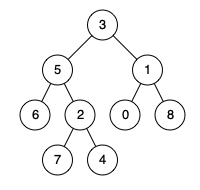

   * [LeetCode-部分算法题解](#LeetCode-部分算法题解)
      * [236.二叉树的最近公共祖先](#236二叉树的最近公共祖先)

# LeetCode-部分算法题解
## 236.二叉树的最近公共祖先

[二叉树的最近公共祖先.playground](https://github.com/sxxjaeho/iOS-Primer/blob/master/contents/swift/arithmetic/code/二叉树的最近公共祖先.playground)

题目：给定一个二叉树, 找到该树中两个指定节点的最近公共祖先。

百度百科中最近公共祖先的定义为：“对于有根树 T 的两个结点 p、q，最近公共祖先表示为一个结点 x，满足 x 是 p、q 的祖先且 x 的深度尽可能大（一个节点也可以是它自己的祖先）。”

例如，给定如下二叉树:  root = [3,5,1,6,2,0,8,null,null,7,4]



```
class BinaryTreeNode {
    var left: BinaryTreeNode?
    var right: BinaryTreeNode?
    var value: Int
    
    init(value: Int, left: BinaryTreeNode?, right: BinaryTreeNode?) {
        self.value = value
        self.left = left
        self.right = right
    }
}

var lowestCommonAncestor: BinaryTreeNode?

func recurseTree(_ root: BinaryTreeNode?, _ node1: BinaryTreeNode?, _ node2: BinaryTreeNode?) -> Bool {
    
    guard root != nil else {
       return false
    }

    let left = recurseTree(root?.left, node1, node2) ? 1 : 0

    let right = recurseTree(root?.right, node1, node2) ? 1 : 0

    let mid = (root?.value == node1?.value || root?.value == node2?.value) ? 1 : 0
    
    if mid + left + right >= 2 {
        lowestCommonAncestor = root
    }

    return (mid + left + right > 0)
}

func lowestCommonAncestor(_ root: BinaryTreeNode?, _ node1: BinaryTreeNode?, _ node2: BinaryTreeNode?) {
    recurseTree(root, node1, node2)
}

let root = BinaryTreeNode(value: 3, left: BinaryTreeNode(value: 5, left: BinaryTreeNode(value: 6, left: nil, right: nil), right: BinaryTreeNode(value: 2, left: BinaryTreeNode(value: 7, left: nil, right: nil), right: BinaryTreeNode(value: 4, left: nil, right: nil))), right: BinaryTreeNode(value: 1, left: BinaryTreeNode(value: 0, left: nil, right: nil), right: BinaryTreeNode(value: 8, left: nil, right: nil)))

lowestCommonAncestor(root, BinaryTreeNode(value: 5, left: BinaryTreeNode(value: 6, left: nil, right: nil), right: BinaryTreeNode(value: 2, left: BinaryTreeNode(value: 7, left: nil, right: nil), right: BinaryTreeNode(value: 4, left: nil, right: nil))), BinaryTreeNode(value: 1, left: BinaryTreeNode(value: 0, left: nil, right: nil), right: BinaryTreeNode(value: 8, left: nil, right: nil)))

print(lowestCommonAncestor?.value ?? 0)
```

***

